# Constrained Flow Matching

A PyTorch implementation of **Flow Matching**, exploring standard unconditional generation and various zero-shot hard-constrained sampling methods.

This repository focuses on adapting pre-trained Flow Matching models to satisfy geometric, structural, and physics-inspired constraints *without retraining*. We explore and compare two distinct inference-time sampling algorithms to enforce these constraints: **ECI** and **HardFlow**.

---

## Algorithms Overview

### 1. ECI (Extrapolation, Correction, Interpolation)
**Paper:** [Gradient-Free Generation for Hard-Constrained Systems (ECI)](https://arxiv.org/abs/2412.01786)
* **Mechanism:** A gradient-free approach that steps forward, mathematically projects (snaps) the intermediate state onto the constraint manifold, and recalculates the trajectory.
* **Characteristics:** Very fast (no backpropagation during sampling) and strictly enforces boundaries, but prone to artifacts when the constraint heavily contradicts the learned unconditional prior.

### 2. HardFlow (Gradient-Guided Trajectory Optimization)
**Paper:** [HardFlow: Hard-Constrained Sampling for Flow-Matching Models via Trajectory Optimization](https://arxiv.org/pdf/2511.08425)
* **Mechanism:** Treats the constraint as a differentiable loss function evaluated on the predicted final state ($\hat{x}_1$). It uses the gradient of this loss to gently steer the velocity vector at every integration step.
* **Characteristics:** Computationally heavier but results in smoother, more natural generation. It successfully navigates complex, non-linear constraints by finding paths of least resistance through the data manifold.

---

## 1. Checkerboard Experiments
*Toy dataset experiments to visualize the impact of constraints on 2D vector fields.*

### Standard Generation (Unconstrained)
A baseline implementation of Flow Matching on 2D checkerboard data.
 

  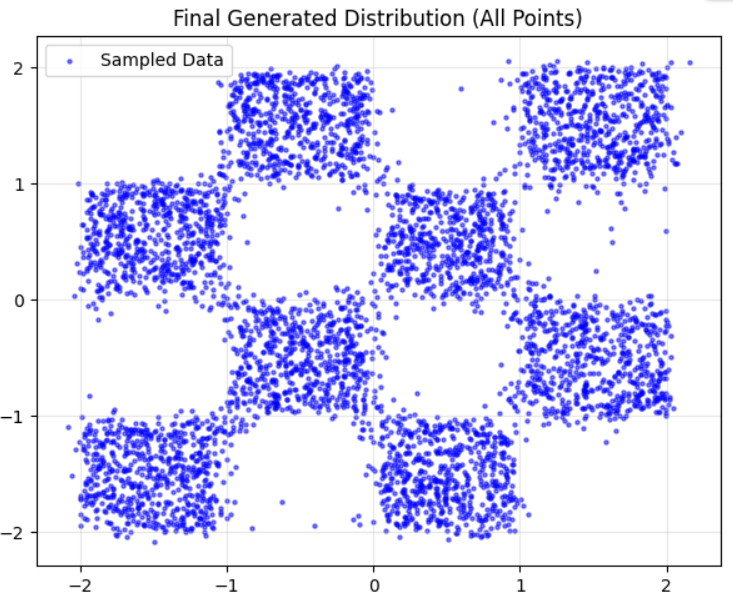

### Constrained Sampling: Valid Black Squares
Forcing the generated points to land strictly inside the valid black checkerboard squares.

**ECI Method:**
 

  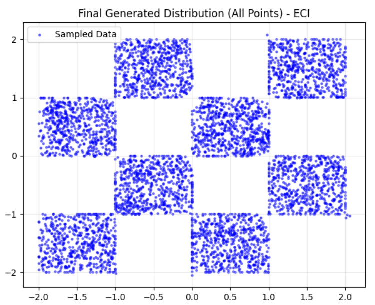

**HardFlow Method:**
 

  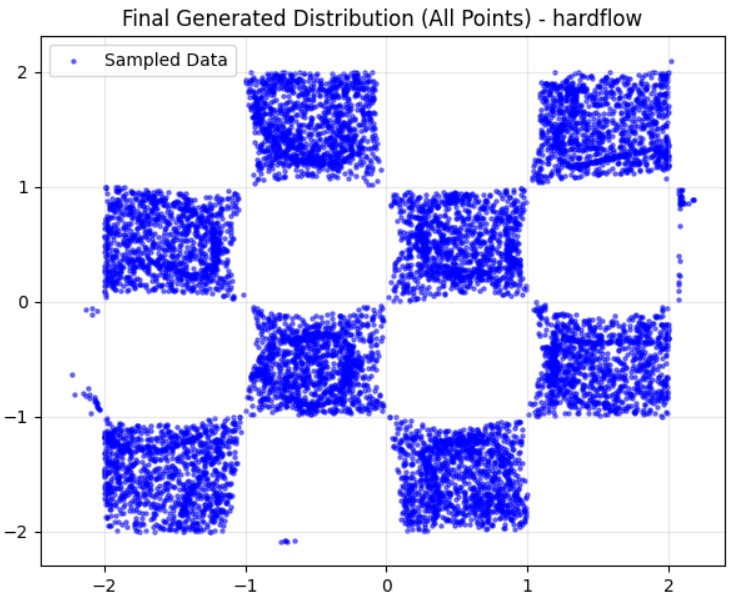

  
Another interesting thing to see is where the flow takes the points most of the time. We can see it by generating a lot of points (100,000) and setting them to be almost transparent. This flow structure is the result of the Flow Matching model training.

  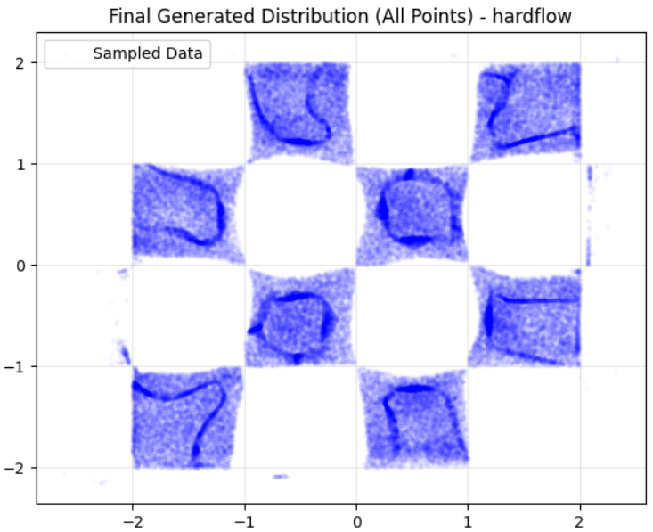

  

---

## 2. MNIST Experiments
*Generative modeling of handwritten digits with complex, high-dimensional constraints.*

### Standard Generation (Unconstrained)
Standard unconditional generation of MNIST digits using a U-Net based vector field.
 

  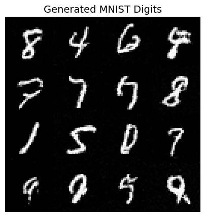

---

### Hard-Constrained Generation
The constraints below are applied at inference time to the same pre-trained unconditional model, comparing the ECI and HardFlow sampling trajectories.

#### Experiment A: Inpainting
**Constraint:** Force the center $6 \times 6$ pixels to be black.

  <table style="border: none;">
    <tr>
      <td align="center"><b>ECI</b></td>
      <td align="center"><b>HardFlow</b></td>
    </tr>
    <tr>
      <td>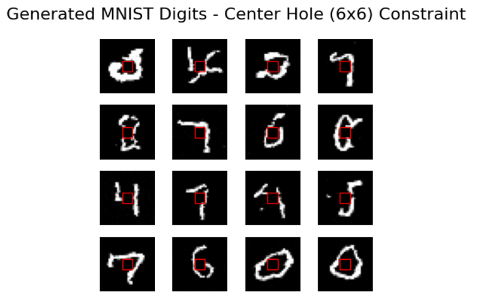</td>
      <td>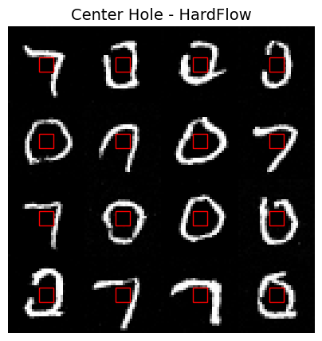</td>
    </tr>
  </table>

#### Experiment B: Total Ink
**Constraint:** Control the total sum of pixel intensities ("Ink Amount").  
*Left to Right: Low Ink (K = 60), High Ink (K = 150).*

  <table style="border: none;">
    <tr>
      <td align="center"><b>ECI</b></td>
      <td align="center"><b>HardFlow</b></td>
    </tr>
    <tr>
      <td align="center">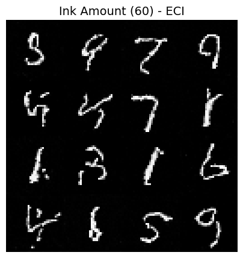</td>
      <td align="center">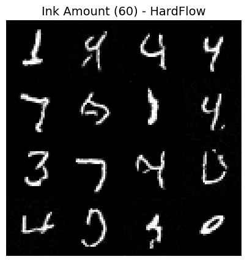</td>
    </tr>
    <tr>
      <td align="center"></td>
      <td align="center">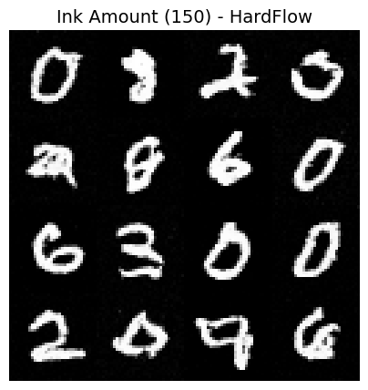</td>
    </tr>
  </table>

#### Experiment C: Subspace Projection
**Constraint:** Project the noisy state onto the PCA subspace of a specific digit class (e.g., targeting digit '3').

  <table style="border: none;">
    <tr>
      <td align="center"><b>ECI</b></td>
      <td align="center"><b>HardFlow</b></td>
    </tr>
    <tr>
      <td>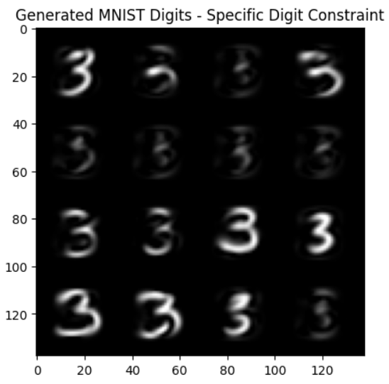</td>
      <td>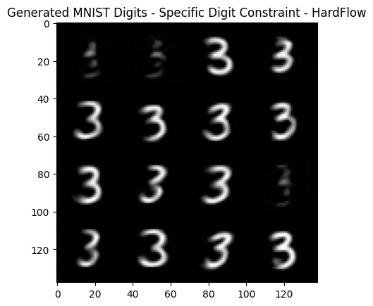</td>
    </tr>
  </table>

*Targeting All Digits (0-9) using PCA Constraint:*

  <b>ECI:</b> 
  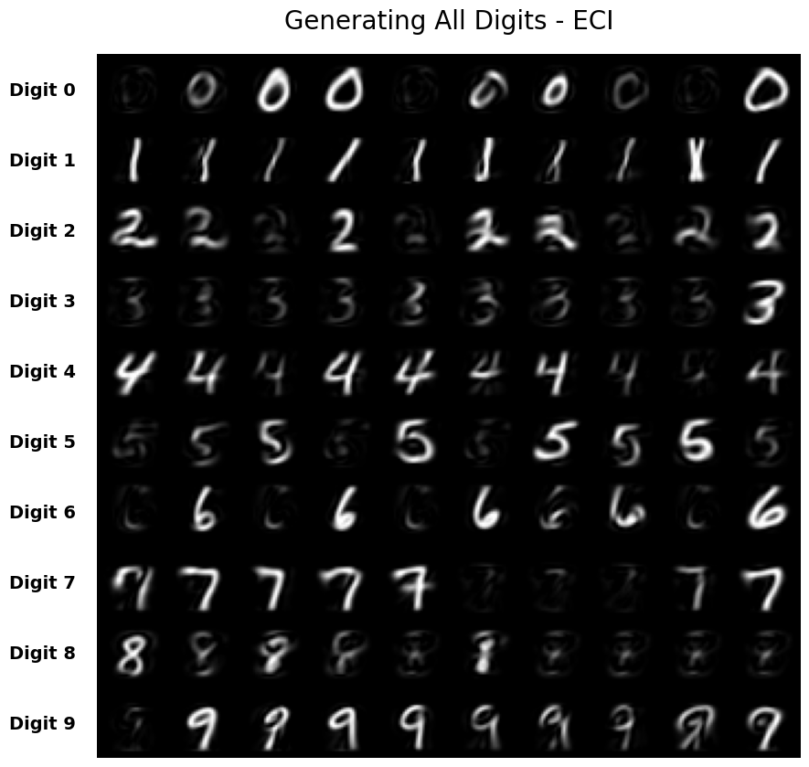 
  <b>HardFlow:</b> 
  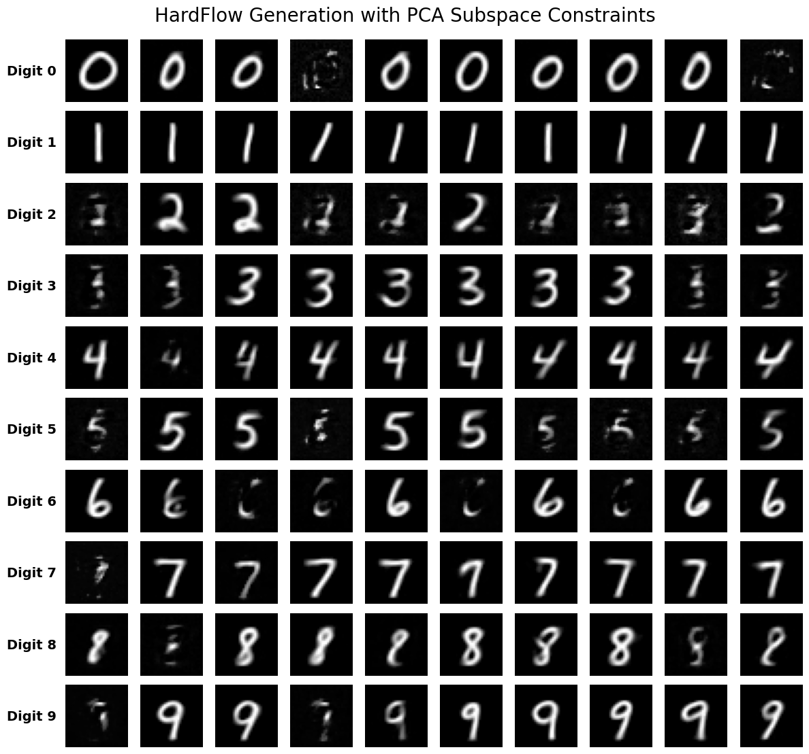

#### Experiment D: Structural Symmetry
**Constraint:** Force the generated digit to be vertically symmetric (left side mirrors the right side).

  <table style="border: none;">
    <tr>
      <td align="center"><b>ECI</b></td>
      <td align="center"><b>HardFlow</b></td>
    </tr>
    <tr>
      <td>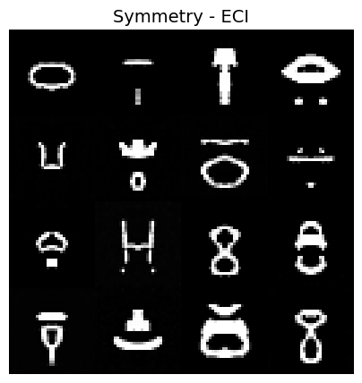</td>
      <td>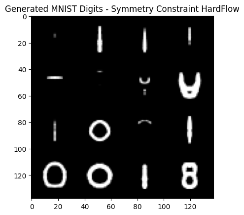</td>
    </tr>
  </table>

