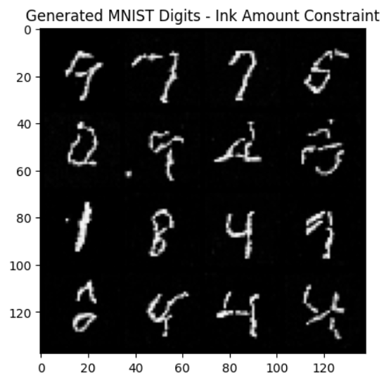
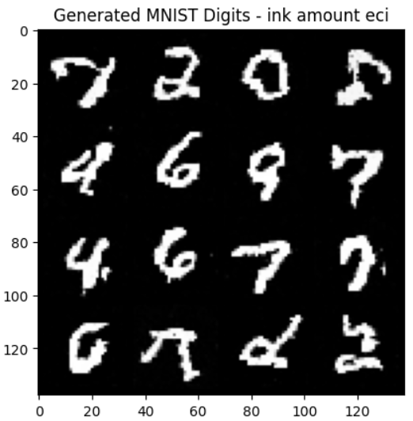
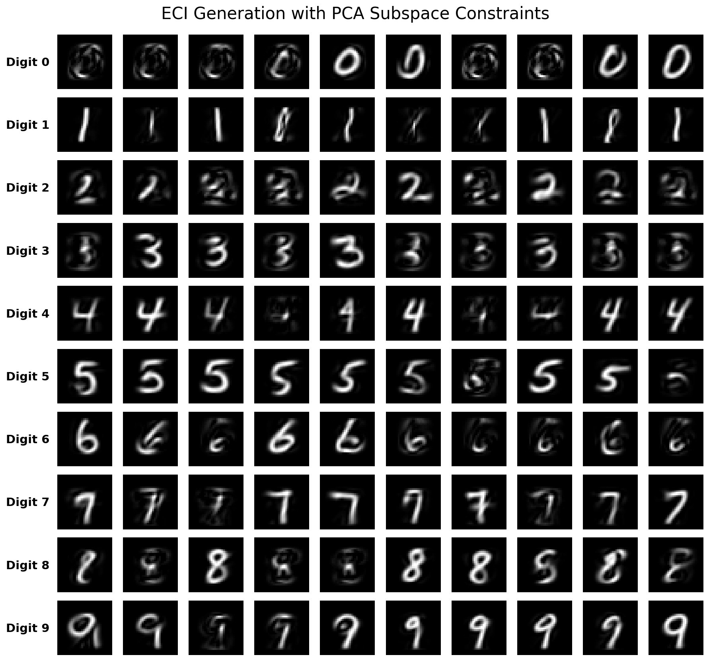

# Constrained Flow Matching

A PyTorch implementation of **Flow Matching**, exploring standard unconditional generation and various zero-shot hard-constrained sampling methods.

This repository focuses on adapting pre-trained Flow Matching models to satisfy geometric and physics-inspired constraints without retraining, currently using the **[ECI (Extrapolation, Correction, Interpolation)](https://arxiv.org/abs/2412.01786)** algorithm.

---

## 1. Checkerboard Experiments

### Standard Generation (Unconstrained)
A baseline implementation of Flow Matching on 2D checkerboard data.
 

  

### ECI Constrained Sampling
Applying the ECI algorithm to force samples into the black squares.
 

  

---

## 2. MNIST Experiments

### Baseline Generation
Standard unconditional generation of MNIST digits using a U-Net based vector field.
 

  

---

### Hard-Constrained Generation (ECI)
All constraints below are applied at inference time to the **same** pre-trained unconditional model using the ECI sampling trajectory.
 

#### Experiment A: Inpainting
**Constraint:** Force the center $6 \times 6$ pixels to be black.
 

  

#### Experiment B: Physics-Inspired Constraints (Total Ink)
**Constraint:** Control the total sum of pixel intensities ("Ink Amount").
 
*Left: Low Ink (K = 60). Right: High Ink (K = 150).*

  
  

#### Experiment C: Subspace Projection (Classifier-Free Guidance)
**Constraint:** Project the noisy state onto the PCA subspace of a specific digit class.

*Targeting Digit: 3*

  

*Targeting All Digits (0-9)*

  

