# Constrained Flow Matching: Routing Probability Mass on Discrete and Continuous Manifolds

This repository explores the implementation and mathematical stabilization of **Conditional Continuous Normalizing Flows (Flow Matching)** on 2D manifolds. Specifically, it tackles the challenge of enforcing strict spatial and algebraic constraints on generative trajectories, ensuring that probability mass flows exclusively into dynamically defined boundaries without collapsing the target distribution.

By testing the architecture against both highly discontinuous discrete datasets and smoothly overlapping continuous densities, this project demonstrates a generalized approach to constrained generative routing.

## Table of Contents
1. [The Architecture](#the-architecture)
2. [Experiment 1: The Discrete Manifold (Checkerboard)](#experiment-1-the-discrete-manifold-checkerboard)
3. [Experiment 2: The Continuous Manifold (4-Peak GMM)](#experiment-2-the-continuous-manifold-4-peak-gmm)
4. [Technical Takeaways](#technical-takeaways)

---

## The Architecture

At the core of this project is the `ConstrainedMLP`, a wide ResNet architecture paired with Sinusoidal Time Embeddings. To achieve strict constraint adherence without external ODE solver wrappers or penalty functions, the spatial and algebraic boundary rules are encapsulated natively within the forward pass.

During integration, the model internally calculates the relative distances to geometric boundaries (e.g., $d_{left}$, $d_{top}$) or the algebraic distance $P(x_t)$ to a dynamic polynomial curve. This grants the network continuous spatial awareness of the constraint at every micro-step of the ODE solver, forcing it to learn boundary-respecting vector fields.

---

## Experiment 1: The Discrete Manifold (Checkerboard)

The first phase maps standard Gaussian noise to a highly discontinuous 2D Checkerboard. This tests the model's ability to learn sharp, nearly vertical mathematical "cliffs" to route mass into discrete squares.

* **Prior:** Standard Normal Gaussian $\mathcal{N}(0, I)$
* **Target:** 2D Checkerboard Manifold (Scaled to `[-4.0, 4.0]`)

  
  

### Unconstrained Baseline
Before introducing constraints, we establish a robust baseline. 

**Inference Progression (t=0 to t=1):**

**Final Samples & Exact Likelihood:**

  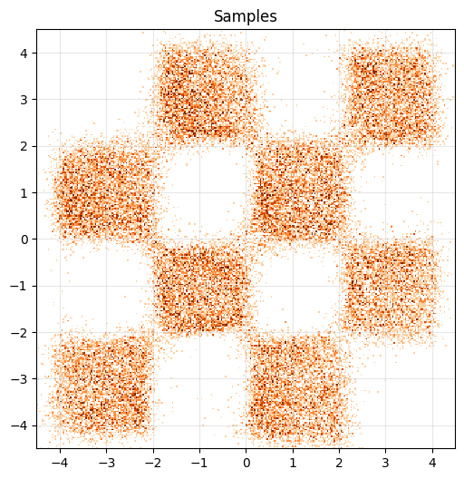
  

### Bounding Box Constraints
The network is conditioned to route particles exclusively into dynamically defined rectangular regions. The model successfully kills velocity flowing to excluded modes.

  
  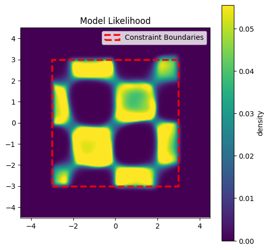

  
  

**Progression Example:**
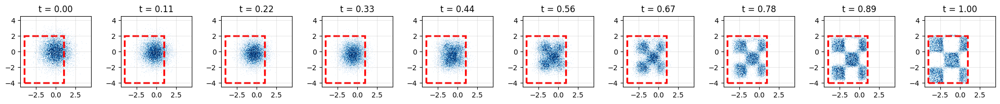

  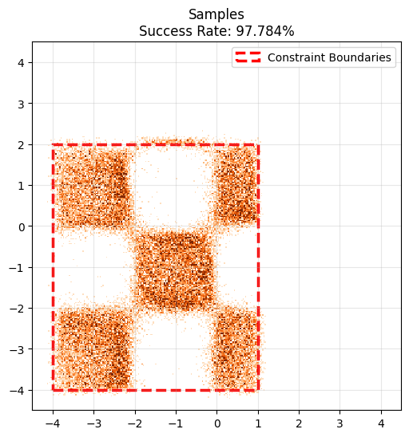
  

### Polynomial Constraints
The model is extended to respect arbitrary algebraic curves defined by a matrix of polynomial coefficients (up to degree $d=3$), requiring the model to route mass such that $P(x_1) \le 0$. 

To prevent "Target Density Explosions" from vanishingly small valid areas, a **Proxy-Grid Rejection Sampler** evaluates randomly generated curves against a static dataset mesh, discarding polynomials that do not bound a healthy active area (5% to 95%).

**Random Target Examples ($P(x) \le 0$):**
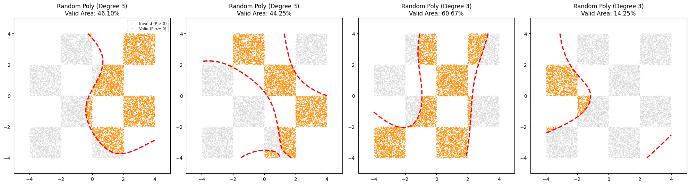

**Example 1**

  
  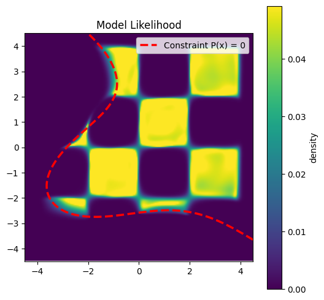

**Example 2**

  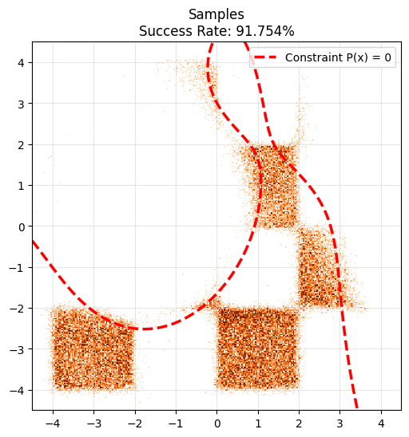
  

**Example 3**

  
  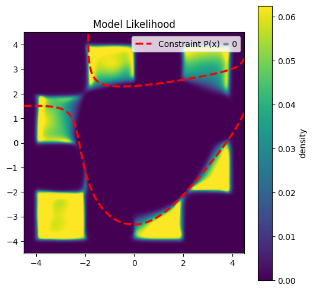

---

## Experiment 2: The Continuous Manifold (4-Peak GMM)

To prove the architecture's geometric and algebraic constraints are fully generalized, the model is tested against a 4-Peak Gaussian Mixture Model. 

**The Challenge:** Unlike the flat density of the checkerboard, the GMM introduces smooth density gradients, varying variances, and heavily overlapping covariance bridges. Furthermore, accurate performance tracking requires Maximum A Posteriori (MAP) labeling rather than simple Euclidean distance.

* **Prior:** Standard Normal Gaussian $\mathcal{N}(0, I)$
* **Target:** 2D GMM with 4 peaks: [-1.5, -1.5], [1.5, 2.0], [2.0, -1.5], [-0.5, 0.5] of varying variances and covariances.

  
  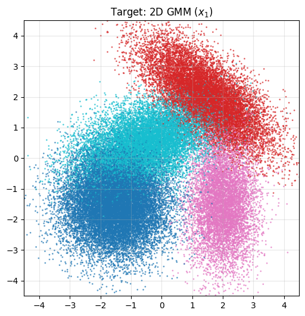
  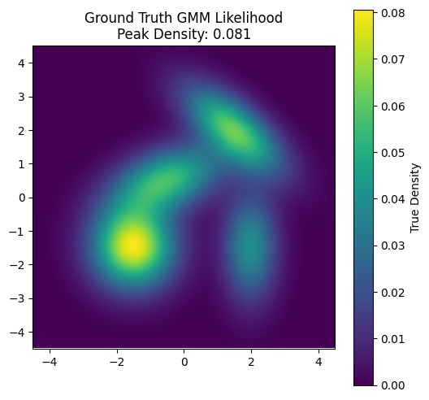

### Unconstrained Baseline
The model successfully maps the standard Gaussian prior into four overlapping clusters, respecting the smooth covariance curves without jitter.

**Inference Progression (t=0 to t=1):**
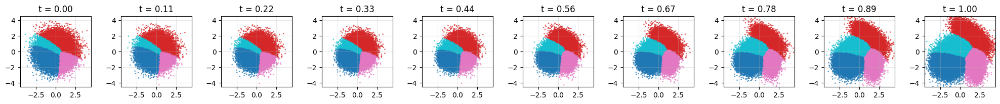

**Final Samples & Exact Likelihood:**

  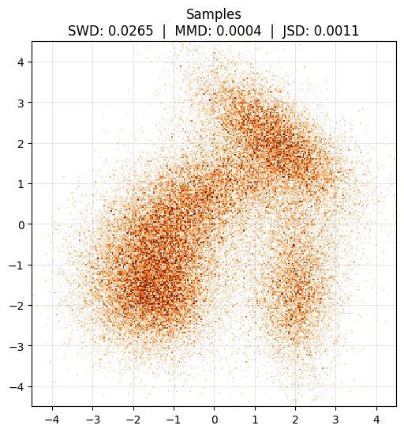
  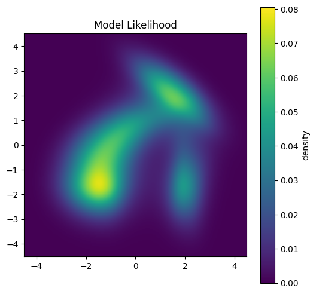

#### Evaluation Metrics
| Metric | Median / Value | Mean | Worst 5% | Target |
| :--- | :--- | :--- | :--- | :--- |
| **Sliced Wasserstein (SWD)** | 0.0315 | - | - | *Lower is better* |
| **Mean Discrepancy (MMD)** | 0.0002 | - | - | *Lower is better* |
| **Jensen-Shannon (JSD)** | 0.0019 | - | - | *Lower is better* |

### Geometric Constraints (BBox) - Improved Version
When a geometric bounding box forces a strict cutoff through the middle of a continuous Gaussian tail, the model learns to compress the probability mass abruptly against the artificial boundary while maintaining the natural density gradient everywhere else.

**Example 1**

  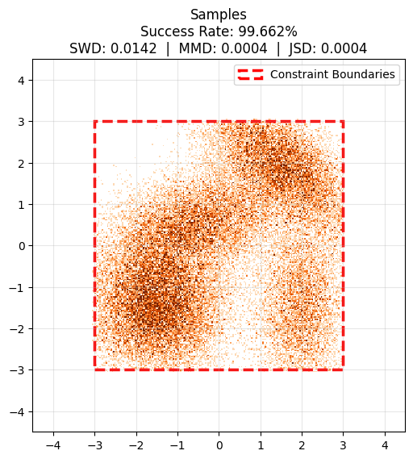
  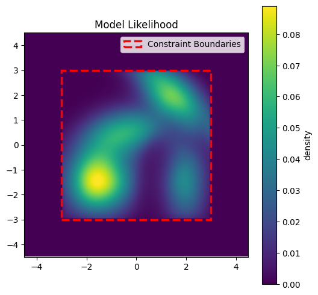

**Example 2**

  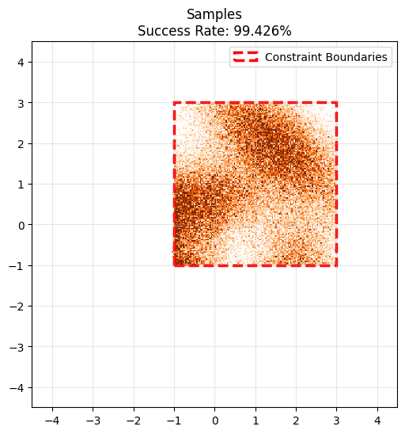
  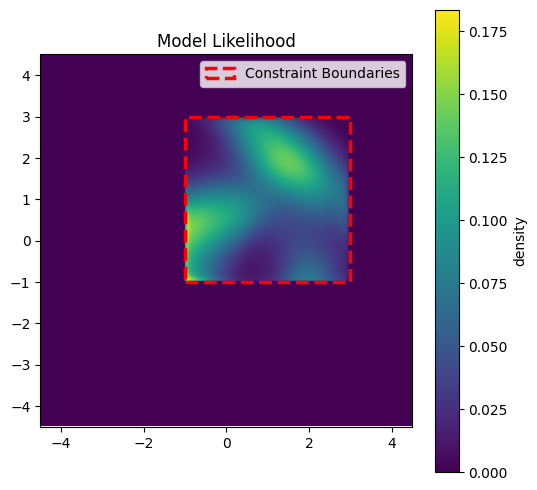

**Example 3 (With Progression)**
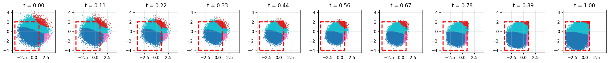

  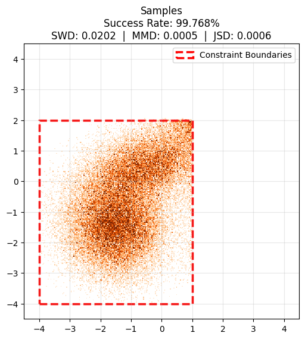
  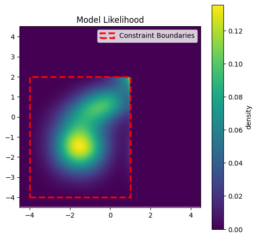

#### Evaluation Metrics
| Metric | Median / Value | Mean | Worst 5% | Target |
| :--- | :--- | :--- | :--- | :--- |
| **Success Rate (%)** | 98.88 | 98.57 | 97.07 | *Higher is better* |
| **Sliced Wasserstein (SWD)** | 0.0176 | 0.0203 | 0.0348 | *Lower is better* |
| **Mean Discrepancy (MMD)** | 0.0003 | 0.0004 | 0.0008 | *Lower is better* |
| **Jensen-Shannon (JSD)** | 0.0016 | 0.0019 | 0.0031 | *Lower is better* |

### Algebraic Constraints (Polynomials)
Polynomial curves are shown to be highly effective at isolating highly correlated, overlapping distributions. A continuous algebraic curve gracefully slices through the Gaussian bridges, and the model successfully redirects the remaining density without breaking the target topology.

**Random Target Examples ($P(x) \le 0$):**
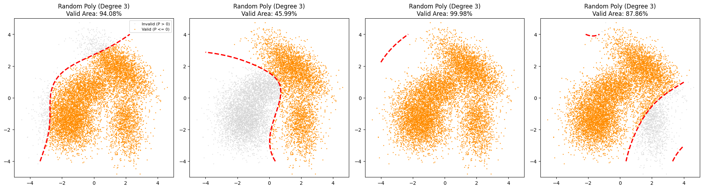

**Inference Example 1**
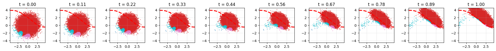

  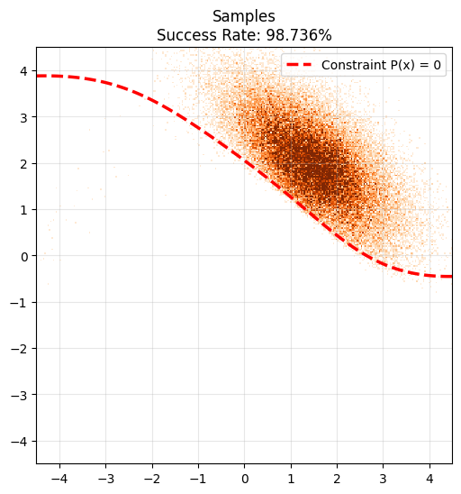
  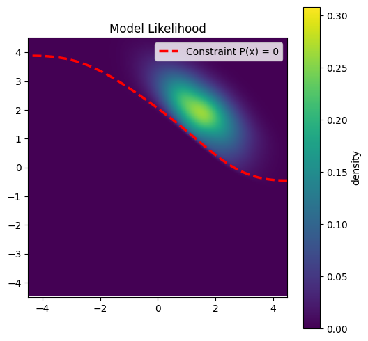

**Inference Example 2**
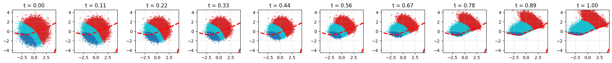

  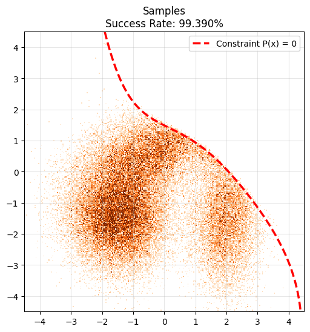
  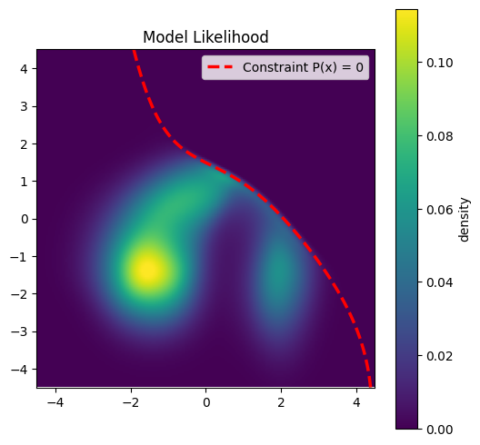

**Inference Example 3**
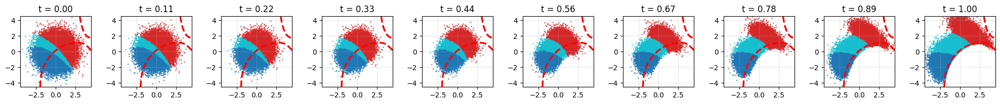

  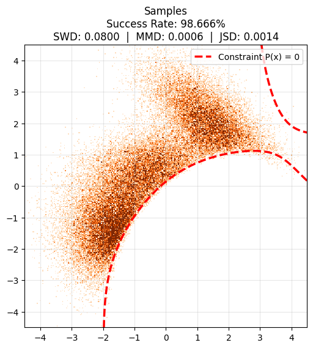
  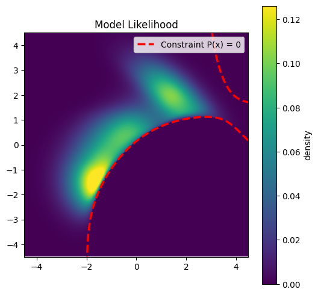

#### Evaluation Metrics
| Metric | Median / Value | Mean | Worst 5% | Target |
| :--- | :--- | :--- | :--- | :--- |
| **Success Rate (%)** | 98.24 | 97.31 | 93.48 | *Higher is better* |
| **Sliced Wasserstein (SWD)** | 0.0822 | 0.1075 | 0.2805 | *Lower is better* |
| **Mean Discrepancy (MMD)** | 0.0007 | 0.0015 | 0.0034 | *Lower is better* |
| **Jensen-Shannon (JSD)** | 0.0048 | 0.0068 | 0.0177 | *Lower is better* |
