# Constrained Flow Matching

This repository explores the implementation and mathematical stabilization of **Conditional Continuous Normalizing Flows (Flow Matching)** on 2D manifolds. Specifically, it tackles the challenge of enforcing strict spatial and algebraic constraints on generative trajectories, ensuring that probability mass flows exclusively into dynamically defined boundaries without collapsing the target distribution.

## Table of Contents
1. [Problem Setup & Base Distributions](#phase-1-problem-setup--base-distributions)
2. [Unconstrained Baseline](#phase-2-the-unconstrained-baseline)
3. [Bounding Box Constraints](#phase-3-geometric-bounding-box-constraints)
4. [Polynomial Constraints](#phase-4-generalized-polynomial-constraints)

---

## Problem Setup & Base Distributions

The core objective of Flow Matching is to learn a dynamic vector field that transports a simple prior distribution into a complex target distribution. For this project, we map standard Gaussian noise to a highly discontinuous 2D Checkerboard. 

* **Prior:** Standard Normal Gaussian $\mathcal{N}(0, I)$
* **Target:** 2D Checkerboard Manifold (Scaled to `[-4.0, 4.0]`)

  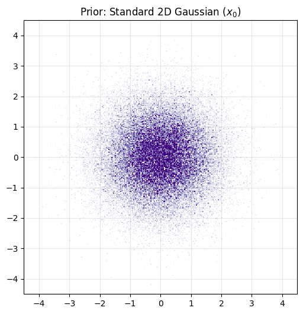
  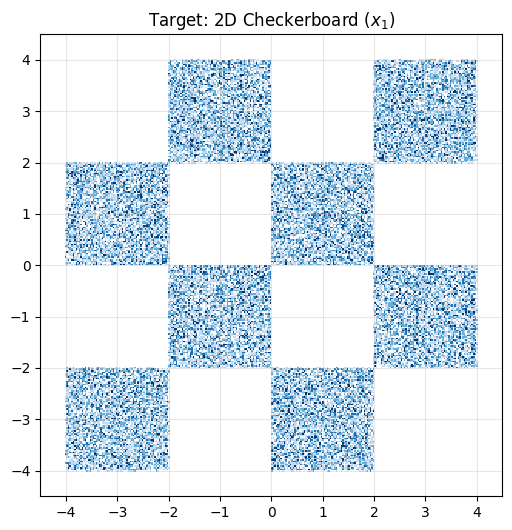

---

## Unconstrained Baseline

Before introducing constraints, we establish a robust unconstrained Continuous Normalizing Flow.  
A wide ResNet architecture with Sinusoidal Time Embeddings was utilized to maintain spatial smoothness while providing high-precision temporal awareness.

### Inference Progression (t=0 to t=1)
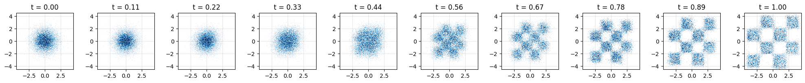

### Final Samples & Exact Likelihood

  
  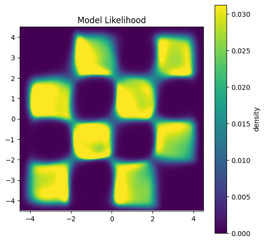

---

## Bounding Box Constraints

In this phase, the network is conditioned to route particles exclusively into dynamically defined rectangular regions. The model receives absolute boundary coordinates and internally calculates relative distance vectors. 

### Example 1

  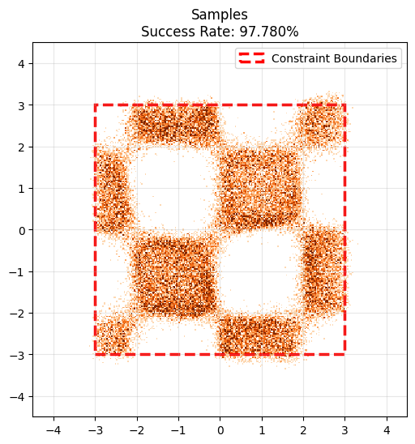
  

### Example 2

  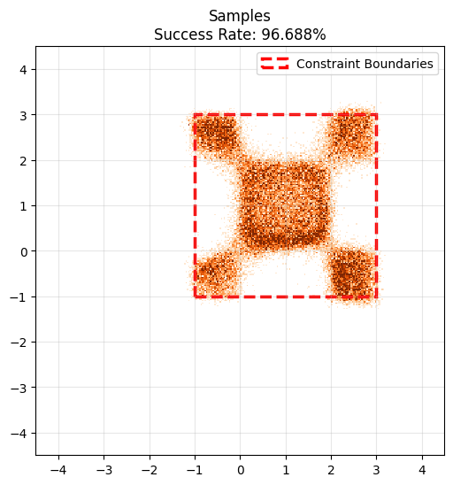
  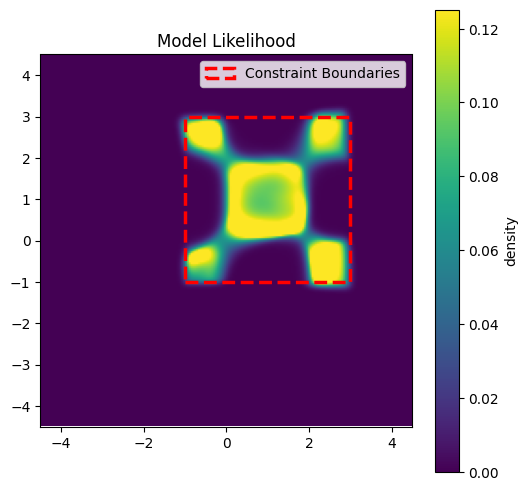

### Example 3 (With Progression)

  
  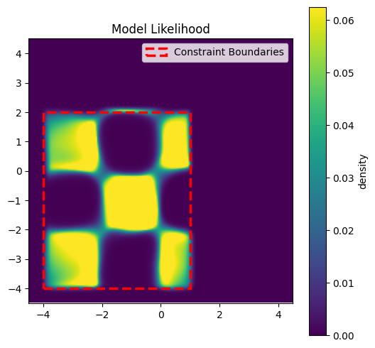

---

## Polynomial Constraints

To move beyond simple orthogonal geometry, the model is extended to respect arbitrary algebraic curves. The constraint is defined by a matrix of polynomial coefficients (up to degree $d=3$), requiring the model to route probability mass such that $P(x_1) \le 0$.

### The Polynomial Challenge
Randomly sampled high-degree polynomials can easily result in "Target Density Explosions" if the valid area shrinks to a microscopic sliver. To ensure stability, a **Proxy-Grid Rejection Sampler** evaluates randomly generated curves against a static dataset mesh, discarding polynomials that do not bound a healthy active area (5% to 95%) before normalizing the coefficients.

**Random Target Examples ($P(x) \le 0$):**

### Inference Example 1
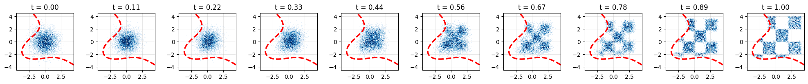

  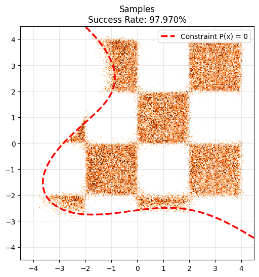
  

### Inference Example 2
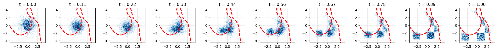

  
  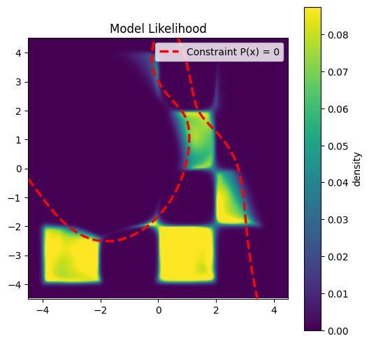

### Inference Example 3
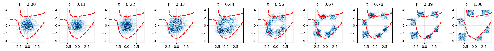

  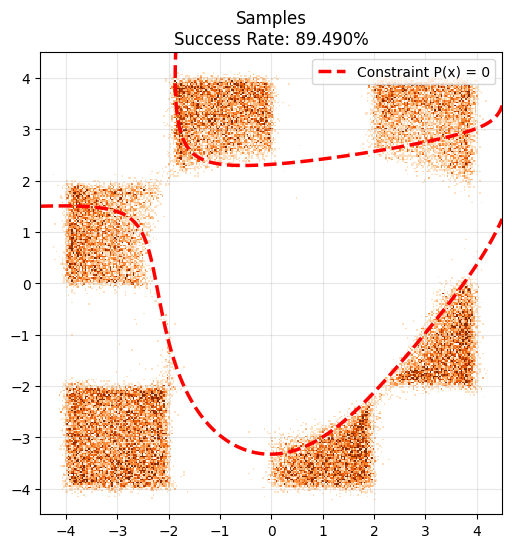

