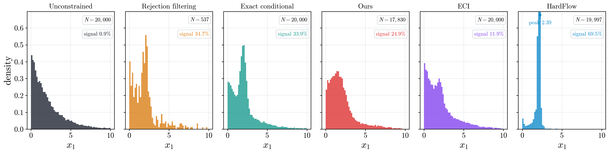

# Scalability and Real-World Application

Two physics-inspired constrained-generation problems, each documented end to end and each
standing on its own. Part A is a 2D bump hunt whose feasible regions are randomized convex
polygons. Part B is a 6D two-particle kinematics problem whose feasible regions are
invariant-mass shells.

## Table of Contents

- [Part A — 2D Bump Hunting](#part-a--2d-bump-hunting)
  - [A.1 The target](#a1-the-target)
  - [A.2 The constraint family](#a2-the-constraint-family)
  - [A.3 Method](#a3-method)
  - [A.4 Evaluation protocol](#a4-evaluation-protocol)
  - [A.5 Results](#a5-results)
  - [A.6 Signal recovery](#a6-signal-recovery)
  - [A.7 Reproduction](#a7-reproduction)
- [Part B — 6D Particle Kinematics](#part-b--6d-particle-kinematics)
  - [B.1 The target](#b1-the-target)
  - [B.2 The constraint family](#b2-the-constraint-family)
  - [B.3 Method](#b3-method)
  - [B.4 Evaluation protocol](#b4-evaluation-protocol)
  - [B.5 Results](#b5-results)
  - [B.6 Kinematic fidelity](#b6-kinematic-fidelity)
  - [B.7 Reproduction](#b7-reproduction)

---

# Part A — 2D Bump Hunting

## A.1 The target

A bump hunt asks whether a small localized excess sits on top of a large smooth background.
The target here is that situation in its minimal form: a two-dimensional mixture on the box
$\Omega = [0, L]^2$ with $L = 10$,

$$
p(x) \;=\; (1 - w)\, p_{\mathrm{bg}}(x) \;+\; w\, \mathcal{N}_{\Omega}\!\left(x; \mu_s, \sigma_s^2 I\right),
\qquad w = 0.01 .
$$

The background factorizes into two exponentials truncated to the box,

$$
p_{\mathrm{bg}}(x) \;=\; \prod_{j=1}^{2} \frac{\beta_j^{-1} e^{-x_j / \beta_j}}{1 - e^{-L / \beta_j}},
\qquad \beta = (2.2,\, 1.5),
$$

and the signal is an isotropic Gaussian with $\mu_s = (2.0,\, 6.5)$ and $\sigma_s = 0.35$.
Both components are renormalized on $\Omega$ exactly, so the mixture is a proper density and
its log-density is available in closed form.

| quantity | value |
| :--- | :--- |
| dimension | $2$ |
| domain | $[0, 10]^2$ |
| background scales $\beta$ | $(2.2,\ 1.5)$ |
| signal mean $\mu_s$ | $(2.0,\ 6.5)$ |
| signal width $\sigma_s$ | $0.35$ |
| signal weight $w$ | $0.01$ |

The parameters are chosen so that the signal is *unobservable without a constraint*. It sits
at $x_2 = 6.5$, roughly $4.3$ background scale lengths out in the $x_2$ tail, and carries one
percent of the mass. The 1D $x_1$ marginal of the mixture is a smooth exponential with no
visible feature, and no amount of unconditional sampling changes that.


## A.2 The constraint family

A feasible region is a convex polygon, represented as an intersection of half-planes. With
unit normals $a_i \in \mathbb{R}^2$ and offsets $b_i \in \mathbb{R}$,

$$
C(x) \;=\; \max_{i = 1 \dots K} \left( a_i^\top x - b_i \right) \;\le\; 0 .
$$

The max-of-affine form is convex, is exactly zero on the boundary, and its value is a signed
distance in domain units, so a single scale $\tau$ calibrates it everywhere. Polygons are
drawn with $K \in \{3, \dots, 7\}$ vertices and circumradius in $[0.35, 7.0]$, then rejected
unless their probability mass under $p$ falls in $[0.02, 0.98]$.

| quantity | value |
| :--- | :--- |
| vertices $K$ | $3$ to $7$ |
| circumradius | $[0.35,\ 7.0]$ |
| admissible mass | $[0.02,\ 0.98]$ |


## A.3 Method

The constraint is conditioned on *implicitly*: a polygon is encoded into a latent vector by a
meta-learned SIREN, and the flow is conditioned on that latent rather than on any explicit
parameterization. This keeps the conditioning interface fixed at $\mathbb{R}^{512}$ no matter
how many half-planes the polygon has.

### A.3.1 The polygon encoder

A modulated SIREN $f_\theta(x, z)$ is meta-trained to regress the squashed constraint value

$$
f_\theta(x, z) \;\approx\; \tanh\!\left( C(x) / \tau \right), \qquad \tau = 1.0 .
$$

Because $C$ has unit normals, $\tau$ is a length: it sets the width of the transition band
around the boundary. Sweeping $\tau \in \{0.3, 1.0, 3.0\}$ at 120 epochs gave 5th-percentile
mass-IoU of $0.867 / 0.921 / 0.882$. Narrower is not better — a $w_0 = 30$ sine basis on
$[-1, 1]$ coordinates cannot resolve a sharper ramp and overshoots it — and wider fits to a
lower MSE while placing the zero level set less precisely.

| component | value |
| :--- | :--- |
| Input | 2D coordinate $x$, mapped from $[0, L]^2$ to $[-1, 1]^2$ |
| Hidden | 4 sine layers, width 512, $w_0 = 30$ |
| Latent | $z \in \mathbb{R}^{512}$ |
| Modulation | FiLM: a linear map $z \mapsto (\gamma_i, \beta_i)$ per layer |
| Output | $\tanh(\cdot)$, matching the $\tanh(C / \tau) \in (-1, 1)$ targets |

Meta-training follows CAVIA: the shared weights $\theta$ are updated in the outer loop, and
$z$ is the only quantity fitted per shape, by 15 inner gradient steps at learning rate
$6.25 \times 10^{-4}$ with an $\ell_2$ penalty $\lambda_z = 10^{-4}$.

| hyperparameter | value |
| :--- | :--- |
| epochs $\times$ steps | $600 \times 400$ |
| shapes per batch | 16 |
| query points per shape | 1000 |
| target-drawn query fraction | 0.5 |
| outer / inner learning rate | $10^{-4}$ / $6.25 \times 10^{-4}$ |
| inner steps | 15 |
| latent penalty $\lambda_z$ | $10^{-4}$ |
| early stopping | patience 100, validated every 10 epochs on 200 held-out shapes |

Half the query points are drawn from the target rather than uniformly from the box. The
background concentrates in one corner, so a uniform query set spends the fixed 15-step budget
resolving boundary that sits where there is no probability mass.

### A.3.2 The conditional flow

A pool of $10^5$ polygons is encoded once with the frozen SIREN, and a continuous flow
matching model is trained on pairs $(x, z)$ where $x$ is drawn from $p$ restricted to the
polygon that $z$ encodes. The velocity field also receives the pointwise value $f_\theta(x, z)$
as an extra input channel, which gives it a local read of where the boundary is without
having to decode the latent itself.

| hyperparameter | value |
| :--- | :--- |
| run id | `bump2d_functa-b5bd15d7` |
| width / residual blocks | 1024 / 4 |
| time embedding | 128 |
| iterations | 15001 |
| batch size | 1024 |
| learning rate | $10^{-3}$, cosine to $10^{-5}$ |
| pool rounds | 32 |
| integrator | midpoint, step size 0.05 |

An unconstrained flow matching model (`bump2d_base_fm-471d306f`, same width and depth, 15001
iterations, batch 4096) is trained on $p$ alone and serves as the backbone for the two
inference-time baselines.

## A.4 Evaluation protocol

Scoring uses a frozen benchmark of 1000 polygons, stratified uniformly over 20 probability-mass
bins so that tight and loose constraints are equally represented, together with a fixed set of
10000 prior draws shared by every method.

Four methods are scored on identical inputs:

| method | description |
| :--- | :--- |
| Ground Truth | rejection sampling from $p$, restricted to the polygon |
| Functa (ours) | the amortized conditional flow of A.3.2 |
| ECI | inference-time projection applied to the unconstrained base flow |
| HardFlow | inference-time guidance applied to the unconstrained base flow |

Metrics are acceptance rate, sliced Wasserstein distance, maximum mean discrepancy, and
Jensen–Shannon divergence against an exact conditional reference; the amortized model
additionally reports NLL and $\mathrm{KL}(p_{\text{true}} \,\|\, q)$, which it can because it
defines a density.

**Ground Truth is scored as a method.** It is a second independent draw from the exact
conditional, so its distance to the reference is not zero — it is the sampling noise floor at
this sample size, and every other number is quoted as a multiple of it. This makes the
comparison self-calibrating: a method at $1.0\times$ is statistically indistinguishable from
exact conditional sampling.

Acceptance rate for Ground Truth comes out at 99.990 rather than 100. This is float32
cancellation in $\max_i (a_i^\top x - b_i)$ with operands of order $10$, giving an error near
$3 \times 10^{-6}$ that scales with the polygon perimeter exactly as predicted. Every method
goes through the identical feasibility code path, so the comparison is unaffected and 99.990
is the acceptance-rate noise floor.

## A.5 Results

### A.5.1 Benchmark table

1000 constraints. Distances are paired medians of the ratio to each constraint's own noise
floor.

| method | AR median | AR p5 | SWD ($\times$ floor) | MMD ($\times$ floor) | JSD ($\times$ floor) | KLD median |
| :--- | :--- | :--- | :--- | :--- | :--- | :--- |
| Ground Truth | 99.990 | 99.940 | 0.01892 (1.0x) | 0.0002351 (1.0x) | 0.001066 (1.0x) | -- |
| Functa (ours) | 97.990 | 91.012 | 0.1121 (6.0x) | 0.006026 (25.4x) | 0.008366 (8.1x) | 0.0558 |
| ECI | 100.000 | 100.000 | 0.2766 (16.9x) | 0.05212 (246.4x) | 0.09057 (89.6x) | -- |
| HardFlow | 99.990 | 98.789 | 0.1211 (7.0x) | 0.007262 (30.3x) | 0.01275 (12.1x) | -- |

ECI reaches a perfect acceptance rate, which is what a projection is for, and pays for it with
the largest distributional error in the table: $246\times$ the MMD noise floor.

### A.5.2 The aggregate is not the result

The medians above hide a crossing. Stratifying by constraint mass shows that the two
inference-time baselines are strongly mass-dependent while the amortized model is not.

**Excess MMD by constraint mass**

| mass band | Functa (ours) | ECI | HardFlow |
| :--- | :--- | :--- | :--- |
| [0.0, 0.1) | 26.0x | 1003.3x | 1780.5x |
| [0.1, 0.2) | 17.7x | 621.7x | 1275.3x |
| [0.2, 0.4) | 15.9x | 467.1x | 329.5x |
| [0.4, 0.6) | 19.4x | 264.5x | 35.2x |
| [0.6, 0.8) | 33.4x | 116.2x | 7.6x |
| [0.8, 1.0) | 38.3x | 22.8x | 2.9x |

**Excess SWD by constraint mass**

| mass band | Functa (ours) | ECI | HardFlow |
| :--- | :--- | :--- | :--- |
| [0.0, 0.1) | 6.1x | 33.0x | 58.2x |
| [0.1, 0.2) | 5.4x | 26.5x | 52.2x |
| [0.2, 0.4) | 5.6x | 24.6x | 21.2x |
| [0.4, 0.6) | 5.5x | 17.5x | 7.2x |
| [0.6, 0.8) | 5.9x | 11.3x | 2.9x |
| [0.8, 1.0) | 7.5x | 8.1x | 1.8x |

HardFlow varies by a factor of $614$ in excess MMD across the sweep and by $32$ in excess SWD;
the amortized model varies by $2.4$ and by $1.4$. The regime that matters for a bump hunt is
the left edge of these tables — the tight constraints that cut the background away — and there
the amortized model is $39\times$ better than ECI and $68\times$ better than HardFlow in
excess MMD.

<p align="center">
  
  
</p>

<p align="center">
  
  
</p>

### A.5.3 The cost of amortization

The amortized model is the only one that does not enforce the constraint exactly, and the
acceptance-rate tail is where that shows:

| percentile | acceptance rate (%) |
| :--- | :--- |
| min | 79.97 |
| p1 | 84.72 |
| p5 | 90.86 |
| p25 | 96.31 |
| median | 97.99 |

3.8% of the benchmark falls below 90% acceptance and 16.4% below 95%. The failures are
concentrated on tight polygons: median acceptance is 91.98% for mass below 0.1 and 98.93% for
mass above 0.8. Density quality moves the same way — median KLD is 0.1675 on the tightest band
and 0.0470 on the loosest.

<p align="center">
  
  
</p>

### A.5.4 A single constraint

The tightest polygon in the benchmark (constraint 624, mass 2.01%), with every method drawing
the same budget from the same prior draws.


## A.6 Signal recovery

Distributional distances are dominated by the bulk, so a metric table cannot by itself
certify that a one-percent component survived. This section measures the component directly.

Take a horizontal band of half-width $2.9\sigma_s$ centered on the signal. It carries 2.90% of
the target mass, so a fixed budget of 20000 unconditional draws leaves 537 usable events. The
signal's share of the mass is estimated by its mean posterior responsibility under the true
mixture,

$$
\hat{w} \;=\; \frac{1}{N} \sum_{n=1}^{N}
    \frac{w\, \mathcal{N}(x_n; \mu_s, \sigma_s^2 I)}{p(x_n)},
$$

which requires neither a binning choice nor a fit.



| treatment | $N$ | signal fraction | ratio to exact |
| :--- | :--- | :--- | :--- |
| Unconstrained | 20,000 | 0.9% | -- |
| Rejection filtering | 537 | 34.7% | 1.02 |
| Exact conditional | 20,000 | 33.9% | 1.00 |
| Functa (ours) | 17,830 | 24.9% | 0.73 |
| ECI | 20,000 | 11.9% | 0.35 |
| HardFlow | 19,997 | 69.5% | 2.05 |

The constraint is what makes the signal visible at all: it goes from 1.0% of the mass to
33.9%. Against the exact conditional, the amortized model is the closest of the three
samplers, and the two baselines fail in opposite directions — ECI erases two thirds of the
excess, HardFlow piles up twice too much of it into a spike far narrower than the true signal.

The amortized model's error is a broadening, not a displacement: it places the excess at the
right location but with too little contrast against the background, recovering roughly three
quarters of it.

### A.6.1 Where the loss occurs

The chain was audited stage by stage to locate the missing quarter. The figures below come
from a separate run of the audit script, so its numbers carry their own sampling noise.

| stage | signal fraction in the band |
| :--- | :--- |
| target, unconditional | 1.00% |
| exact conditional | 33.89% |
| unconstrained base flow, filtered to the band | 32.75% |
| amortized conditional model | 25.46% |

The unconstrained base flow, filtered by rejection, recovers 32.75% against the exact 33.89%,
so the one-percent component is fully present in the learned target and the loss is not a
failure of density estimation. The SIREN reconstructs this band at a mass-IoU of 0.982, so the
loss is not a failure of the encoder either. It is in the conditional velocity field, which
respects the band's support but smooths its interior density.

## A.7 Reproduction

```bash
sbatch scripts/run_bump_fm.sh                                  # unconstrained base flow
sbatch scripts/run_bump_siren.sh                               # polygon encoder
sbatch scripts/run_bump_functa.sh                              # latent pool + conditional flow
sbatch scripts/run_bench1k_build.sh --problem bump2d        # frozen 1000-constraint benchmark
PROBLEM=bump2d sbatch scripts/run_bench1k_eval.sh           # 20-shard scoring array
python3 -m constrained_fm.scripts.merge_bench1k --problem bump2d
sbatch scripts/run_bumphunt_plots.sh                           # tables and figures
sbatch scripts/run_bump_signal_check.sh                        # stage-by-stage signal audit
```

Artifacts land in `constrained_fm/baselines/bump2d_functa/`, merged scores in
`constrained_fm/baselines/bench1k/bump2d/metrics.json`, figures and `table.md` in
`constrained_fm/images/bench1k/bump2d/`.

---

# Part B — 6D Particle Kinematics

## B.1 The target

Two massless particles are described by their Cartesian momenta,

$$
x \;=\; \left( p_{x1},\, p_{y1},\, p_{z1},\, p_{x2},\, p_{y2},\, p_{z2} \right) \in \mathbb{R}^6 ,
$$

but they are *generated* in the collider coordinates in which the physics factorizes. For
each particle independently,

$$
p_T \sim \mathrm{Exp}_{[10,\, 500]}(\beta = 40), \qquad
\eta \sim \mathcal{N}_{[-3,\, 3]}(0,\, 1.5^2), \qquad
\phi \sim \mathcal{U}[-\pi,\, \pi],
$$

mapped to Cartesian momenta by

$$
(p_x,\, p_y,\, p_z) \;=\; \left( p_T \cos\phi,\; p_T \sin\phi,\; p_T \sinh\eta \right).
$$

| quantity | value |
| :--- | :--- |
| dimension | $6$ |
| $p_T$ range / scale | $[10,\ 500]$ GeV / $40$ GeV |
| $\eta$ range / width | $[-3,\ 3]$ / $1.5$ |
| $\phi$ | uniform on $[-\pi,\ \pi]$ |

The map from $(p_T, \eta, \phi)$ to Cartesian coordinates is a diffeomorphism with Jacobian
determinant $|J| = p_T^2 \cosh\eta$, so the Cartesian log-density is available exactly:

$$
\log p(x) \;=\; \sum_{i=1}^{2} \Big[ \log p(p_{T,i}) + \log p(\eta_i) + \log p(\phi_i)
    \;-\; 2\log p_{T,i} \;-\; \log\cosh\eta_i \Big].
$$

Having the exact density in closed form is what makes NLL and KLD well-defined in six
dimensions, where no histogram-based estimator would be usable.

## B.2 The constraint family

The physical observable is the invariant mass of the pair. In the massless limit
$E_i = \lVert \vec{p}_i \rVert$, so

$$
M^2(x) \;=\; 2 \left( E_1 E_2 - \vec{p}_1 \cdot \vec{p}_2 \right)
     \;=\; 2\, p_{T1} p_{T2} \left( \cosh \Delta\eta - \cos \Delta\phi \right).
$$

A resonance search fixes a mass and a tolerance, which gives the constraint

$$
C(x) \;=\; \frac{\left| M(x) - M_\star \right| - \varepsilon}{s} \;\le\; 0,
\qquad s = \sqrt{\mathbb{E}\!\left[M^2\right]} .
$$

The scale $s$ normalizes the value to order one so the same guidance and projection step sizes
apply across shells. $M^2$ vanishes for collinear pairs, where $\mathrm{d}\sqrt{\cdot}\,/\,\mathrm{d}M^2$
is unbounded, so $M^2$ is floored at $10^{-6}$ to keep the guidance gradient finite there.

**This feasible set is not convex.** It is a thin curved shell in $\mathbb{R}^6$, it has no
interior reference point, and it is not even connected in any useful sense for projection.
Projection onto it is available only through damped Newton iterations on $C$.

| quantity | value |
| :--- | :--- |
| admissible shell mass | $[0.01,\ 0.5]$ |
| mass stratification bins | 20 |
| $M^2$ floor | $10^{-6}$ |

## B.3 Method

Unlike a polygon, a mass shell is fully described by two numbers, so there is nothing to
encode: the flow is conditioned *explicitly* on $(M_\star, \varepsilon)$ through Fourier
features, plus the pointwise constraint value $C(x)$ as an extra input channel.

| hyperparameter | value |
| :--- | :--- |
| run id | `kin6d_explicit-7ee66fcd` |
| conditioning | Fourier features of $(M_\star, \varepsilon)$, 16 frequencies, plus $C(x)$ |
| width / residual blocks | 1024 / 4 |
| time embedding | 128 |
| iterations | 120001 |
| shells / points per shell / shells per batch | 100 / 64 / 64 |
| training pool | $2 \times 10^6$ |
| learning rate | $10^{-3}$, cosine to $10^{-5}$ |
| integrator | midpoint, step size 0.05 |

Training pairs are produced by sampling a large pool from $p$ once and, for each shell,
selecting the pool members that fall inside it. This is why the pool is $2 \times 10^6$: a
shell carrying 1% of the mass yields only about 20000 usable events.

An unconstrained flow matching model (`kin6d_base_fm-0e4d7ac9`, same width and depth, 30001
iterations, batch 4096) is trained on $p$ alone and serves as the backbone for the two
inference-time baselines.

## B.4 Evaluation protocol

Scoring uses a frozen benchmark of 1000 shells, stratified uniformly over 20 probability-mass
bins, together with a fixed set of 10000 prior draws shared by every method.

| method | description |
| :--- | :--- |
| Ground Truth | rejection sampling from $p$, restricted to the shell |
| Explicit (ours) | the amortized conditional flow of B.3 |
| ECI | inference-time projection applied to the unconstrained base flow |
| HardFlow | inference-time guidance applied to the unconstrained base flow |

Three details are specific to six dimensions:

- **MMD bandwidth.** The RBF bandwidth is pinned at $\gamma = 0.13$ rather than re-estimated
  per comparison, so the statistic stays comparable across samplers. The measured median
  squared distance in the normalized frame is 7.66, well under the Gaussian expectation of
  $2d = 12$, because the normalized frame stays heavy-tailed along $p_z$.
- **JSD.** Computed per coordinate on 1D histograms and averaged; a 6D joint histogram is not
  estimable at this sample size.
- **In-support fraction.** Reported in addition to acceptance rate, because a sampler can
  satisfy the mass window while drifting outside the physical $(p_T, \eta)$ ranges.

As in Part A, Ground Truth is scored as a method and supplies the noise floor for every
distance.

## B.5 Results

### B.5.1 Benchmark table

1000 constraints. Distances are paired medians of the ratio to each shell's own noise floor.

| method | AR median | AR p5 | SWD ($\times$ floor) | MMD ($\times$ floor) | JSD ($\times$ floor) | KLD median | in support (%) |
| :--- | :--- | :--- | :--- | :--- | :--- | :--- | :--- |
| Ground Truth | 100.000 | 100.000 | 0.04565 (1.0x) | 0.0002106 (1.0x) | 0.002489 (1.0x) | -- | 100.0000 |
| Explicit (ours) | 94.505 | 52.000 | 0.04607 (1.0x) | 0.0002403 (1.1x) | 0.03149 (13.6x) | 0.1179 | 96.6700 |
| ECI | 100.000 | 100.000 | 0.222 (4.4x) | 0.01095 (46.1x) | 0.289 (118.5x) | -- | 98.6200 |
| HardFlow | 89.300 | 18.816 | 0.4965 (10.8x) | 0.1027 (425.3x) | 0.07953 (33.7x) | -- | 82.5850 |

The amortized model reaches the sampling noise floor: $1.0\times$ in SWD and $1.1\times$ in
MMD means its samples are, by these statistics, not distinguishable from a second independent
draw of the exact conditional. ECI is $46\times$ the MMD floor and HardFlow $425\times$.

The elevated JSD at $13.6\times$ alongside an MMD at the floor is not a contradiction. JSD
here is a per-coordinate 1D statistic on a fine histogram and is sensitive to small localized
biases in individual marginals; MMD and SWD weigh the joint structure. The model's residual
error is a marginal-level bias, not a misplacement of the joint distribution.

### B.5.2 Behaviour across shell tightness

**Excess MMD by constraint mass**

| mass band | Explicit (ours) | ECI | HardFlow |
| :--- | :--- | :--- | :--- |
| [0.0, 0.1) | 1.1x | 48.4x | 674.5x |
| [0.1, 0.2) | 1.1x | 52.9x | 282.5x |
| [0.2, 0.4) | 1.2x | 37.6x | 91.4x |
| [0.4, 0.6) | 1.4x | 35.4x | 36.9x |

**Excess SWD by constraint mass**

| mass band | Explicit (ours) | ECI | HardFlow |
| :--- | :--- | :--- | :--- |
| [0.0, 0.1) | 1.0x | 4.5x | 13.3x |
| [0.1, 0.2) | 1.0x | 4.5x | 8.9x |
| [0.2, 0.4) | 1.0x | 4.3x | 5.4x |
| [0.4, 0.6) | 1.1x | 3.9x | 4.6x |

The amortized model stays within $1.4\times$ of the noise floor across the entire range. The
two baselines never approach it: the best cell in either baseline column is $3.9\times$ in SWD
and $35.4\times$ in MMD, both at the loosest shells.

<p align="center">
  
  
</p>

<p align="center">
  
  
</p>

### B.5.3 The cost of amortization

Distributional fidelity at the noise floor is bought with an acceptance rate that is neither
exact nor uniform: median 94.505% but 5th percentile 52.000%. Constraint satisfaction is soft,
and on the tightest shells a substantial share of draws lands outside the window. ECI, which
projects, is exact by construction. HardFlow is worse on both counts at once — 89.300% median
acceptance, 18.816% at the 5th percentile, and only 82.585% of its draws inside the physical
support.

<p align="center">
  
  
</p>

## B.6 Kinematic fidelity

Aggregate distances say the joint distribution is right; the physics is checked on the
observables a practitioner would actually plot. The showcase is the tightest shell in the
benchmark: shell 457, $M_\star = 40.90$ GeV, $\varepsilon = 0.603$ GeV, carrying 1.00% of the
unconditional mass.

The invariant-mass spectrum is the direct test, since $M$ is the constrained quantity:


The transverse momentum, pseudorapidity and azimuth of the leading particle are *not*
constrained directly — they are only shaped by the mass window acting through the kinematics,
so they test whether the conditional structure was learned rather than merely enforced:


The full six-dimensional structure, as 1D marginals on the diagonal and pairwise density
contours below it:


## B.7 Reproduction

```bash
sbatch scripts/run_kin_fm.sh                                       # unconstrained base flow
sbatch scripts/run_kin_constrained.sh                              # explicit conditional flow
sbatch scripts/run_bench1k_build.sh --problem kinematics6d      # frozen 1000-shell benchmark
PROBLEM=kinematics6d sbatch scripts/run_bench1k_eval.sh         # 20-shard scoring array
python3 -m constrained_fm.scripts.merge_bench1k --problem kinematics6d
sbatch scripts/run_bumphunt_plots.sh                               # tables and figures
```

Artifacts land in `constrained_fm/baselines/kin6d_explicit/`, merged scores in
`constrained_fm/baselines/bench1k/kinematics6d/metrics.json`, figures and `table.md` in
`constrained_fm/images/bench1k/kinematics6d/`.
