# Scalability and Real-World Application

Two physics-inspired constrained-generation problems, each documented end to end and each
standing on its own. Part A is a 2D bump hunt whose feasible regions are randomized convex
polygons. Part B is a 6D two-particle kinematics problem whose feasible regions are
invariant-mass windows.

## Table of Contents

- [Part A — 2D Bump Hunting](#part-a--2d-bump-hunting)
  - [A.1 The target](#a1-the-target)
  - [A.2 The constraint family](#a2-the-constraint-family)
  - [A.3 Method](#a3-method)
  - [A.4 Evaluation protocol](#a4-evaluation-protocol)
  - [A.5 Results](#a5-results)
  - [A.6 Signal recovery](#a6-signal-recovery)
  - [A.7 Reproduction](#a7-reproduction)
- [Part B — 6D Particle Kinematics](#part-b--6d-particle-kinematics)
  - [B.1 The target](#b1-the-target)
  - [B.2 The constraint family](#b2-the-constraint-family)
  - [B.3 Method](#b3-method)
  - [B.4 Evaluation protocol](#b4-evaluation-protocol)
  - [B.5 Results](#b5-results)
  - [B.6 Kinematic fidelity](#b6-kinematic-fidelity)
  - [B.7 Reproduction](#b7-reproduction)

---

# Part A — 2D Bump Hunting

## A.1 The target

A bump hunt asks whether a small localized excess sits on top of a large smooth background.
The target here is that situation in its minimal form: a two-dimensional mixture on the box
$\Omega = [0, L]^2$ with $L = 10$,

$$
p(x) = (1 - w) p_{\mathrm{bg}}(x) + w \mathcal{N}_{\Omega}\left(x; \mu_s, \sigma_s^2 I\right),
\qquad w = 0.01 .
$$

The background factorizes into two exponentials truncated to the box,

$$
p_{\mathrm{bg}}(x) = \prod_{j=1}^{2} \frac{\beta_j^{-1} e^{-x_j / \beta_j}}{1 - e^{-L / \beta_j}},
\qquad \beta = (2.2, 1.5),
$$

and the signal is an isotropic Gaussian with $\mu_s = (2.0, 6.5)$ and $\sigma_s = 0.35$.
Both components are renormalized on $\Omega$ exactly, so the mixture is a proper density and
its log-density is available in closed form.

| quantity | value |
| :--- | :--- |
| dimension | $2$ |
| domain | $[0, 10]^2$ |
| background scales $\beta$ | $(2.2, 1.5)$ |
| signal mean $\mu_s$ | $(2.0, 6.5)$ |
| signal width $\sigma_s$ | $0.35$ |
| signal weight $w$ | $0.01$ |

The parameters are chosen so that the signal is *unobservable without a constraint*. It sits
at $x_2 = 6.5$, roughly $4.3$ background scale lengths out in the $x_2$ tail, and carries one
percent of the mass. At the signal centre the signal density is about 8 times the background
density, but the background there is already so thin that the bump's peak is only about 5% of
the density maximum at the origin. On a linear colour scale (left) it is a faint smudge; the
log scale (right) shows the full dynamic range.

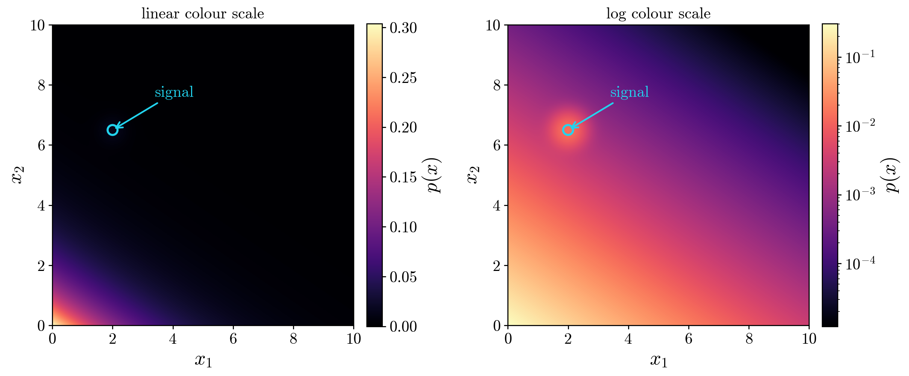

## A.2 The constraint family

A feasible region is a convex polygon, represented as an intersection of half-planes. With
unit normals $a_i \in \mathbb{R}^2$ and offsets $b_i \in \mathbb{R}$,

$$
C(x) = \max_{i = 1 \dots K} \left( a_i^\top x - b_i \right) \le 0 .
$$

The max-of-affine form is convex, is exactly zero on the boundary, and its value is a signed
distance in domain units, so a single scale $\tau$ calibrates it everywhere. Polygons are
drawn with $K \in \{3, \dots, 7\}$ vertices and circumradius in $[0.35, 7.0]$, then rejected
unless their probability mass under $p$ falls in $[0.02, 0.98]$.

| quantity | value |
| :--- | :--- |
| vertices $K$ | $3$ to $7$ |
| circumradius | $[0.35, 7.0]$ |
| admissible mass | $[0.02, 0.98]$ |

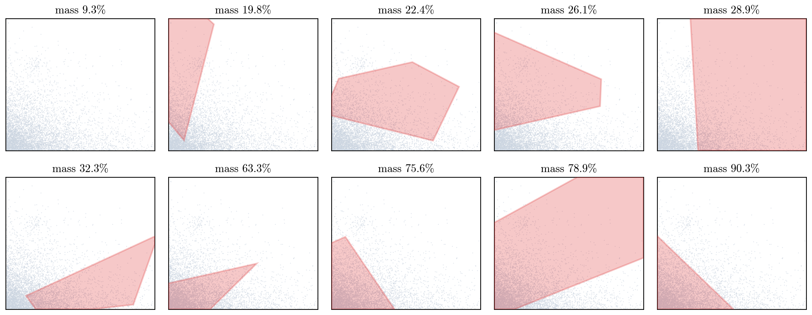

## A.3 Method

The constraint is conditioned on *implicitly*: a polygon is encoded into a latent vector by a
meta-learned SIREN, and the flow is conditioned on that latent rather than on any explicit
parameterization. This keeps the conditioning interface fixed at $\mathbb{R}^{512}$ no matter
how many half-planes the polygon has.

### A.3.1 The polygon encoder

A modulated SIREN $f_\theta(x, z)$ is meta-trained to regress the squashed constraint value

$$
f_\theta(x, z) \approx \tanh\left( C(x) / \tau \right), \qquad \tau = 1.0 .
$$

Because $C$ has unit normals, $\tau$ is a length: it sets the width of the transition band
around the boundary. Sweeping $\tau \in \{0.3, 1.0, 3.0\}$ at 120 epochs gave 5th-percentile
mass-IoU of $0.867 / 0.921 / 0.882$. Narrower is not better — a $w_0 = 30$ sine basis on
$[-1, 1]$ coordinates cannot resolve a sharper ramp and overshoots it — and wider fits to a
lower MSE while placing the zero level set less precisely.

| component | value |
| :--- | :--- |
| Input | 2D coordinate $x$, mapped from $[0, L]^2$ to $[-1, 1]^2$ |
| Hidden | 4 sine layers, width 512, $w_0 = 30$ |
| Latent | $z \in \mathbb{R}^{512}$ |
| Modulation | FiLM: a linear map $z \mapsto (\gamma_i, \beta_i)$ per layer |
| Output | $\tanh(\cdot)$, matching the $\tanh(C / \tau) \in (-1, 1)$ targets |

Meta-training follows CAVIA: the shared weights $\theta$ are updated in the outer loop, and
$z$ is the only quantity fitted per shape, by 15 inner gradient steps at learning rate
$6.25 \times 10^{-4}$ with an $\ell_2$ penalty $\lambda_z = 10^{-4}$.

| hyperparameter | value |
| :--- | :--- |
| epochs $\times$ steps | $600 \times 400$ |
| shapes per batch | 16 |
| query points per shape | 1000 |
| target-drawn query fraction | 0.5 |
| outer / inner learning rate | $10^{-4}$ / $6.25 \times 10^{-4}$ |
| inner steps | 15 |
| latent penalty $\lambda_z$ | $10^{-4}$ |
| early stopping | patience 100, validated every 10 epochs on 200 held-out shapes |

Half the query points are drawn from the target rather than uniformly from the box. The
background concentrates in one corner, so a uniform query set spends the fixed 15-step budget
resolving boundary that sits where there is no probability mass.

### A.3.2 The conditional flow

A pool of $10^5$ polygons is encoded once with the frozen SIREN, and a continuous flow
matching model is trained on pairs $(x, z)$ where $x$ is drawn from $p$ restricted to the
polygon that $z$ encodes. The velocity field also receives the pointwise value $f_\theta(x, z)$
as an extra input channel, which gives it a local read of where the boundary is without
having to decode the latent itself.

| hyperparameter | value |
| :--- | :--- |
| run id | `bump2d_functa-b5bd15d7` |
| width / residual blocks | 1024 / 4 |
| time embedding | 128 |
| iterations | 15001 |
| batch size | 1024 |
| learning rate | $10^{-3}$, cosine to $10^{-5}$ |
| pool rounds | 32 |
| integrator | midpoint, step size 0.05 |

An unconstrained flow matching model (`bump2d_base_fm-471d306f`, same width and depth, 15001
iterations, batch 4096) is trained on $p$ alone and serves as the backbone for the two
inference-time baselines.

### A.3.3 The inference-time baselines

Both baselines take the unconstrained model above and steer its sampling toward the polygon
while it runs. Neither is trained on constraints. Both integrate 100 steps from $t = 0$ to
$t = 1$ and use the same endpoint prediction: from the current point $x_t$ and velocity
$v(x_t, t)$, the model's guess of where the sample will end up is

$$
\hat{x}_1 = x_t + (1 - t) v(x_t, t).
$$

All computations happen in the model's normalised coordinates; the polygon is mapped into
those coordinates by the same affine transform.

**ECI (Extrapolation–Correction–Interpolation; Cheng et al., 2024).** Each step has three
parts.

1. *Extrapolation*: compute $\hat{x}_1$.
2. *Correction*: project $\hat{x}_1$ into the polygon. The projection repeats the step
   $x \leftarrow x - \frac{C(x) + m}{\lVert \nabla C(x) \rVert^2} \nabla C(x)$ up to 16
   times, with margin $m = 10^{-3}$. For a polygon, $\nabla C$ is the normal of the edge that
   is currently most violated, so one step moves the point perpendicularly onto that edge,
   $m$ inside it. Each step is halved (up to 8 times) until it lowers the violation. Near a
   corner, stepping onto one edge can push the point out through the neighbouring edge, and
   the iteration stalls. For points still outside after that, a fallback bisects the segment
   between the point and a fixed interior point of the polygon (24 halvings) and keeps the
   last feasible point. That segment crosses the boundary exactly once because the polygon
   is convex, so the fallback always succeeds.
3. *Interpolation*: move a fraction $\Delta t / (1 - t)$ of the way from $x_t$ toward the
   projected endpoint. On the last step this fraction is 1, so the final sample *is* a
   projected point, and every sample satisfies the constraint.

**HardFlow.** A guided Euler integrator. At each step the velocity is corrected by the
gradient of a penalty on the predicted endpoint,

$$
v_{\text{guided}} = v(x_t, t) - \lambda \nabla_{x_t} \mathrm{ReLU}\left( C(\hat{x}_1) + m \right),
\qquad \lambda = 100, \quad m = 10^{-3},
$$

with the gradient taken through the velocity network by automatic differentiation. A sample
whose predicted endpoint lies inside the polygon (with margin) gets no correction; one whose
endpoint lies outside is pushed along the most violated edge's normal, transported back to
$x_t$ through the network. The penalty is linear rather than squared so the push does not
vanish for points just outside the boundary. There is no final projection, so HardFlow can
leave samples outside.

## A.4 Evaluation protocol

Scoring uses a frozen benchmark of 1000 polygons, stratified uniformly over 20 probability-mass
bins so that tight and loose constraints are equally represented, together with a fixed set of
10000 prior draws shared by every method.

Four methods are scored on identical inputs:

| method | description |
| :--- | :--- |
| Ground Truth | rejection sampling from $p$, restricted to the polygon |
| Functa (ours) | the amortized conditional flow of A.3.2 |
| ECI | inference-time projection applied to the unconstrained base flow (A.3.3) |
| HardFlow | inference-time guidance applied to the unconstrained base flow (A.3.3) |

Metrics are success rate (SR, the percentage of samples that satisfy the constraint), sliced
Wasserstein distance, maximum mean discrepancy, and Jensen–Shannon divergence against an
exact conditional reference; the amortized model additionally reports NLL and
$\mathrm{KL}(p_{\text{true}} \Vert q)$, which it can because it defines a density.

**Ground Truth is scored as a method.** It is a second independent draw from the exact
conditional, so its distance to the reference is not zero — it is the sampling noise floor at
this sample size, and every other number is quoted as a multiple of it. This makes the
comparison self-calibrating: a method at $1.0\times$ is statistically indistinguishable from
exact conditional sampling.

Ground Truth reaches an SR of exactly 100% on every constraint. This requires computing
$\max_i (a_i^\top x - b_i)$ as an elementwise product and sum rather than a matrix multiply:
the container enables TF32 matrix multiplies on the GPU, whose error (up to
$6 \times 10^{-3}$ here) is enough to misclassify exact samples lying close to an edge.

## A.5 Results

### A.5.1 Benchmark table

1000 constraints. Distances are paired medians of the ratio to each constraint's own noise
floor.

| method | SR median | SR 5th percentile | SWD ($\times$ floor) | MMD ($\times$ floor) | JSD ($\times$ floor) | KLD median |
| :--- | :--- | :--- | :--- | :--- | :--- | :--- |
| Ground Truth | 100.000 | 100.000 | 0.01892 (1.0x) | 0.0002351 (1.0x) | 0.001066 (1.0x) | -- |
| Functa (ours) | 97.985 | 91.011 | 0.1122 (6.0x) | 0.006029 (25.4x) | 0.008367 (8.1x) | 0.0559 |
| ECI | 100.000 | 100.000 | 0.2767 (16.9x) | 0.05218 (246.6x) | 0.0906 (89.6x) | -- |
| HardFlow | 99.990 | 98.819 | 0.1211 (7.0x) | 0.007264 (30.2x) | 0.01273 (12.1x) | -- |

ECI reaches a perfect SR, which is what a projection is for, and pays for it with
the largest distributional error in the table: $247\times$ the MMD noise floor.

### A.5.2 The aggregate is not the result

The medians above hide a crossing. Stratifying by constraint mass shows that the two
inference-time baselines are strongly mass-dependent while the amortized model is not.

**Excess MMD by constraint mass**

| mass band | Functa (ours) | ECI | HardFlow |
| :--- | :--- | :--- | :--- |
| [0.0, 0.1) | 26.1x | 1004.1x | 1780.6x |
| [0.1, 0.2) | 17.7x | 622.3x | 1274.0x |
| [0.2, 0.4) | 15.9x | 467.5x | 327.9x |
| [0.4, 0.6) | 19.3x | 264.6x | 35.1x |
| [0.6, 0.8) | 33.4x | 116.3x | 7.6x |
| [0.8, 1.0) | 38.3x | 22.8x | 2.9x |

**Excess SWD by constraint mass**

| mass band | Functa (ours) | ECI | HardFlow |
| :--- | :--- | :--- | :--- |
| [0.0, 0.1) | 6.1x | 33.0x | 58.3x |
| [0.1, 0.2) | 5.4x | 26.5x | 52.1x |
| [0.2, 0.4) | 5.6x | 24.7x | 21.3x |
| [0.4, 0.6) | 5.5x | 17.5x | 7.3x |
| [0.6, 0.8) | 5.9x | 11.3x | 2.9x |
| [0.8, 1.0) | 7.5x | 8.1x | 1.8x |

HardFlow varies by a factor of $614$ in excess MMD across the sweep and by $32$ in excess SWD;
the amortized model varies by $2.4$ and by $1.4$. The regime that matters for a bump hunt is
the left edge of these tables — the tight constraints that cut the background away — and there
the amortized model is $38\times$ better than ECI and $68\times$ better than HardFlow in
excess MMD.

<p align="center">
  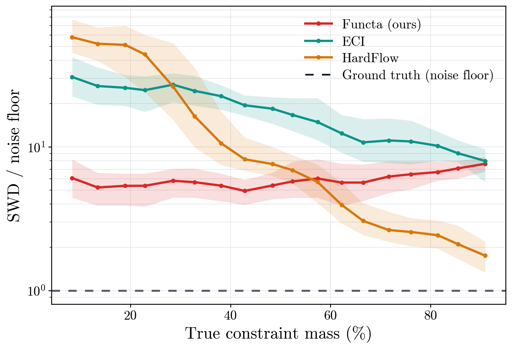
  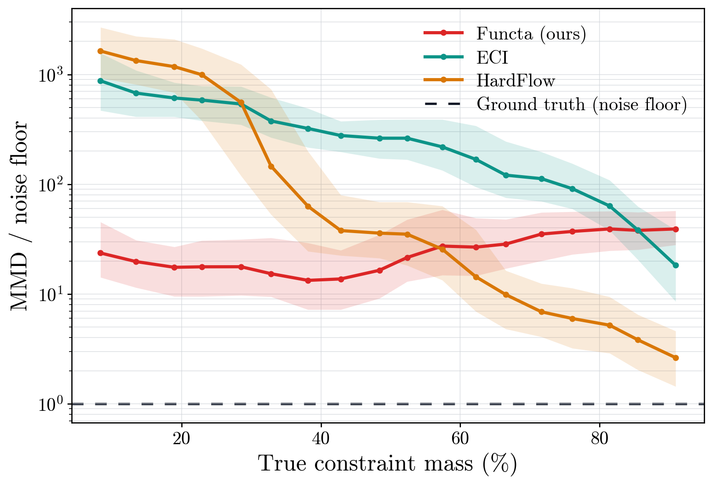
</p>

<p align="center">
  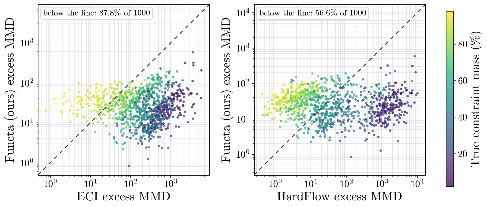
  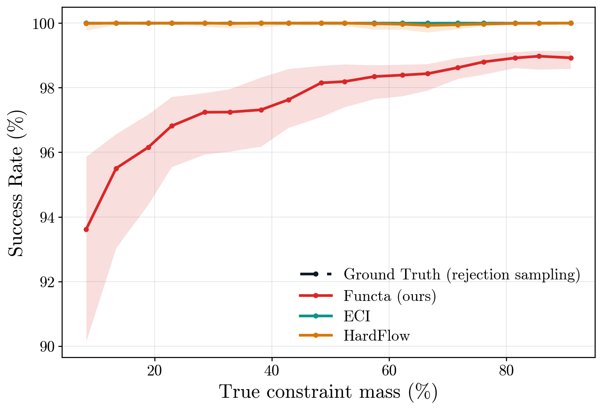
</p>

### A.5.3 The cost of amortization

The amortized model is the only one that does not enforce the constraint exactly, and the
SR tail is where that shows:

| percentile | SR (%) |
| :--- | :--- |
| min | 79.99 |
| 1st percentile | 84.76 |
| 5th percentile | 91.01 |
| 25th percentile | 96.30 |
| median | 97.98 |

3.8% of the benchmark falls below 90% SR and 16.4% below 95%. The failures are
concentrated on tight polygons: median SR is 91.97% for mass below 0.1 and 98.94% for
mass of 0.8 and above. Density quality moves the same way: median KLD is 0.1677 on the
tightest band and 0.0469 on the loosest.

<p align="center">
  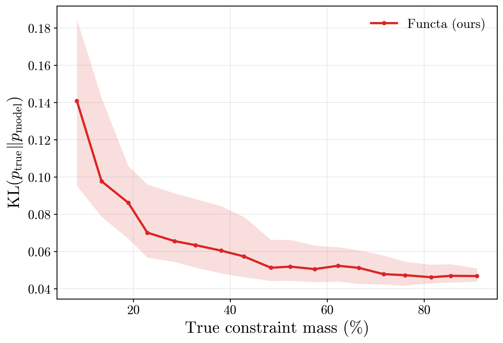
  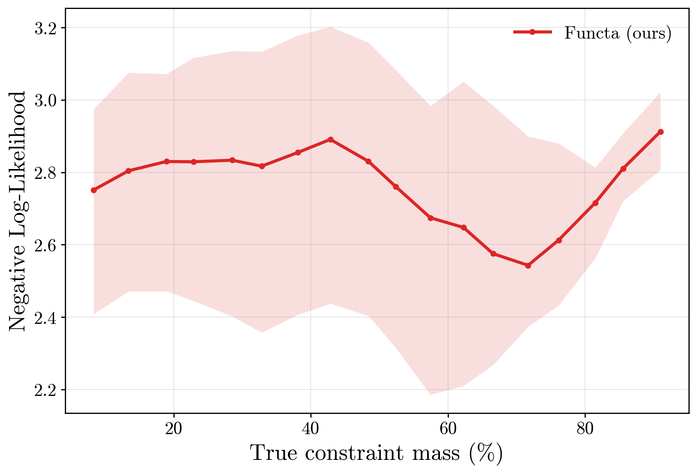
</p>

### A.5.4 A single constraint

A typical polygon (constraint 492, mass 10.05%, chosen as the constraint with mass closest to
10%), with every method drawing the same budget from the same prior draws. SR per method:
Ground Truth 100.00%, Functa 95.42%, ECI 100.00%, HardFlow 99.99%.

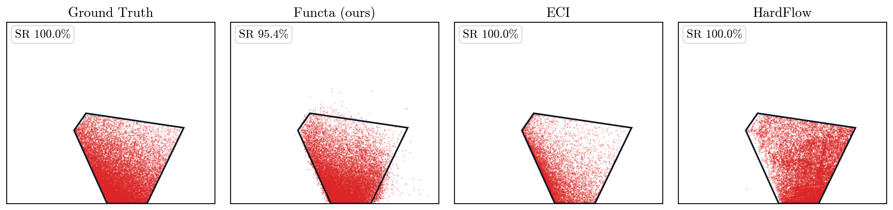

## A.6 Signal recovery

Distributional distances are dominated by the bulk, so a metric table cannot by itself
certify that a one-percent component survived. This section measures the component directly.

The region is a hand-drawn convex pentagon around the signal, with vertices
$(0.3, 4.8), (3.8, 4.2), (4.6, 6.8), (3.0, 9.2), (0.4, 8.6)$, intersected with the four faces of
the domain box. It carries 4.2% of the target mass. The signal's share of the samples inside
the region is estimated by its mean posterior responsibility under the true mixture,

$$
\hat{w} = \frac{1}{N} \sum_{n=1}^{N}
    \frac{w \mathcal{N}(x_n; \mu_s, \sigma_s^2 I)}{p(x_n)},
$$

which needs neither a binning choice nor a fit. For the generative methods, $\hat{w}$ is
computed on their feasible samples only.

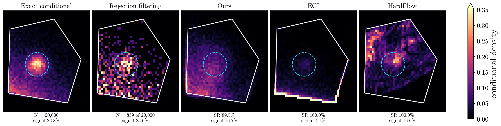

Each panel is a 2D histogram of one method's samples, normalised to a density. All panels
share one linear colour scale, and its maximum is set by the exact conditional, so a panel
that is brighter or darker than the exact one is directly visible as too much or too little
density. Values above the maximum are clipped (the arrow on the colour bar). The generative
panels show all of a method's samples, including infeasible ones, so that constraint
violations are also visible. The dashed circle marks the signal's $2\sigma_s$ radius.

The two reference panels differ only in cost:

* **Exact conditional.** Rejection sampling from the true target, repeated until 20,000 samples
  land inside the region. This takes about $N / \text{mass} \approx 480{,}000$ unconstrained
  draws, and it is the reference.
* **Rejection filtering.** The same procedure with a fixed budget of 20,000 unconstrained draws,
  keeping only the ones that land inside (about 840 here). It costs as much as the other
  methods, but most of the budget is thrown away.

Both give exact samples of the same conditional distribution. Filtering is shown to make the
trade-off visible: it is unbiased, but at a fixed budget it leaves only 839 events here.

| treatment | $N$ | signal fraction | ratio to exact | SR |
| :--- | :--- | :--- | :--- | :--- |
| Exact conditional | 20,000 | 23.79% | 1.00 | -- |
| Rejection filtering | 839 of 20,000 | 23.63% | 0.99 | -- |
| Functa (ours) | 20,000 | 16.73% | 0.70 | 89.52% |
| ECI | 20,000 | 4.10% | 0.17 | 100.00% |
| HardFlow | 20,000 | 16.61% | 0.70 | 100.00% |

The constraint is what makes the signal visible: its share goes from about 1% of the target to
23.8% inside the region. The amortized model and HardFlow each recover about 70% of it, but
in different ways. The amortized model reproduces the shape of the exact conditional, with a
signal that is present but too faint. HardFlow puts a compact spike near the signal centre and
piles much of the rest of its density along the upper-left edges, where the exact conditional
is sparse; its signal fraction is close to ours only because these two errors partly cancel.
ECI recovers about 17%: its projection moves samples onto the polygon boundary (the bright
rim along the lower edges) and does not bring the excess with them.

This polygon is one on which the amortized model's SR is lower than usual (89.5%, against a
benchmark median of 98.0%).

### A.6.1 Benchmark polygons that contain the signal

A single hand-drawn region could be favourable or unfavourable by chance, so the same
measurement was repeated on the benchmark itself. Of the 1000 polygons, 448 contain the
signal centre $\mu_s$, and 41 of those hold at least 10% signal under the exact conditional
(below that, the signal is too weak to measure a ratio reliably).

| method | median signal fraction | median ratio to exact | ratio, 25th–75th percentile | median SR |
| :--- | :--- | :--- | :--- | :--- |
| Exact conditional | 15.1% | 1.00 | 1.00–1.00 | -- |
| Rejection filtering | 15.0% | 1.01 | 0.97–1.03 | -- |
| Functa (ours) | 11.2% | 0.66 | 0.61–0.74 | 92.3% |
| ECI | 2.9% | 0.19 | 0.15–0.26 | 100.0% |
| HardFlow | 3.1% | 0.25 | 0.02–0.54 | 100.0% |

The amortized model keeps about two thirds of the signal, and does so consistently: its
interquartile range is narrow. ECI loses about four fifths of it everywhere. HardFlow is
the least predictable: on a quarter of these polygons it keeps almost none of the signal
(ratio 0.02 or less), and on others it overshoots. On the hand-drawn region above, it
happened to land near our value.

The figure shows the polygon with the median exact signal fraction (constraint 455), chosen
by a rule that does not look at any method's output. Here HardFlow overshoots (22.2% against
the exact 15.0%) by collapsing the signal into a narrow spike, while the amortized model
gives 11.3% and ECI 1.5%.

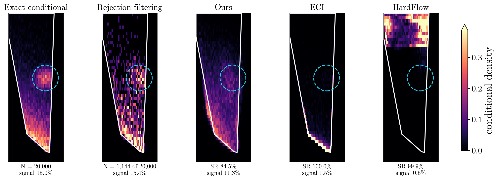

### A.6.2 Where the loss occurs

The chain was audited stage by stage on the hand-drawn region. These numbers come from a
separate run of the audit script, so they carry their own sampling noise.

| stage | signal fraction in the region |
| :--- | :--- |
| target, unconditional | 0.99% |
| exact conditional | 23.79% |
| unconstrained base flow, filtered to the region | 23.06% |
| Functa (ours) | 17.12% |

The unconstrained base flow, filtered by rejection, gives 23.06% against the exact 23.79%.
The one-percent component is therefore present in the learned unconditional target, and the
loss is not a failure of density estimation. The SIREN reconstructs this polygon with a
mass-IoU of 0.942, so the encoder is not the main cause either. The loss is in the
conditional velocity field, which respects the region's support but smooths its interior
density.

## A.7 Reproduction

```bash
sbatch scripts/run_bump_fm.sh                                  # unconstrained base flow
sbatch scripts/run_bump_siren.sh                               # polygon encoder
sbatch scripts/run_bump_functa.sh                              # latent pool + conditional flow
sbatch scripts/run_bench1k_build.sh --problem bump2d        # frozen 1000-constraint benchmark
PROBLEM=bump2d sbatch scripts/run_bench1k_eval.sh           # 20-shard scoring array
python3 -m constrained_fm.scripts.merge_bench1k --problem bump2d
sbatch scripts/run_bumphunt_plots.sh                           # tables and figures
sbatch scripts/run_bump_signal_check.sh                        # stage-by-stage signal audit
```

Artifacts land in `constrained_fm/baselines/bump2d_functa/`, merged scores in
`constrained_fm/baselines/bench1k/bump2d/metrics.json`, figures and `table.md` in
`constrained_fm/images/bench1k/bump2d/`.

---

# Part B — 6D Particle Kinematics

## B.1 The target

Two massless particles are described by their Cartesian momenta,

$$
x = \left( p_{x1}, p_{y1}, p_{z1}, p_{x2}, p_{y2}, p_{z2} \right) \in \mathbb{R}^6 ,
$$

but they are *generated* in the collider coordinates in which the physics factorizes. For
each particle independently,

$$
p_T \sim \mathrm{Exp}_{[10, 500]}(\beta = 40), \qquad
\eta \sim \mathcal{N}_{[-3, 3]}(0, 1.5^2), \qquad
\phi \sim \mathcal{U}[-\pi, \pi],
$$

mapped to Cartesian momenta by

$$
(p_x, p_y, p_z) = \left( p_T \cos\phi, p_T \sin\phi, p_T \sinh\eta \right).
$$

| quantity | value |
| :--- | :--- |
| dimension | $6$ |
| $p_T$ range / scale | $[10, 500]$ GeV / $40$ GeV |
| $\eta$ range / width | $[-3, 3]$ / $1.5$ |
| $\phi$ | uniform on $[-\pi, \pi]$ |

The map from $(p_T, \eta, \phi)$ to Cartesian coordinates is a diffeomorphism with Jacobian
determinant $|J| = p_T^2 \cosh\eta$, so the Cartesian log-density is available exactly:

$$
\log p(x) = \sum_{i=1}^{2} \Big[ \log p(p_{T,i}) + \log p(\eta_i) + \log p(\phi_i)
    - 2\log p_{T,i} - \log\cosh\eta_i \Big].
$$

Having the exact density in closed form is what makes NLL and KLD well-defined in six
dimensions, where no histogram-based estimator would be usable.

## B.2 The constraint family

The physical observable is the invariant mass of the pair. In the massless limit
$E_i = \lVert \vec{p}_i \rVert$, so

$$
M^2(x) = 2 \left( E_1 E_2 - \vec{p}_1 \cdot \vec{p}_2 \right)
     = 2 p_{T1} p_{T2} \left( \cosh \Delta\eta - \cos \Delta\phi \right).
$$

A resonance search fixes a mass and a tolerance, which gives the constraint

$$
C(x) = \frac{\left| M(x) - M_\star \right| - \varepsilon}{s} \le 0,
\qquad s = \sqrt{\mathbb{E}\left[M^2\right]} .
$$

The feasible set is the *mass window* $M_\star - \varepsilon \le M(x) \le M_\star + \varepsilon$.
The scale $s$ normalizes the value to order one so the same guidance and projection step sizes
apply across windows. $M^2$ vanishes for collinear pairs, where the derivative of
$\sqrt{M^2}$ with respect to $M^2$ is unbounded, so $M^2$ is floored at $10^{-6}$ to keep the
guidance gradient finite there.

As an example, take the showcase window of B.6: $M_\star = 59.88$ GeV, $\varepsilon = 6.12$ GeV,
so the window is $53.76 \le M \le 66.00$ GeV. The events below were drawn from $p$ (momenta
in GeV). A and B are inside the window, $-A$ is A with every momentum component negated, and C
is outside.

| event | $p_{x1}$ | $p_{y1}$ | $p_{z1}$ | $p_{x2}$ | $p_{y2}$ | $p_{z2}$ | $M$ | inside? |
| :--- | ---: | ---: | ---: | ---: | ---: | ---: | ---: | :--- |
| A | -23.04 | -11.28 | 42.06 | 27.05 | -30.42 | 115.71 | 53.97 | yes |
| B | -38.53 | -16.04 | -52.35 | 11.19 | -5.47 | 8.21 | 59.54 | yes |
| $-A$ | 23.04 | 11.28 | -42.06 | -27.05 | 30.42 | -115.71 | 53.97 | yes |
| C | 21.55 | 12.84 | 109.47 | 10.76 | 32.41 | -31.28 | 126.30 | no |

The same events in the collider coordinates they were generated in:

| event | $p_{T1}$ | $\eta_1$ | $\phi_1$ | $p_{T2}$ | $\eta_2$ | $\phi_2$ |
| :--- | ---: | ---: | ---: | ---: | ---: | ---: |
| A | 25.65 | 1.27 | -2.69 | 40.70 | 1.77 | -0.84 |
| B | 41.74 | -1.05 | -2.75 | 12.46 | 0.62 | -0.45 |
| $-A$ | 25.65 | -1.27 | 0.46 | 40.70 | -1.77 | 2.30 |
| C | 25.08 | 2.18 | 0.54 | 34.15 | -0.82 | 1.25 |

Negating the momenta keeps each $p_T$, flips the sign of each $\eta$, and rotates each $\phi$
by $\pi$. None of these changes $\Delta\eta$ or $\cos\Delta\phi$, so the mass is unchanged.

**The mass window is not convex.** Convex would mean that the midpoint of any two allowed
events is also allowed. It is not: A and $-A$ are both inside the window (53.97 GeV), yet
their midpoint is the all-zero event, whose mass is 0. Because of this, a projection onto the
window has no interior point to fall back on and relies on Newton-type iterations alone
(B.3.1).

| quantity | value |
| :--- | :--- |
| admissible window mass | $[0.01, 0.5]$ |
| mass stratification bins | 20 |
| $M^2$ floor | $10^{-6}$ |

## B.3 Method

Unlike a polygon, a mass window is fully described by two numbers, so there is nothing to
encode: the flow is conditioned *explicitly* on $(M_\star, \varepsilon)$ through Fourier
features, plus the pointwise constraint value $C(x)$ as an extra input channel.

| hyperparameter | value |
| :--- | :--- |
| run id | `kin6d_explicit-7ee66fcd` |
| conditioning | Fourier features of $(M_\star, \varepsilon)$, 16 frequencies, plus $C(x)$ |
| width / residual blocks | 1024 / 4 |
| time embedding | 128 |
| iterations | 120001 |
| windows / points per window / windows per batch | 100 / 64 / 64 |
| training pool | $2 \times 10^6$ |
| learning rate | $10^{-3}$, cosine to $10^{-5}$ |
| integrator | midpoint, step size 0.05 |

Training pairs are produced by sampling a large pool from $p$ once and, for each window,
selecting the pool members that fall inside it. This is why the pool is $2 \times 10^6$: a
window carrying 1% of the mass yields only about 20000 usable events.

An unconstrained flow matching model (`kin6d_base_fm-0e4d7ac9`, same width and depth, 30001
iterations, batch 4096) is trained on $p$ alone and serves as the backbone for the two
inference-time baselines.

### B.3.1 The inference-time baselines

Both baselines take the unconstrained model above and steer its sampling toward the mass
window while it runs. Neither is trained on constraints. Both integrate 100 steps from
$t = 0$ to $t = 1$ and use the same endpoint prediction: from the current point $x_t$ and
velocity $v(x_t, t)$, the model's guess of where the sample will end up is

$$
\hat{x}_1 = x_t + (1 - t) v(x_t, t).
$$

All computations happen in the model's normalised coordinates, with $C$ evaluated on the
corresponding physical momenta. The gradient of the constraint is

$$
\nabla C(x) = \frac{\mathrm{sign}\left( M(x) - M_\star \right)}{s} \nabla M(x),
$$

so it points along the direction that changes the pair's mass fastest: outward (raising $M$)
for an event below the window and inward for an event above it.

**ECI (Extrapolation–Correction–Interpolation; Cheng et al., 2024).** Each step has three
parts.

1. *Extrapolation*: compute $\hat{x}_1$.
2. *Correction*: move $\hat{x}_1$ into the window by repeating
   $x \leftarrow x - \frac{C(x) + m}{\lVert \nabla C(x) \rVert^2} \nabla C(x)$ up to 32 times,
   with margin $m = 10^{-4}$. Each step changes the mass by the amount needed to reach the
   window edge (to first order), shifted $m$ inside it. Each step is halved (up to 8 times)
   until it lowers the violation without overshooting. There is no fallback: the window is
   not convex (B.2), so there is no interior point to bisect toward.
3. *Interpolation*: move a fraction $\Delta t / (1 - t)$ of the way from $x_t$ toward the
   corrected endpoint. On the last step this fraction is 1, so the final sample *is* a
   corrected point.

The margin is ten times smaller than in the 2D polygon problem because the narrowest window
in the benchmark is only 0.004 wide in units of $C$; a larger margin would push corrected
points a quarter of the way across it.

**HardFlow.** A guided Euler integrator. At each step the velocity is corrected by the
gradient of a penalty on the predicted endpoint,

$$
v_{\text{guided}} = v(x_t, t) - \lambda \nabla_{x_t} \mathrm{ReLU}\left( C(\hat{x}_1) + m \right),
\qquad \lambda = 100, \quad m = 10^{-4},
$$

with the gradient taken through the velocity network by automatic differentiation. A sample
whose predicted endpoint has a mass inside the window gets no correction; one outside is
pushed in the direction that moves its mass toward $M_\star$. There is no final correction,
so HardFlow can leave samples outside the window.

## B.4 Evaluation protocol

Scoring uses a frozen benchmark of 1000 mass windows, stratified uniformly over 20
probability-mass bins, together with a fixed set of 10000 prior draws shared by every method.

| method | description |
| :--- | :--- |
| Ground Truth | rejection sampling from $p$, restricted to the mass window |
| Explicit (ours) | the amortized conditional flow of B.3 |
| ECI | inference-time correction applied to the unconstrained base flow (B.3.1) |
| HardFlow | inference-time guidance applied to the unconstrained base flow (B.3.1) |

Metrics are success rate (SR, the percentage of samples inside the mass window), sliced
Wasserstein distance, maximum mean discrepancy, and Jensen–Shannon divergence against an
exact conditional reference; the amortized model additionally reports NLL and
$\mathrm{KL}(p_{\text{true}} \Vert q)$.

Three details are specific to six dimensions:

- **MMD bandwidth.** The RBF bandwidth is pinned at $\gamma = 0.13$ rather than re-estimated
  per comparison, so the statistic stays comparable across samplers. The measured median
  squared distance in the normalized frame is 7.66, well under the Gaussian expectation of
  $2d = 12$, because the normalized frame stays heavy-tailed along $p_z$.
- **JSD.** Computed on a 100-bin histogram of the invariant mass $M$, spanning the smallest to
  the largest mass in either sample; a 6D joint histogram is not estimable at this sample
  size.
- **In-support fraction.** Reported in addition to SR, because a sampler can satisfy the mass
  window while drifting outside the physical $(p_T, \eta)$ ranges.

As in Part A, Ground Truth is scored as a method and supplies the noise floor for every
distance.

## B.5 Results

### B.5.1 Benchmark table

1000 constraints. Distances are paired medians of the ratio to each window's own noise floor.

| method | SR median | SR 5th percentile | SWD ($\times$ floor) | MMD ($\times$ floor) | JSD ($\times$ floor) | KLD median | in support (%) |
| :--- | :--- | :--- | :--- | :--- | :--- | :--- | :--- |
| Ground Truth | 100.000 | 100.000 | 0.04565 (1.0x) | 0.0002106 (1.0x) | 0.002489 (1.0x) | -- | 100.0000 |
| Explicit (ours) | 94.505 | 52.000 | 0.04607 (1.0x) | 0.0002403 (1.1x) | 0.03149 (13.6x) | 0.1179 | 96.6700 |
| ECI | 100.000 | 100.000 | 0.222 (4.4x) | 0.01095 (46.1x) | 0.289 (118.5x) | -- | 98.6200 |
| HardFlow | 89.300 | 18.816 | 0.4965 (10.8x) | 0.1027 (425.3x) | 0.07953 (33.7x) | -- | 82.5850 |

The amortized model reaches the sampling noise floor: $1.0\times$ in SWD and $1.1\times$ in
MMD means its samples are, by these statistics, not distinguishable from a second independent
draw of the exact conditional. ECI is $46\times$ the MMD floor and HardFlow $425\times$.

The elevated JSD at $13.6\times$ alongside an MMD at the floor is not a contradiction. JSD
here looks only at the histogram of $M$, where the exact conditional puts all of its mass
inside the window. Samples that leak outside the window (a median of 5.5% for our model) land
in bins where the reference has nothing, which JSD penalizes heavily; they also stretch the
histogram's range, so fewer of the 100 bins resolve the window itself. MMD and SWD measure
distances in the full 6D space, where an event just outside a narrow window is still close to
the reference events. The JSD therefore mostly reflects constraint violation (B.5.3) rather
than a misplaced joint distribution. ECI, whose samples all satisfy the constraint, still has
the largest JSD. The likely cause is that its correction step stacks endpoints just inside
the window edges, which distorts the shape of $M$ within the window. The showcase window in
B.6 shows this directly, but it was not measured across the benchmark.

### B.5.2 Behaviour across window tightness

**Excess MMD by constraint mass**

| mass band | Explicit (ours) | ECI | HardFlow |
| :--- | :--- | :--- | :--- |
| [0.0, 0.1) | 1.1x | 48.4x | 674.5x |
| [0.1, 0.2) | 1.1x | 52.9x | 282.5x |
| [0.2, 0.4) | 1.2x | 37.6x | 91.4x |
| [0.4, 0.6) | 1.4x | 35.4x | 36.9x |

**Excess SWD by constraint mass**

| mass band | Explicit (ours) | ECI | HardFlow |
| :--- | :--- | :--- | :--- |
| [0.0, 0.1) | 1.0x | 4.5x | 13.3x |
| [0.1, 0.2) | 1.0x | 4.5x | 8.9x |
| [0.2, 0.4) | 1.0x | 4.3x | 5.4x |
| [0.4, 0.6) | 1.1x | 3.9x | 4.6x |

The amortized model stays within $1.4\times$ of the noise floor across the entire range. The
two baselines never approach it: the best cell in either baseline column is $3.9\times$ in SWD
and $35.4\times$ in MMD, both at the loosest windows.

<p align="center">
  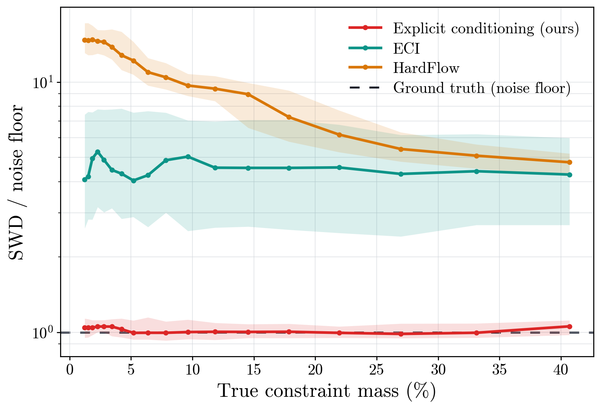
  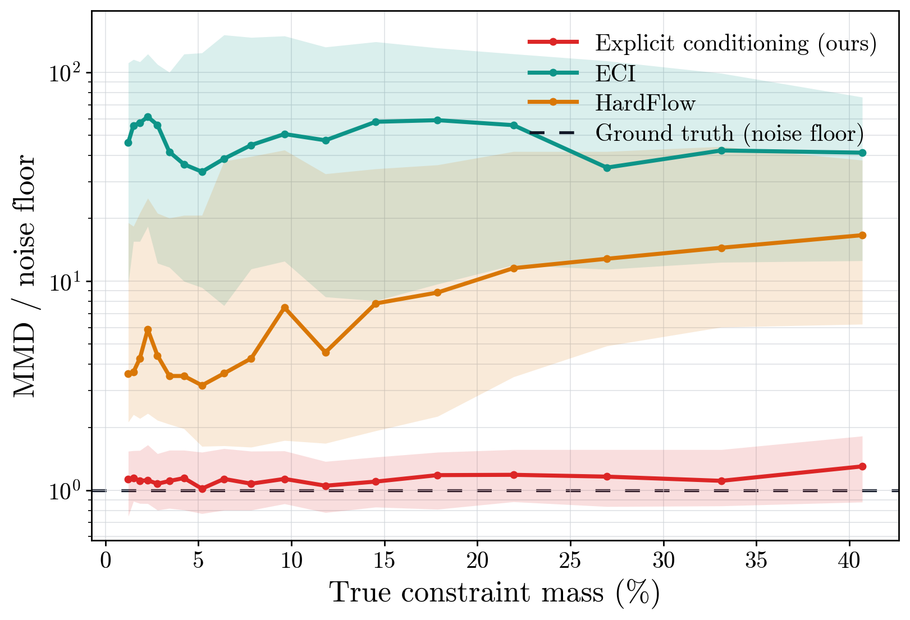
</p>

<p align="center">
  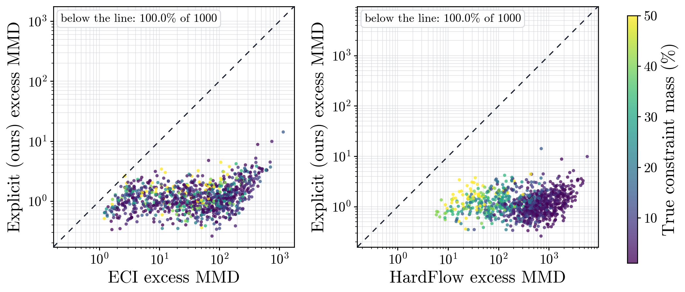
  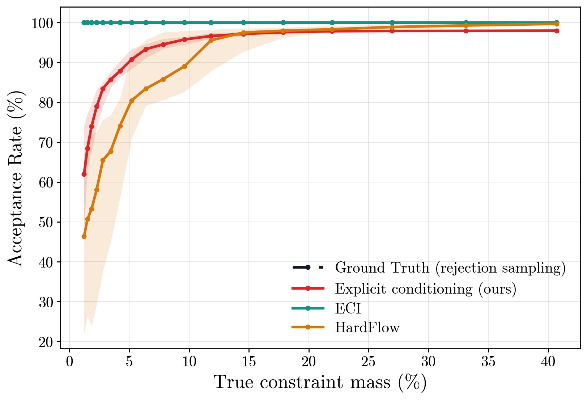
</p>

### B.5.3 The cost of amortization

Distributional fidelity at the noise floor is bought with a success rate that is neither
exact nor uniform: median 94.505% but 5th percentile 52.000%. Constraint satisfaction is soft,
and on the tightest windows a substantial share of draws lands outside. ECI, which corrects
every endpoint, is exact by construction. HardFlow is worse on both counts at once — 89.300%
median SR, 18.816% at the 5th percentile, and only 82.585% of its draws inside the physical
support.

<p align="center">
  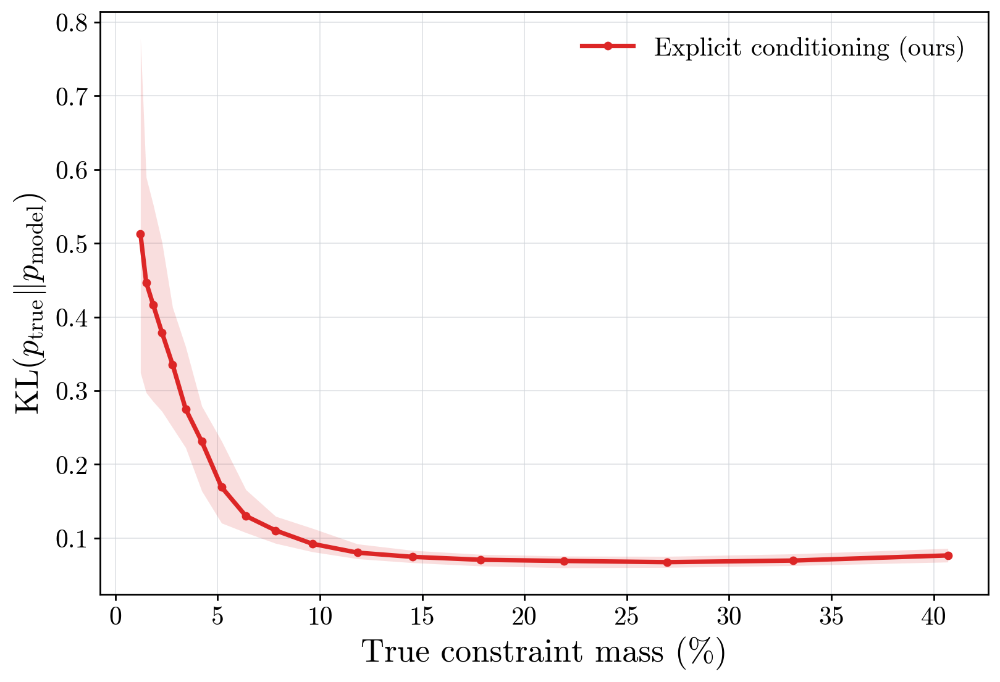
  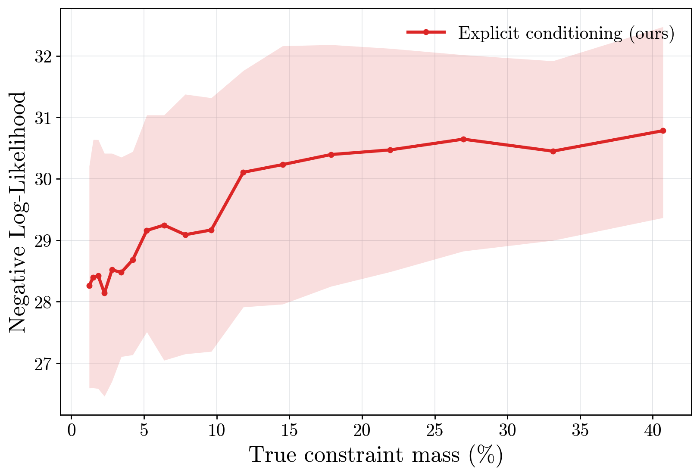
</p>

## B.6 Kinematic fidelity

Aggregate distances say the joint distribution is right; the physics is checked on the
observables a practitioner would actually plot. The showcase is a typical window, chosen as
the one whose mass is closest to 10%: window 38, $M_\star = 59.88$ GeV,
$\varepsilon = 6.12$ GeV, carrying 9.63% of the unconditional mass. SR per method: Explicit
94.95%, ECI 100.00%, HardFlow 81.17%.

The invariant-mass spectrum is the direct test, since $M$ is the constrained quantity. The
left panel shows the full range on a log scale, where leakage outside the window is visible.
The right panel zooms on the window, on a linear scale, with the exact conditional drawn in
black; the unconstrained target is omitted there because its density is negligible at this
scale. Every histogram is normalised by its own sample count.

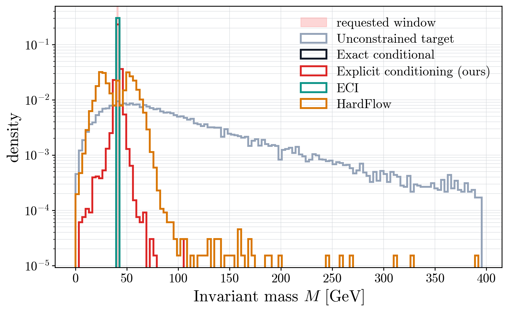

The exact conditional is nearly flat across the window. ECI puts about 70% of its samples in
the single bin at the upper edge (bins are 0.41 GeV wide; the bar is clipped and its height
printed), which is where its correction step leaves them, and its remaining samples decline
across the window. HardFlow rises toward the upper edge, and its leakage extends far into the
high-mass tail. The amortized model is the closest in shape but not flat: it has a peak near
56 GeV, about 2.4 times the exact density, and a smaller rise near the upper edge.

The transverse momentum, pseudorapidity and azimuth of the leading particle are *not*
constrained directly — they are only shaped by the mass window acting through the kinematics,
so they test whether the conditional structure was learned rather than merely enforced:

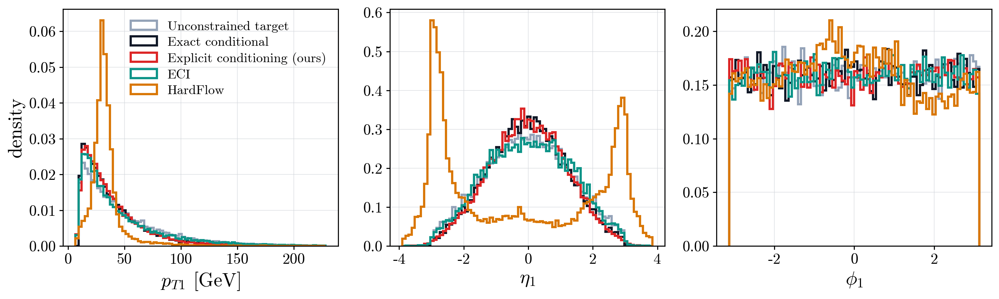

The full six-dimensional structure, as 1D marginals on the diagonal and pairwise density
contours below it:

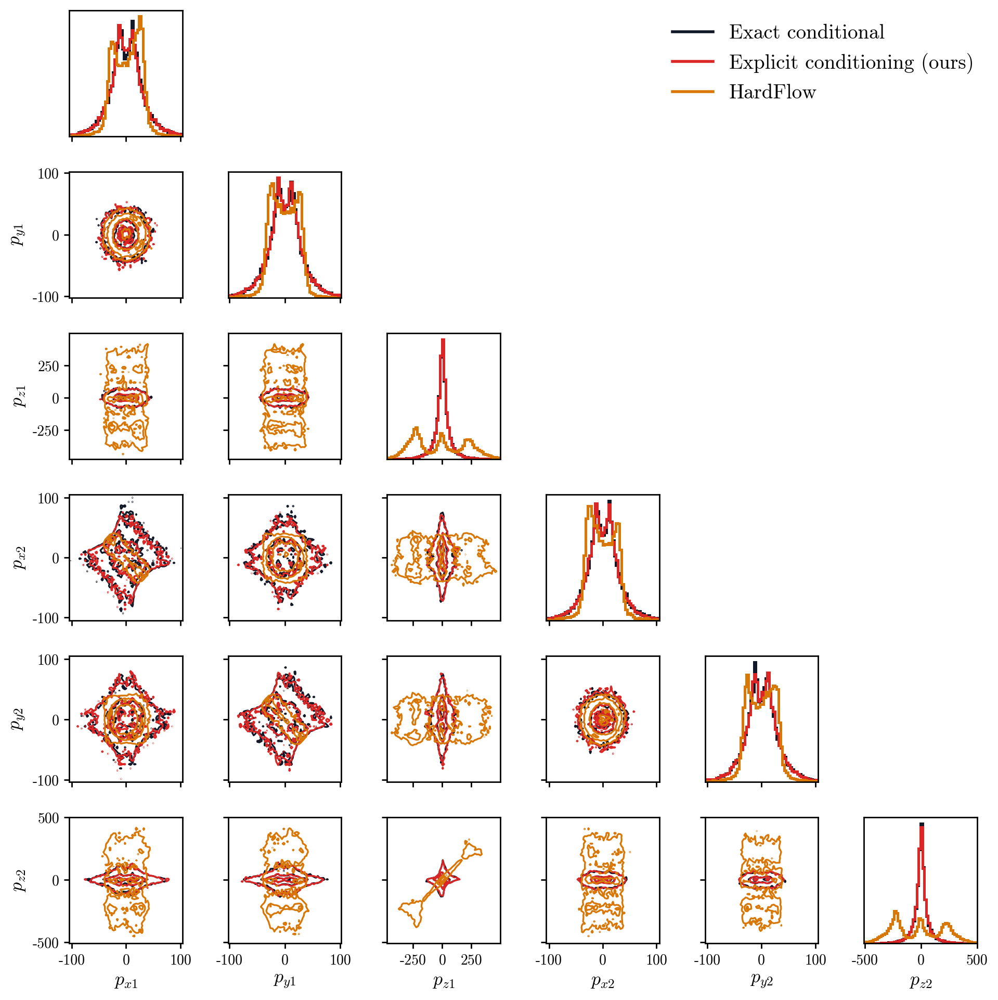

## B.7 Reproduction

```bash
sbatch scripts/run_kin_fm.sh                                       # unconstrained base flow
sbatch scripts/run_kin_constrained.sh                              # explicit conditional flow
sbatch scripts/run_bench1k_build.sh --problem kinematics6d      # frozen 1000-window benchmark
PROBLEM=kinematics6d sbatch scripts/run_bench1k_eval.sh         # 20-shard scoring array
python3 -m constrained_fm.scripts.merge_bench1k --problem kinematics6d
sbatch scripts/run_bumphunt_plots.sh                               # tables and figures
```

Artifacts land in `constrained_fm/baselines/kin6d_explicit/`, merged scores in
`constrained_fm/baselines/bench1k/kinematics6d/metrics.json`, figures and `table.md` in
`constrained_fm/images/bench1k/kinematics6d/`.
