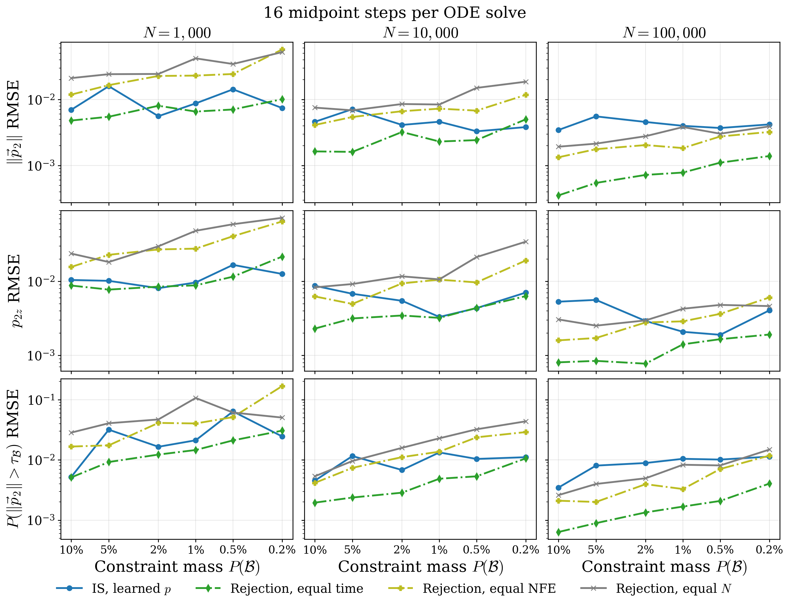

# Conditional Flow Matching and Importance Sampling for a 6D Decay

This experiment tests whether a flow trained to sample directly inside a box on one particle's
momentum can estimate observables of the other particle more efficiently than rejection sampling.
It also checks that importance sampling (IS) corrects errors in the learned conditional sampler.

This is the third version of the experiment (v3). Compared with v2, it uses a fixed-step
midpoint ODE solver evaluated at 8, 16, 32 and 64 steps. The proposal density is integrated
during sampling, and the divergence is a single batched Jacobian product. Rejection runs with a
real per-repetition equal-time budget. The box flow was retrained on masses 0.1%–20%, and six
cubes with masses 0.2%–10% serve as test boxes. The v2 results are archived; see
[Previous version](#previous-version-v2-adaptive-dopri5).

## Contents

1. [Problem and target](#problem-and-target)
2. [Evaluation boxes](#evaluation-boxes)
3. [Models and estimators](#models-and-estimators)
4. [Training and evaluation](#training-and-evaluation)
5. [Solver, timing, and budgets](#solver-timing-and-budgets)
6. [Results](#results)
7. [Interpretation and limitations](#interpretation-and-limitations)
8. [Reproduction and artifacts](#reproduction-and-artifacts)
9. [Previous version (v2, adaptive dopri5)](#previous-version-v2-adaptive-dopri5)

## Problem and target

The event is a two-body decay with a common random boost. For mass $M$, split fraction $u$,
unit direction $\hat v$, and boost $\vec P$,

$$
\vec p_1 = u(M\hat v + \vec P), \qquad
\vec p_2 = (1-u)(-M\hat v + \vec P).
$$

The parameters are $M\sim\mathcal N(1,0.05^2)$, $\vec P\sim\mathcal N(0,0.1^2 I_3)$,
$u\sim\mathcal U(0.1,0.9)$, and $\hat v$ uniform on the sphere. The six-dimensional target
is the joint distribution of $(\vec p_1,\vec p_2)$. The constraint is an axis-aligned box
$\mathcal B$ on $\vec p_1$; the requested quantity is

$$
\mathbb E[f(\vec p_2)\mid \vec p_1\in\mathcal B].
$$

In the simulator, the direction is sampled in [decay6d.py](src/problems/decay6d.py#L85):
draw a three-component standard-normal vector $g$ and set $\hat v=g/\lVert g\rVert$.
For example, $g=(3,4,0)$ gives $\hat v=(0.6,0.8,0)$, while $g=(1,1,1)$ gives
$\hat v\approx(0.577,0.577,0.577)$. These illustrate the normalization; the actual components
are random Gaussian draws. This construction gives a uniform direction on the sphere's surface.

The three observables are $\lVert\vec p_2\rVert$, $p_{2z}$, and the tail indicator
$\mathbb 1[\lVert\vec p_2\rVert>\tau_{\mathcal B}]$. Here $\tau_{\mathcal B}$ is a cutoff
chosen separately for each box: 95% of true events inside that box have a smaller
$\lVert\vec p_2\rVert$, and about 5% have a larger one. It is not a universal physics constant;
it makes the tail observable similarly rare in all six boxes.

The target density formula contains the hidden split fraction $u$. For a given observed pair
$(\vec p_1,\vec p_2)$, the density is found by adding up the contributions from all possible
values of $u$ between 0.1 and 0.9. For a fixed $u$, the code recovers
$\vec a=M\hat v=\tfrac12(\vec p_1/u-\vec p_2/(1-u))$ and
$\vec P=\tfrac12(\vec p_1/u+\vec p_2/(1-u))$. It evaluates the density of $\vec a$
(whose value at radius $r=\lVert\vec a\rVert$ is
$[\phi_M(r)+\phi_M(-r)]/(4\pi r^2)$), multiplies by the 3D Gaussian density of $\vec P$,
and divides by the change-of-variables Jacobian $8u^3(1-u)^3$. Here $\phi_M$ is the Gaussian
mass density; both signs appear because either signed mass along a uniform direction can produce
the same vector radius. This gives the joint density contribution $p(x\mid u)$ for that split.

The marginal likelihood is the average of those contributions over the uniform split:
$p(x)=\frac{1}{0.8}\int_{0.1}^{0.9}p(x\mid u)\,du$. Numerically, the code uses 4096
equally spaced $u$ values and normalized trapezoid weights. If there are $K=4096$ grid points,
the two endpoints each get weight $1/[2(K-1)]$ and each interior point gets
$1/(K-1)$. The weights sum to one, so the weighted sum approximates the *uniform average*
over $u$, not the unnormalized integral. The code combines the weighted density contributions
in log space. In this report, “exact density” means this physics-based calculation rather than
a learned neural density; the one-dimensional integral is still numerical.

The physical coupling explains why conditioning on $\vec p_1$ changes $\vec p_2$:


## Evaluation boxes

Six cubes share one centre on $\vec p_1$, $(-0.35,0.25,-0.20)$, and differ only in size.
This isolates the effect of constraint mass. Each half-width was found by bisection against a
10-million-event pool. The final probabilities were measured independently on one billion
simulator events (`gt_mass` in `boxes.json`).

| box | target mass | measured mass | half-width | $\tau_{\mathcal B}$ |
| :--- | ---: | ---: | ---: | ---: |
| cube_0.2pct | 0.2% | 0.2029% | 0.0827 | 0.651 |
| cube_0.5pct | 0.5% | 0.5033% | 0.1116 | 0.680 |
| cube_1pct | 1% | 1.0020% | 0.1398 | 0.712 |
| cube_2pct | 2% | 1.9979% | 0.1745 | 0.757 |
| cube_5pct | 5% | 4.9965% | 0.2316 | 0.848 |
| cube_10pct | 10% | 9.9938% | 0.2842 | 0.926 |

The panels below show three projections of the $\vec p_1$ distribution and the six box outlines.
In each panel a box is a two-dimensional projection: points can lie inside the drawn rectangle
but outside the box along the omitted axis.


The boxes induce different $\vec p_2$ distributions. The top row compares
$\lVert\vec p_2\rVert$ for all events and in-box events, and all panels share one vertical
density scale. The bottom row shows the in-box $(p_{2x},p_{2z})$ density. Because the cubes
are nested around one centre, the conditional distributions shift smoothly with mass.


Ground-truth conditional means are listed below. Tail means vary slightly around
0.05 because the cutoff is estimated from a finite pool.

| box | $\mathbb E[\lVert\vec p_2\rVert]$ | $\mathbb E[p_{2z}]$ | tail probability |
| :--- | ---: | ---: | ---: |
| cube_0.2pct | 0.52883 | 0.21178 | 0.05038 |
| cube_0.5pct | 0.53345 | 0.21143 | 0.04885 |
| cube_1pct | 0.53989 | 0.21072 | 0.04901 |
| cube_2pct | 0.55100 | 0.20876 | 0.05020 |
| cube_5pct | 0.58085 | 0.19881 | 0.05011 |
| cube_10pct | 0.61756 | 0.17402 | 0.04946 |

## Models and estimators

The conditional flow $q(\vec p_1,\vec p_2\mid\mathcal B)$ receives the box centre and the
logarithm of each half-width. A half-width is the distance from the box centre to a face; its
logarithm keeps the value positive when converted back and makes narrow and wide boxes easier
to represent on one numerical scale. The model is trained on simulator events conditioned to
lie inside the box. Training boxes have masses between 0.1% and 20% (v2 used 0.5%–50%), so all
test boxes lie inside the training range. Its samples are not perfectly confined, so its measured leakage is reported. The unconstrained flow
$p_{\mathrm{uncon}}$ models the full six-dimensional target.

For a proposal sample $x\sim q$, the importance weight is

$$
w(x)=\frac{p(x)\,\mathbb 1[x_1\in\mathcal B]}{q(x\mid\mathcal B)}.
$$

The conditional expectation is estimated by the self-normalized ratio
$\sum_i w_i f_i/\sum_i w_i$. The average weight $N^{-1}\sum_i w_i$ independently estimates
$P(\mathcal B)$ and is a normalization check.

The seven reported estimators are:

| label | estimator | plain-language meaning |
| :--- | :--- | :--- |
| (a) | `q_raw` | Average over all $q$ samples, including samples that leaked outside the box. |
| (b) | `q_filtered` | Average over only the $q$ samples inside the box. |
| (c) | `is_learned` | IS using the learned unconstrained density $p_{\mathrm{uncon}}$. |
| (d) | `is_exact` | IS using the exact quadrature density; this is the density-corrected reference. |
| (e1) | `rej_equal_n` | Rejection sampling from $p_{\mathrm{uncon}}$ with the same number of draws. |
| (e2) | `rej_equal_time` | Rejection sampling that draws until it has used the measured wall time of the same repetition's learned IS. |
| (e3) | `rej_equal_nfe` | Rejection sampling with as many velocity-network calls as learned IS; this is $2N$ draws. |

For (d), each sample from the box flow gets a weight using the physics-based density calculated
by the $u$-quadrature, rather than the learned unconstrained flow. This corrects the box flow's
sampling errors using the reference density. It is a comparison standard for (c), not a claim
that the numerical quadrature has zero error.

In (e3), a “network evaluation” (NFE) is one call to the velocity network. The midpoint
solver makes two calls per step, so an $S$-step solve costs $2S$ NFE per sample. Learned IS
needs two solves per proposal: a forward solve for $q$ and a backward solve for
$p_{\mathrm{uncon}}$. A rejection draw needs one, so equal NFE means exactly $2N$ draws.
NFE does not count the divergence derivatives. Equal NFE therefore ignores the main extra
cost of IS, which equal time does include.

Methods (a) and (b) test the conditional flow without density correction. Methods (c) and (d)
test importance sampling with learned and quadrature densities, respectively. Rejection is
included as a direct baseline and is necessarily wasteful for small boxes.

## Training and evaluation

Both flows use a CondOT flow-matching objective, standard-normal prior, hidden width 1024,
three residual blocks, batch size 4096, Adam with learning rate $10^{-3}$ and cosine decay to
$10^{-5}$. The conditional model trained for 100,000 steps; the unconstrained model trained
for 500,000 steps. Both use global gradient clipping at 1.0 and EMA weights (decay 0.9999)
for evaluation.

| run | run id | steps | diagnostic |
| :--- | :--- | ---: | :--- |
| unconstrained flow (reused from v2) | `decay6d_uncon-cb36fa75` | 500,000 | $D_{KL}(p\Vert p_{uncon})=0.00043\pm0.00062$ |
| box-conditioned flow | `decay6d_box-f2ff7b7d` | 100,000 | mean in-box rate 97.0%; range 94.0%–99.0% |
| box benchmark | `decay6d_boxes-519394b0` | — | six cubes, $10^9$ ground-truth events |
| evaluation, 8 / 16 / 32 / 64 steps | `decay6d_is-e53848a3` / `-83fe43b2` / `-c0c5f76c` / `-6a7ae6dd` | — | 20 repetitions at each $N\in\{10^3,10^4,10^5\}$ |

The box-flow diagnostic samples fresh boxes from the training distribution and integrates
64 midpoint steps. Its in-box rate is lower than in v2 (98.7%) because training now
covers boxes five times smaller.

Here $N$ is the number of proposals used to make ONE estimate. Every repetition draws fresh
samples for every estimator: $N$ new proposals for IS, and new candidates for each rejection
budget. Estimates at different $N$ and repetitions are therefore independent. For rejection,
only candidates that land inside the box enter the estimate.

The simulator and density checks passed before the full run: analytic moment errors were below
$3.7\times10^{-4}$ relative, changing the quadrature resolution four-fold changed its result by
$1.3\times10^{-4}$, the PIT/KS statistic was 0.0056 versus a 0.0096 critical value, and
$\mathbb E_g[p/g]=0.9996\pm0.0006$.

## Solver, timing, and budgets

Every ODE uses the explicit midpoint method in float64 with a fixed number of steps
$S\in\{8,16,32,64\}$. Each $S$ is a separate evaluation run with its own metrics and figures.
Proposal sampling, learned-density solves, and unconstrained rejection draws all use the same
$S$, so every method has the same discretization.

Learned IS processes each batch of proposals in two solves:

1. **Forward, with density.** The box flow is integrated from the prior to $t=1$ together with
   $\tfrac{d}{dt}\log q=-\nabla\cdot v$. The sample and $\log q$ come out of the same solve
   ([`cnf.sample_with_log_prob_fixed`](src/solvers/cnf.py)); no density solve is needed
   afterwards.
2. **Backward, unconstrained density.** The unconstrained flow is integrated from the sample
   back to the prior with its divergence, giving $\log p_{\mathrm{uncon}}$
   ([`cnf.log_prob_fixed`](src/solvers/cnf.py)). This cannot be merged into step 1 because its
   starting point is the final sample.

The exact quadrature density for (d) is timed separately and excluded from learned-IS time.

The divergence is the trace of the $6\times6$ velocity Jacobian. It is computed with one batched
vector-Jacobian product over the six basis vectors
(`torch.autograd.grad(..., is_grads_batched=True)`), instead of six sequential backward passes.
The check job confirms that both forms agree to $2.8\times10^{-17}$. On its small test network
both took about 2.2 ms because that network is limited by kernel-launch overhead. The check
therefore shows correctness, not a speedup.

**Equal time is measured, not estimated.** In each repetition, the learned-IS wall time
becomes the budget for a rejection loop on the same GPU in the same job. That time covers
both solves, with CUDA synchronization. The loop draws batches of 10,000 while they fit in the
remaining time. The last batch is sized from a per-task calibration of batch time against batch
size (median of repeated timings from 1 to 10,000 samples), so the loop stops at the budget.
Realized rejection/IS time ratios are 0.997–1.011 at $N=1{,}000$ and 1.000–1.002 at
$N\ge10{,}000$.

At every $S$, equal time buys about 14.6 unconstrained draws per IS proposal. The ratio does not
depend on $S$ because both costs are linear in $S$. Each midpoint step of an IS solve adds a
batched VJP to the velocity call, and IS needs two such solves. A rejection draw needs one solve
with no divergence. Learned-IS time is linear in $N$: at 64 steps it is 1.8 s, 17 s and 171 s
for $N=10^3,10^4,10^5$, about 1.7 ms per proposal.

| steps | wall time per box task (all $N$, 20 repetitions, all estimators) |
| ---: | ---: |
| 8 | ~19 min |
| 16 | ~36 min |
| 32 | ~71 min |
| 64 | ~141 min |

## Results

### RMSE versus constraint mass

Each grid has one observable per row and one $N$ per column. The horizontal axis runs from the
largest box (10%, left) to the rarest (0.2%, right). For each box, estimator, observable and
$N$, the RMSE is $\sqrt{\mathrm{mean}_r[(\hat\mu_r-\mu_{\rm gt})^2]}$ over the 20 repetitions,
so it includes both bias and spread. The grids show learned IS and the three rejection budgets.
Raw $q$, filtered $q$ and exact IS are in the per-step tables
([64 steps](baselines/decay6d_is/eval/steps64/tables.md),
[32](baselines/decay6d_is/eval/steps32/tables.md),
[16](baselines/decay6d_is/eval/steps16/tables.md),
[8](baselines/decay6d_is/eval/steps8/tables.md)).





1. **With 64 steps, IS beats every rejection budget on rare boxes, and the gap widens as mass
   falls.** For every box at or below 2%, learned IS has a lower RMSE than equal-time rejection
   on all three observables and all $N$. At 5% the two are close; at 10% equal-time rejection
   is equal or better. In the rarest box (0.2%), the $\lVert\vec p_2\rVert$ RMSE at $N=10^5$ is
   $1.9\times10^{-4}$ for IS versus $1.05\times10^{-3}$ for equal-time rejection (5.6×). At
   $N=10^3$ it is $1.7\times10^{-3}$ versus $1.0\times10^{-2}$.
2. **IS error is nearly flat in mass; rejection error grows as mass falls.** Rejection keeps
   only a fraction $P(\mathcal B)$ of its draws, so its noise grows roughly like
   $P(\mathcal B)^{-1/2}$. The box flow puts almost all proposals inside the box at every size.
3. **The step count decides whether IS works.** With 32 steps, IS beats equal-time rejection
   for boxes at or below 1% on every observable and $N$. The crossover lies between 2% and 10%,
   depending on observable and $N$. With 8 or 16 steps, IS is worse than equal-time rejection
   almost everywhere, and at 8 steps its curves are erratic.
4. **Rejection barely depends on the step count.** Equal-time rejection always gets about 14.6
   draws per IS proposal, and its RMSE is similar at 8 and 64 steps. Equal-$N$ and equal-NFE
   rejection are the worst everywhere.

### Why few steps break IS

The weight $p/q$ is a ratio of two discretized densities, so solver error in $\log q$ and
$\log p_{\mathrm{uncon}}$ enters the weights directly. The table gives ranges over the six boxes
at $N=10^5$; the gap column is the mean of $\log p_{\mathrm{uncon}}-\log p$ on in-box
proposals.

| steps | ESS / $N$, learned | $\hat P(\mathcal B)/P(\mathcal B)$, learned | $\hat P(\mathcal B)/P(\mathcal B)$, exact | learned − exact $\log p$ | leakage |
| ---: | ---: | ---: | ---: | ---: | ---: |
| 8 | 0.03–0.08 | 1.24–1.52 | 1.06–1.37 | +0.10 to +0.15 | 0.10–0.57% |
| 16 | 0.09–0.42 | 1.05–1.22 | 1.03–1.20 | +0.018 to +0.026 | 0.16–0.80% |
| 32 | 0.75–0.92 | 1.01–1.05 | 1.01–1.04 | +0.005 | 0.25–0.67% |
| 64 | 0.95–0.97 | 0.995–1.000 | 0.992–0.998 | +0.002 to +0.003 | 0.60–2.08% |

Exact-density IS is also biased at 8 steps. Its mass estimate is too high, which means the
coarse forward solve makes $\log q$ too small on in-box samples. So the error is not only in
$p_{\mathrm{uncon}}$. Between 8 and 64 steps, the learned-versus-exact density gap shrinks
from about 0.1 to 0.002 nats. At 64 steps, mass estimates are within 0.8% of the benchmark.

Leakage is the fraction of proposals outside the box. It is higher at 64 steps (up to 2.1% for
the 0.2% box) than at 32. Leaked proposals get zero weight, so this costs samples but not bias;
the cause was not investigated. No proposal was non-finite. At most one in-box backward density
per box and step count was non-finite, and it was dropped from the weights. At most eight
unconstrained draws per box were non-finite; they fail the box test and are discarded.

### Error versus time in the rarest box

Each point is the mean wall time of one estimate and the RMSE across repetitions; labels give
the draws per estimate. At 64 steps, the IS RMSE in the 0.2% box is about 5.6× lower than
equal-time rejection. Since RMSE falls like $t^{-1/2}$, rejection would need roughly 30× more
time to match it.


### Further figures

Each `images/thesis_pool/decay6d_is/steps{S}/` folder also contains:

- `error_vs_n_*`: RMSE and estimates versus $N$ for every box.
- `ess_vs_n` and `weight_histograms`: weight diagnostics.
- `p2_marginals_box*`: ground truth versus raw and reweighted $q$ marginals.
- `rmse_vs_time_cube_0.2pct_p2_norm`: the time figure above.

ESS (“effective sample size”) is $(\sum_i w_i)^2/\sum_i w_i^2$. It equals $N$ when all weights
are equal and is much smaller when a few samples carry most of the weight; the plots show
ESS$/N$.

## Interpretation and limitations

1. **IS wins in wall time on rare constraints once the ODE is accurate.** With 64 midpoint
   steps, learned IS beats equal-time rejection on every box at or below 2%, by up to 5.6× in
   RMSE at 0.2%. Rejection noise grows like $P(\mathcal B)^{-1/2}$ and IS noise barely changes,
   so the gap should keep widening below 0.2%. That is an extrapolation and was not tested.
2. **IS needs an accurate density; rejection does not.** Discretization error in $\log q$ and
   $\log p_{\mathrm{uncon}}$ biases the weights. At 8–16 steps this dominates and rejection
   wins. At 32 steps IS wins only on the rarer boxes.
3. **Both methods use the same $S$, which favours IS.** Rejection accuracy barely changes
   between 8 and 64 steps, so rejection could run with fewer steps. 8-step rejection under a
   64-step IS time budget would get about 8× more draws, which is about 2.8× less noise. That
   would still leave IS ahead at 0.2%, but not at 2%. This mixed-step comparison was not run, and
   the 8-step rejection bias at that larger budget is unknown.
4. **Speed comes from the solver, not from a measured divergence speedup.** IS now needs no
   separate density solve for $q$, and all costs are fixed by $S$. The batched divergence
   matches the loop exactly, but its speedup was not measured on the production networks.
5. **The box flow is less confined than in v2.** Its mean in-box rate is 97.0% versus
   98.7%, likely because training now covers boxes five times smaller. IS gives leaked samples
   zero weight, so this costs samples but adds no bias.
6. **Provenance caveat.** The benchmark run id `decay6d_boxes-519394b0` is unchanged from v2.
   Its fingerprint covers only the command-line settings, while the box geometry lives in
   `src/consts.py`. The v3 benchmark is identified by its `git_commit` and `created_at` in
   `provenance.json` and by the six cube names in `boxes.json`.

## Reproduction and artifacts

All jobs ran on the DLC2 cluster in the local PyTorch container. The v3 jobs were:

| stage | job |
| :--- | ---: |
| simulator, density and divergence check | 275548 |
| build the six cube boxes | 275549 |
| train box-conditioned flow (100k) | 275550 |
| box-flow diagnostic rerun (`--skip-train`) | 275566 |
| dataset overview figures | 275564 |
| evaluation arrays, 8 / 16 / 32 / 64 steps | 275567 / 275569 / 275571 / 275573 |
| merge and figures, 8 / 16 / 32 / 64 steps | 275568 / 275570 / 275572 / 275574 |

The unconstrained flow is reused from v2 (job 274973). Job 275550 finished training and saved
its checkpoint. Its final diagnostic then failed because it still used adaptive dopri5, which
underflowed. The diagnostic was switched to fixed midpoint steps and rerun on the saved
checkpoint.

From the project root:

```bash
sbatch scripts/run_decay6d_check.sh
sbatch scripts/run_decay6d_boxes.sh
sbatch scripts/run_decay6d_train.sh --mode box
sbatch scripts/run_decay6d_dataset.sh
for s in 8 16 32 64; do
  eval_id=$(sbatch --parsable scripts/run_decay6d_eval.sh --steps $s)
  sbatch --dependency=afterok:${eval_id} scripts/run_decay6d_merge.sh --steps $s
done
```

Per-step metrics, configuration and provenance are in
`baselines/decay6d_is/eval/steps{S}/` (for example
[`steps64/metrics.json`](baselines/decay6d_is/eval/steps64/metrics.json)). Benchmark boxes and
ground truth are in [`baselines/decay6d_is/benchmark/boxes.json`](baselines/decay6d_is/benchmark/boxes.json).
Per-task shards and model checkpoints are not committed.

## Previous version (v2, adaptive dopri5)

v2 used adaptive dopri5 with tolerance $10^{-5}$ and five boxes of different shapes (0.5%–30%).
The box flow was trained on 0.5%–50% masses. Equal-time rejection budgets came from
median chunk timings rather than a per-repetition measurement. Its main results were:

- Learned IS matched exact IS closely, with ESS fractions of 0.93–0.98.
- At equal wall time, rejection was competitive; IS cost 14–19× the time per proposal.
- Rare adaptive-solver underflows needed RK4 fallbacks, and one corrupted a raw-$q$ estimate.

The v2 artifacts are archived, not deleted:

- [`eval_v2_dopri5/`](baselines/decay6d_is/eval_v2_dopri5/), with its
  [`tables.md`](baselines/decay6d_is/eval_v2_dopri5/tables.md).
- [`benchmark_v2_dopri5/`](baselines/decay6d_is/benchmark_v2_dopri5/) and
  [`box_v2_dopri5/`](baselines/decay6d_is/box_v2_dopri5/).
- Figures in `images/thesis_pool/decay6d_is/v2_dopri5/`.

The earlier 100k-step unconstrained-model comparison (v1) is in
[`eval_v1_uncon100k/`](baselines/decay6d_is/eval_v1_uncon100k/metrics.json) and
`images/thesis_pool/decay6d_is/v1_uncon100k/`.
