# Conditional Flow Matching and Importance Sampling for a 6D Decay

This experiment tests whether a flow trained to sample directly inside a box on one particle's
momentum can estimate observables of the other particle more efficiently than rejection sampling.
It also checks that importance sampling (IS) corrects errors in the learned conditional sampler.

## Contents

1. [Problem and target](#problem-and-target)
2. [Evaluation boxes](#evaluation-boxes)
3. [Models and estimators](#models-and-estimators)
4. [Training and evaluation](#training-and-evaluation)
5. [Results](#results)
6. [Interpretation and limitations](#interpretation-and-limitations)
7. [Reproduction and artifacts](#reproduction-and-artifacts)

## Problem and target

The event is a two-body decay with a common random boost. For mass $M$, split fraction $u$,
unit direction $\hat v$, and boost $\vec P$,

$$
\vec p_1 = u(M\hat v + \vec P), \qquad
\vec p_2 = (1-u)(-M\hat v + \vec P).
$$

The parameters are $M\sim\mathcal N(1,0.05^2)$, $\vec P\sim\mathcal N(0,0.1^2 I_3)$,
$u\sim\mathcal U(0.1,0.9)$, and $\hat v$ uniform on the sphere. The six-dimensional target
is the joint distribution of $(\vec p_1,\vec p_2)$. The constraint is an axis-aligned box
$\mathcal B$ on $\vec p_1$; the requested quantity is

$$
\mathbb E[f(\vec p_2)\mid \vec p_1\in\mathcal B].
$$

The three observables are $\lVert\vec p_2\rVert$, $p_{2z}$, and the tail indicator
$\mathbb 1[\lVert\vec p_2\rVert>\tau_{\mathcal B}]$. Here $\tau_{\mathcal B}$ is a cutoff
chosen separately for each box: 95% of true events inside that box have a smaller
$\lVert\vec p_2\rVert$, and about 5% have a larger one. It is not a universal physics constant;
it makes the tail observable similarly rare in all five boxes.

The target density formula contains the hidden split fraction $u$. For a given observed pair
$(\vec p_1,\vec p_2)$, the density is found by adding up the contributions from all possible
values of $u$ between 0.1 and 0.9. The code approximates this one-dimensional integral with
4096 evenly spaced points and trapezoid weights. In this report, “exact density” means this
physics-based density calculation, as opposed to a density learned by a neural network; the
integral itself is evaluated numerically.

The physical coupling explains why conditioning on $\vec p_1$ changes $\vec p_2$:

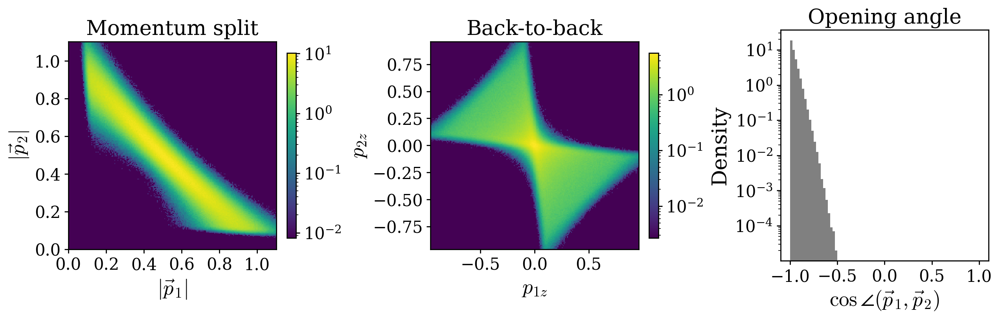

## Evaluation boxes

Five fixed test boxes target different probabilities and geometries. They were selected by
bisecting a scale against a large simulated pool; their final probabilities were independently
measured from ground-truth samples.

| box | target mass | measured mass | centre of $\vec p_1$ | half-widths | $\tau_{\mathcal B}$ |
| :--- | ---: | ---: | :--- | :--- | ---: |
| small_offcentre | 0.5% | 0.501% | $(0.45,0.45,0.35)$ | $(0.153,0.153,0.153)$ | 0.461 |
| thin_slab | 2% | 1.996% | $(0,0,0)$ | $(0.139,0.139,0.035)$ | 1.055 |
| offcentre_cube | 5% | 4.997% | $(-0.35,0.25,-0.20)$ | $(0.232,0.232,0.232)$ | 0.848 |
| elongated | 10% | 10.018% | $(0.30,0,0)$ | $(0.395,0.132,0.132)$ | 1.028 |
| bulk_cube | 30% | 30.012% | $(0,0,0)$ | $(0.278,0.278,0.278)$ | 0.979 |

The panels below show three projections of the $\vec p_1$ distribution and the five box outlines.
In each panel a box is a two-dimensional projection: points can lie inside the drawn rectangle
but outside the box along the omitted axis.

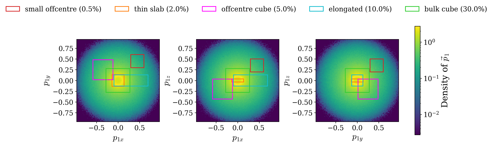

The boxes induce quite different $\vec p_2$ distributions. The top row compares
$\lVert\vec p_2\rVert$ for all events and in-box events. All five panels share one vertical
density scale, so their heights can be compared directly. The bottom row shows the in-box
$(p_{2x},p_{2z})$ density.

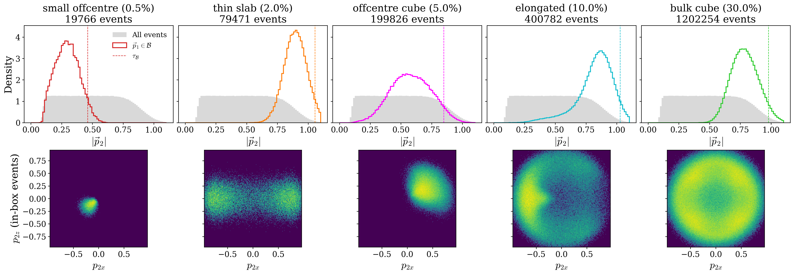

Ground-truth conditional means are listed below. Tail means vary slightly around
0.05 because the cutoff is estimated from a finite pool.

| box | $\mathbb E[\lVert\vec p_2\rVert]$ | $\mathbb E[p_{2z}]$ | tail probability |
| :--- | ---: | ---: | ---: |
| small_offcentre | 0.29728 | -0.13535 | 0.04950 |
| thin_slab | 0.89792 | 0.00000 | 0.04995 |
| offcentre_cube | 0.58085 | 0.19881 | 0.05011 |
| elongated | 0.82484 | 0.00006 | 0.05016 |
| bulk_cube | 0.78744 | 0.00001 | 0.05012 |

## Models and estimators

The conditional flow $q(\vec p_1,\vec p_2\mid\mathcal B)$ receives the box centre and the
logarithm of each half-width. A half-width is the distance from the box centre to a face; its
logarithm keeps the value positive when converted back and makes narrow and wide boxes easier
to represent on one numerical scale. The model is trained on simulator events conditioned to
lie inside the box. Its samples are not perfectly confined, so its measured leakage is reported. The unconstrained flow
$p_{\mathrm{uncon}}$ models the full six-dimensional target.

For a proposal sample $x\sim q$, the importance weight is

$$
w(x)=\frac{p(x)\,\mathbb 1[x_1\in\mathcal B]}{q(x\mid\mathcal B)}.
$$

The conditional expectation is estimated by the self-normalized ratio
$\sum_i w_i f_i/\sum_i w_i$. The average weight $N^{-1}\sum_i w_i$ independently estimates
$P(\mathcal B)$ and is a normalization check.

The seven reported estimators are:

| label | estimator | plain-language meaning |
| :--- | :--- | :--- |
| (a) | `q_raw` | Average over all $q$ samples, including samples that leaked outside the box. |
| (b) | `q_filtered` | Average over only the $q$ samples inside the box. |
| (c) | `is_learned` | IS using the learned unconstrained density $p_{\mathrm{uncon}}$. |
| (d) | `is_exact` | IS using the exact quadrature density; this is the density-corrected reference. |
| (e1) | `rej_equal_n` | Rejection sampling from $p_{\mathrm{uncon}}$ with the same number of draws. |
| (e2) | `rej_equal_time` | Rejection sampling with the number of draws adjusted to the same measured GPU time. |
| (e3) | `rej_equal_nfe` | Rejection sampling with the number of draws adjusted to the same number of network evaluations. |

For (d), each sample from the box flow gets a weight using the physics-based density calculated
by the $u$-quadrature, rather than the learned unconstrained flow. This corrects the box flow's
sampling errors using the reference density. It is a comparison standard for (c), not a claim
that the numerical quadrature has zero error.

In (e3), a “network evaluation” means one call to the neural network to calculate its velocity
at a solver step. An ODE solver may call the network several times per step, so NFE (“number of
function evaluations”) counts actual calls, not just the number of steps. Equal NFE compares
methods at roughly equal neural-network compute, even when their number of generated samples
differs.

Methods (a) and (b) test the conditional flow without density correction. Methods (c) and (d)
test importance sampling with learned and quadrature densities, respectively. Rejection is
included as a direct baseline and is necessarily wasteful for small boxes.

## Training and evaluation

Both flows use a CondOT flow-matching objective, standard-normal prior, hidden width 1024,
three residual blocks, batch size 4096, Adam with learning rate $10^{-3}$ and cosine decay to
$10^{-5}$. The conditional model trained for 100,000 steps; the unconstrained model trained
for 500,000 steps. Both use global gradient clipping at 1.0 and EMA weights (decay 0.9999)
for evaluation.

| run | run id | steps | diagnostic |
| :--- | :--- | ---: | :--- |
| unconstrained flow | `decay6d_uncon-cb36fa75` | 500,000 | $D_{KL}(p\Vert p_{uncon})=0.00043\pm0.00062$ |
| box-conditioned flow | `decay6d_box-cdea812c` | 100,000 | mean in-box rate 98.74%; range 97.64%–99.52% |
| box benchmark | `decay6d_boxes-519394b0` | — | fixed boxes and ground truth |
| final evaluation | `decay6d_is-f07211bc` | — | 20 repetitions at each $N\in\{10^3,10^4,10^5\}$ |

Each box proposal has two million $q$ samples across four shards. Rejection uses 80 million
unconstrained draws in total. The probability-flow ODE uses adaptive dopri5 in float64 with
exact divergence for density evaluation, absolute and relative tolerances $10^{-5}$, and a
max-over-batch error norm. A small number of underflowing trajectories are isolated and retried
with 10,000 fixed RK4 steps; fallback counts are included in the evaluation metrics. The final
run used fallback for 12 of 10 million box-proposal trajectories, 20 backward-density solves
(8 in-box), and 60 of 80 million unconstrained draws.

The simulator and density checks passed before the full run: analytic moment errors were below
$3.7\times10^{-4}$ relative, changing the quadrature resolution four-fold changed its result by
$1.3\times10^{-4}$, the PIT/KS statistic was 0.0056 versus a 0.0096 critical value, and
$\mathbb E_g[p/g]=0.9996\pm0.0006$.

The first 100,000-step unconstrained training was not reliable: a large loss spike occurred
near step 20,000, and its final KL was 0.083. With clipping, EMA, and 500,000 steps, the final
KL fell to 0.00043. The box model also improved, from 96.6% average in-box rate to 98.7%.

## Results

### Accuracy at $N=100{,}000$

The table gives the median RMSE across the five boxes, in physical momentum units (tail
probability RMSE is unitless). The `q_raw` median conceals an extreme outlier and is qualified
below; do not interpret it as uniformly reliable.

| estimator | $\lVert\vec p_2\rVert$ RMSE | $p_{2z}$ RMSE | tail RMSE |
| :--- | ---: | ---: | ---: |
| (a) raw $q$ | 0.00080* | 0.00175* | 0.00082 |
| (b) filtered $q$ | 0.00097 | 0.00161 | 0.00086 |
| (c) learned-$p$ IS | 0.00045 | 0.00097 | 0.00087 |
| (d) exact-$p$ IS | 0.00041 | 0.00075 | 0.00086 |
| (e1) rejection, equal $N$ | 0.00218 | 0.00373 | 0.00360 |
| (e2) rejection, equal time | 0.00048 | 0.00091 | 0.00080 |
| (e3) rejection, equal NFE | 0.00135 | 0.00267 | 0.00210 |

*For raw $q$, the elongated-box RMSE is $6.25\times10^{124}$ for $|\vec p_2|$ and
$5.39\times10^{124}$ for $p_{2z}$. One sample in that box required the RK4 fallback; its
extreme value dominates the ordinary averages. The median shown above is across five boxes and
therefore hides the failure. The filtered estimator removes leaked samples and has ordinary
errors in every box.*

The per-observable error curves show how errors change with sample budget. Exact and learned IS
track one another closely; rejection improves as its draw budget grows, but is much noisier at
equal $N$.

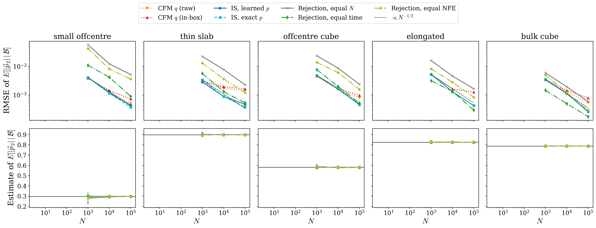

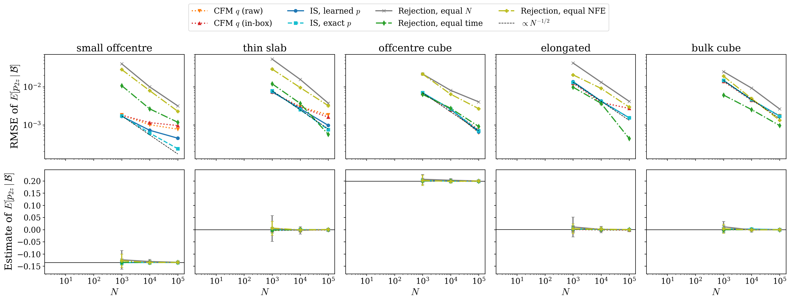

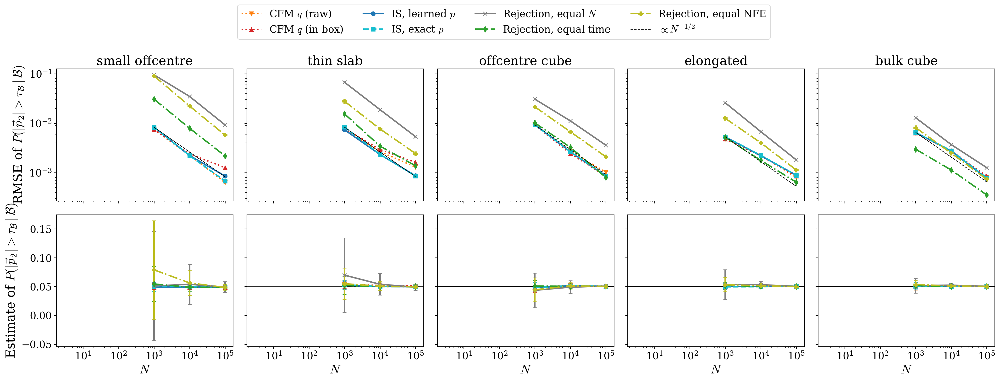

ESS (“effective sample size”) summarizes how evenly the importance weight is spread. Its
formula is $\mathrm{ESS}=(\sum_i w_i)^2/\sum_i w_i^2$. If all weights are equal, ESS equals the
sample count $N$; if a few samples carry nearly all the weight, ESS is much smaller. The plots
show ESS divided by $N$, so values near 1 are healthy and values near 0 indicate that many draws
contribute little useful information.

In `weight_histograms`, each panel shows the distribution of normalized weights for one box.
The horizontal axis is the weight divided by the average in-box weight, on a log scale: zero
means “average weight,” values to the right are heavier-than-average samples, and values to the
left are lighter. A narrow shape near zero means weights are similar; a long right tail means
some samples dominate. The vertical axis is histogram density, shown on a log scale so the
rare heavy weights remain visible.

At $N=100{,}000$, the learned and exact IS estimates of $P(\mathcal B)$ agree with each other
and the benchmark mass to within about 0.2% relative error in every box. Their effective
sample-size fractions are 0.929–0.979 for learned IS and 0.931–0.981 for exact IS. The high,
nearly identical ESS indicates that the box proposal and unconstrained density now match well
on the tested support.

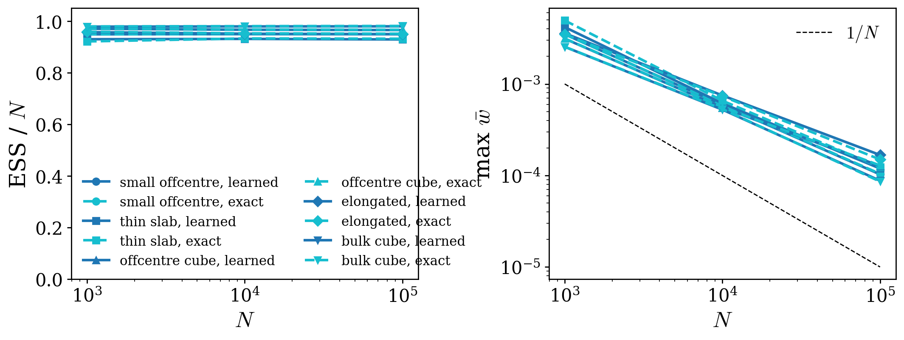

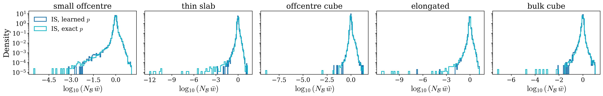

Cost ratios use median per-chunk timings so an occasional solver retry does not dominate the
comparison. Across boxes, IS costs 14.1–19.4 times as much wall-clock time per proposal sample
as unconstrained rejection draws, and 2.1–2.9 times as many network evaluations. At equal
sample count, IS is substantially more accurate than rejection. At equal wall time, rejection
is competitive and is slightly better on the median $|\vec p_2|$ RMSE; therefore the result
does not show a universal wall-clock advantage for IS at these model sizes.

### Marginal distributions

Each panel compares the ground truth, the raw $q$ samples, and the same $q$ samples reweighted
with learned or exact $p$. The density maps make the conditional shape differences visible.
The plotting range is centered on the ground-truth quantiles, so the extreme raw-$q$ fallback
sample is not visible in the elongated marginal; use the RMSE warning above when reading it.

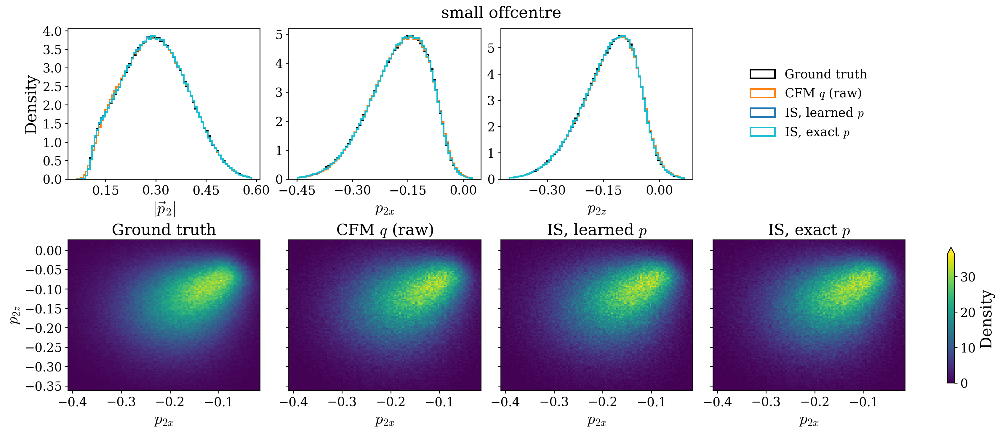

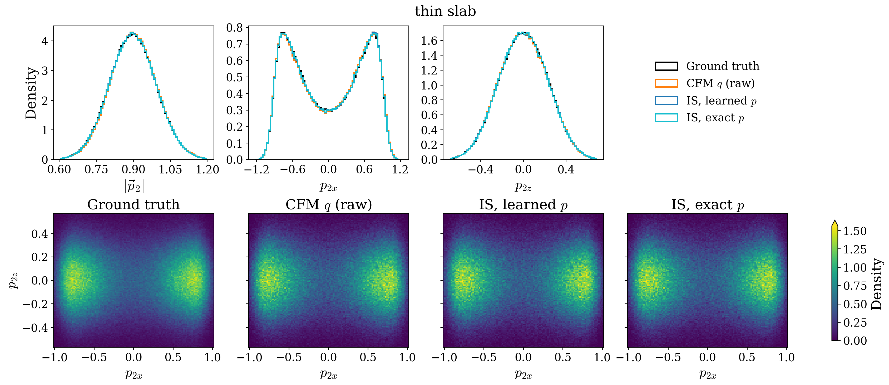

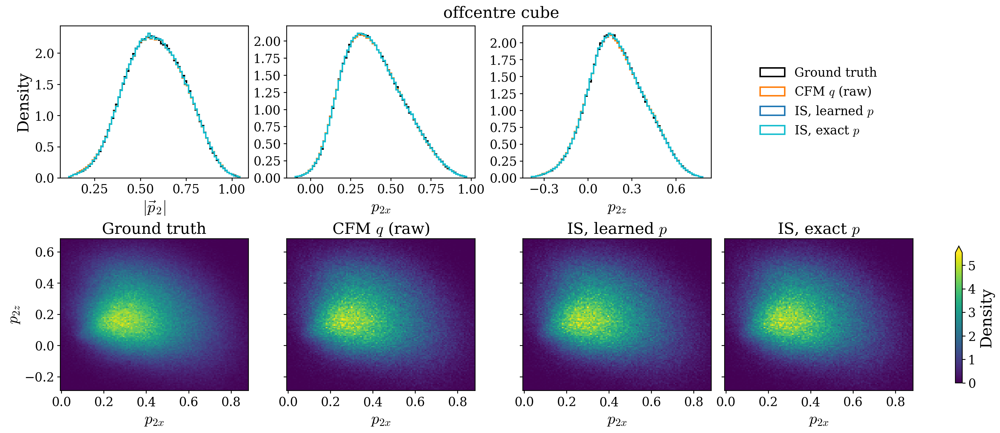

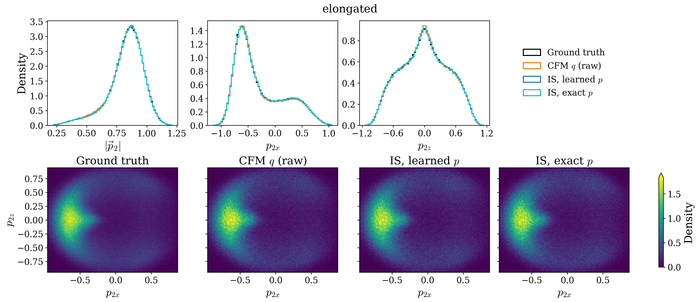

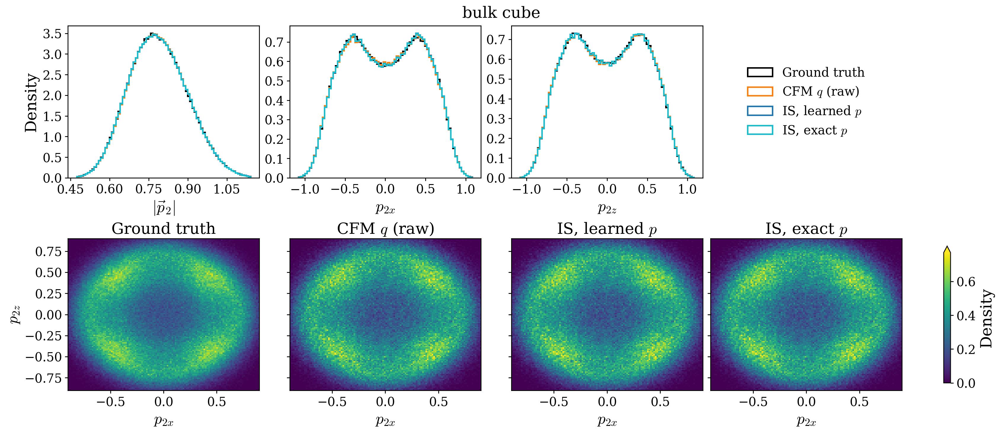

## Interpretation and limitations

1. **Importance sampling is validated.** Exact-density IS recovers the reference observables,
   gets box mass right, and has stable weights. Learned-density IS is nearly indistinguishable
   from exact-density IS after retraining.
2. **The unconstrained flow was the original bottleneck.** The first model had KL 0.083 and
   badly misestimated the thin-slab and elongated box masses. Retraining reduced KL to 0.00043;
   learned IS now gives accurate box masses and observable means.
3. **The conditional proposal is accurate but not numerically flawless.** Leakage is only
   0.22%–1.76%, and filtering it gives stable direct estimates. However, rare adaptive-solver
   underflows require fixed-step fallbacks. One fallback sample creates an astronomically large
   raw-$q$ estimate in the elongated box. That raw estimator and its plotted range should not be
   used as evidence of sampler quality until the fallback trajectory is made stable or its
   contribution is otherwise validated.
4. **The efficiency result depends on the budget.** IS clearly beats rejection at equal $N$;
   at equal wall time, rejection is comparable because an unconstrained sample is much cheaper.
   The current experiment establishes accuracy and sample-efficiency, not a blanket runtime win.

## Reproduction and artifacts

All jobs ran on the DLC2 cluster in the local PyTorch container. Final successful jobs were:

| stage | job |
| :--- | ---: |
| simulator/density validation | 274833 |
| build full evaluation boxes | 274870 |
| train unconstrained flow (500k) | 274973 |
| train box-conditioned flow (100k) | 274981 |
| dataset overview figures | 274972 |
| evaluation retry array | 275140 |
| merge metrics and result figures | 275141 |

The evaluation retry was needed because the first adaptive-solver recovery only handled
backward density solves; forward conditional sampling and unconstrained sampling also
underflowed. The 19 affected tasks were rerun with sample isolation, while successful shards
were reused. A subsequent merge compatibility issue with the older shard format was fixed
before the final successful merge.

From the project root, the main commands are:

```bash
sbatch scripts/run_decay6d_check.sh
sbatch scripts/run_decay6d_boxes.sh
sbatch scripts/run_decay6d_train.sh --mode uncon --iterations 500000
sbatch scripts/run_decay6d_train.sh --mode box
sbatch --dependency=afterok:<boxes>:<uncon>:<box> scripts/run_decay6d_eval.sh
sbatch --dependency=afterok:<eval> scripts/run_decay6d_merge.sh
sbatch scripts/run_decay6d_dataset.sh
```

The final metrics are in [`baselines/decay6d_is/eval/metrics.json`](baselines/decay6d_is/eval/metrics.json),
with run configuration and provenance beside them. Benchmark box definitions and ground-truth
means are in [`baselines/decay6d_is/benchmark/boxes.json`](baselines/decay6d_is/benchmark/boxes.json).
The earlier 100k unconstrained-model comparison is retained in
[`baselines/decay6d_is/eval_v1_uncon100k/metrics.json`](baselines/decay6d_is/eval_v1_uncon100k/metrics.json),
and the corresponding plots are in `images/thesis_pool/decay6d_is/v1_uncon100k/`.

Intermediate per-task shards and model checkpoints are intentionally not part of this report;
the aggregate metrics, run metadata, plotting manifests, and final figures are the committed
results.