# Functa-Conditioned Constrained Flow Matching

The [main README](README.md) constrains generative trajectories with constraints the network is *told* explicitly: a bounding box is four numbers, a polynomial curve is a coefficient matrix, and the model additionally receives the exact algebraic distance $P(x_t)$ at every ODE step.

This part asks a harder question: **can the constraint be carried by a learned latent code instead of its explicit parameters?** The generative model never sees the polynomial. It sees only a 512-dimensional vector $z$ produced by a neural field that has encoded the constraint region, and must route probability mass into a region it can only infer from that code.

This matters because most real constraints have no compact parametric form. If a flow matcher can be conditioned on a *representation* of a region rather than its equation, the same machinery extends to constraints given as masks, point clouds, or measurements.

## Table of Contents
1. [Overview](#overview)
2. [Part I — The Functa Encoder (Modulated SIREN + CAVIA)](#part-i--the-functa-encoder-modulated-siren--cavia)
3. [Part II — The Functa-Conditioned Flow Matcher](#part-ii--the-functa-conditioned-flow-matcher)
4. [Results](#results)
5. [Showcase: Unseen Constraints](#showcase-unseen-constraints)
6. [Technical Takeaways](#technical-takeaways)
7. [Appendix: Development Notes](#appendix-development-notes)

---

## Overview

The system is two frozen-then-composed stages:

```
polynomial P  ──►  1000 query points (x, tanh(P(x)))  ──►  [CAVIA inner loop]  ──►  z ∈ R^512
                                                                                     │
                        Gaussian prior  ──►  [Flow Matching ODE, v_t(x_t, t, z)]  ◄───┘
                                                          │
                                                          ▼
                                        samples from the GMM truncated to {P(x) ≤ 0}
```

* **Stage 1 (encoder).** A modulated SIREN is meta-trained so that *any* constraint region can be compressed into a latent $z$ by a short gradient-descent loop. The region is recovered as the zero level set $\{\,\mathrm{SIREN}(x, z) \le 0\,\}$.
* **Stage 2 (generator).** A flow matcher is trained to transport a Gaussian prior onto the 4-peak GMM **truncated to the region described by $z$**. The SIREN is frozen throughout; only $z$ crosses between the stages.

Target distribution and constraint family are unchanged from the main README: a 4-peak GMM over $[-4.5, 4.5]^2$, and degree-3 polynomial constraints $P(x) \le 0$ rejection-sampled to bound a healthy valid area (5%–95%).

---

## Part I — The Functa Encoder (Modulated SIREN + CAVIA)

### Architecture

A **Modulated SIREN** represents the constraint as a continuous field $f_\theta(x, z) \approx \tanh(P(x))$, so the constraint boundary is the zero level set and the sign carries the inside/outside decision.

| component | value |
| :--- | :--- |
| Input | 2D coordinate $x$, normalized to $[-1, 1]$ |
| Hidden | 4 sine layers, width 512, $w_0 = 30$ |
| Latent | $z \in \mathbb{R}^{512}$ |
| Modulation | FiLM: a single linear map $z \mapsto (\gamma_i, \beta_i)$ per layer |
| Output | $\tanh(\cdot)$, matching the $\tanh(P(x)) \in (-1, 1)$ targets |

Each hidden layer computes $h \leftarrow \sin\!\big(w_0\,[(1 + \gamma_i)\,W_i h + \beta_i]\big)$. The FiLM projection is zero-initialized, so $z = 0$ is exactly the unmodulated SIREN — the natural starting point for adaptation.

Regressing $\tanh(P)$ rather than a binary mask keeps the target smooth and bounded, gives the field a usable gradient away from the boundary, and preserves the signed-distance-like structure the flow matcher exploits downstream.

### Meta-Training (CAVIA)

Only the latent is adapted per constraint; the SIREN weights are shared across all of them. This is the CAVIA split — *context* parameters adapt, *base* parameters generalize — which keeps test-time encoding to a handful of gradient steps and guarantees every constraint lands in one common latent space.

For each task (one polynomial):

1. **Inner loop.** Start at $z = 0$, take **15 plain SGD steps** on the MSE between $f_\theta(x, z)$ and $\tanh(P(x))$ over 1000 query points.
2. **Outer loop.** Backpropagate the post-adaptation loss *through* the inner loop into $\theta$.

| hyperparameter | value |
| :--- | :--- |
| Tasks per batch / query points per task | 16 / 1000 |
| Inner steps, inner lr | 15, $10^{-2}$ (per-shape step $6.25\times10^{-4}$) |
| Outer optimizer | Adam, lr $10^{-4}$, grad-norm clip 1.0 |
| Latent regularization | $\lambda_z \lVert z \rVert^2$, $\lambda_z = 10^{-4}$ |
| Schedule | 400 steps/epoch, early stopping (patience 250) |
| Selected checkpoint | epoch 700, meta-validation MSE **0.00346** |

Because the outer loop optimizes the loss *after exactly 15 inner steps*, the meta-learned initialization is only optimal at the step size it trained with. Test-time extraction therefore replays the identical inner loop, and the deployed step size must match the meta-training one exactly.

### Encoder Results

Reconstructions of held-out polynomials from their extracted latents. The decoded zero level set tracks the true curve across widely varying region shapes and areas.

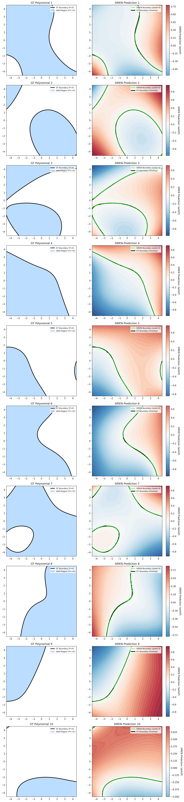

Interpolating linearly between two latents produces a continuous family of valid constraint regions, indicating the latent space is smooth rather than a lookup table — the property the flow matcher needs in order to generalize across conditions.

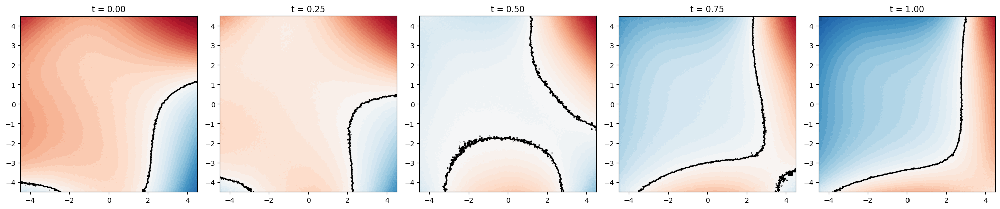

On the 100-constraint validation benchmark, extraction reaches **0.976 mean mass-weighted region IoU** (worst-5%: 0.940) with a final extraction MSE of $4\times10^{-5}$.

---

## Part II — The Functa-Conditioned Flow Matcher

### Architecture

`ConstrainedFlowMatcher` predicts the velocity field $v_t(x) = f(x_t, t, z)$ — **19.05M trainable parameters**.

| component | value |
| :--- | :--- |
| Time embedding | Sinusoidal, 128-dim |
| Backbone | 4 residual blocks, width 1024 |
| Conditioning | AdaGN: $(t_{\text{emb}} \oplus z) \rightarrow$ MLP $\rightarrow (\gamma, \beta)$ per block |
| Direct path | $z$ also concatenated straight into the input projection |
| Pointwise feature | frozen $\mathrm{SIREN}(x_t, z)$ appended to the input coordinates |

Two design points matter:

* **$z$ enters twice.** It modulates every AdaGN block *and* is concatenated directly into the input. Routing a rich 512-dim latent through modulation alone converged to a visibly worse solution; the direct path mirrors how the coefficient-conditioned model consumes its constraint.
* **The SIREN feature is the learned analogue of $P(x_t)$.** The main README's polynomial model is handed the exact algebraic distance at every integration step. Here that scalar is replaced by the frozen encoder's own prediction $\mathrm{SIREN}(x_t, z)$, giving the network continuous boundary awareness without ever revealing the true constraint.

### Training

Standard conditional flow matching: a CondOT affine probability path between a Gaussian prior and the GMM target, regressing the conditional velocity.

$$\mathcal{L} = \mathbb{E}_{t, x_0, x_1, z}\left[\; w \left\lVert v_\theta(x_t, t, z) - \dot{x}_t \right\rVert^2 \;\right]$$

| hyperparameter | value |
| :--- | :--- |
| Iterations / batch size | 15,001 / 1024 |
| Optimizer | Adam, lr $10^{-3}$, cosine annealing to $10^{-5}$ |
| Wall-clock | ~2.3 min on one GPU (plus ~9 min one-time pool build) |

**The conditioning pool.** Extracting a latent inside the training loop would dominate runtime, so 100,000 rejection-sampled polynomials are encoded once, offline. Two tricks make this cheap and unbiased:

* **Orientation flip.** Since $\tanh(-P) = -\tanh(P)$, the flipped region's regression targets are just the negated ones, so a single pass yields both $z_{\text{pos}}$ (for $C$) and $z_{\text{neg}}$ (for $-C$). Every polynomial thus contributes its region *and* its complement.
* **Constraint-consistent pairing.** For each target sample $x_1$, a random pool entry is drawn and the orientation that actually *contains* $x_1$ is selected. This guarantees $P(x_1) \le 0$ by construction with zero SIREN calls at train time, and makes each oriented constraint appear with probability proportional to its valid mass. An optional $\text{mass}^{-\text{power}}$ importance weight can equalize that exposure; it changes only the marginal over constraints, leaving $p(x_1 \mid C)$ exactly the truncated target.

### Evaluation Protocol

All numbers below come from a **frozen benchmark of 100 polynomials** never used in training, with **10,000 samples each**, integrated with a midpoint solver at step size 0.05. Latents are re-extracted from scratch for every evaluation, so the reported figures include encoder error rather than hiding it.

---

## Results

### Quantitative

| Metric | Median | Mean | Worst 5% | Target |
| :--- | ---: | ---: | ---: | :--- |
| **Success Rate (%)** | 97.69 | 95.98 | 86.79 | *Higher is better* |
| **Sliced Wasserstein (SWD)** | 0.0797 | 0.1141 | 0.3167 | *Lower is better* |
| **Mean Discrepancy (MMD)** | 0.0009 | 0.0029 | 0.0053 | *Lower is better* |
| **Jensen-Shannon (JSD)** | 0.0055 | 0.0097 | 0.0279 | *Lower is better* |

Against the explicitly-conditioned polynomial model from the [main README](README.md#algebraic-constraints-polynomials), which receives the true coefficients *and* the exact $P(x_t)$:

| Metric (median) | Coefficient-conditioned | **Functa-conditioned** |
| :--- | ---: | ---: |
| Success Rate (%) | 98.24 | 97.69 |
| SWD | 0.0822 | **0.0797** |
| JSD | 0.0048 | 0.0055 |

**Distributional quality reaches parity** — SWD is marginally better, JSD marginally worse — while the constraint is delivered only as a latent code. The remaining gap is in the tail: worst-5% success rate is 86.79 versus 93.48, concentrated on constraints with small valid mass.

### Where the residual error lives

Scoring the samples twice — once against the true constraint, once against the region the SIREN actually decodes from $z$ — separates *"the flow matcher disobeys its conditioning"* from *"the conditioning describes the wrong region"*:

| quantity | value | reading |
| :--- | ---: | :--- |
| samples inside the decoded region | 97.78% | the flow matcher obeys what it is told |
| encoder ceiling (perfect fill of decoded region) | 98.70% | the encoder is no longer the limit |
| achieved success rate | 95.98% | ~2.7 pts remain on the generator |
| encoder-ceiling SWD vs achieved SWD | 0.0202 vs 0.0788 | most distributional error is generator-side |

Correlation of per-constraint success with decoded-region IoU is $+0.76$, and with constraint mass $+0.51$: the hardest cases are small regions, where a fixed sample budget resolves a thin target and any boundary error costs proportionally more.

### Qualitative

Across the constraint family the model produces the *correct distribution*, not merely admissible points: the four GMM modes keep their relative weights, covariance bridges stay intact, and density terminates abruptly at the boundary instead of smearing across it. Trajectories converge cleanly — samples are not pushed to the boundary and clipped, but routed into the valid region during integration. Disconnected regions are handled without collapsing onto a single component. The visible failure mode is not geometric but **allocative**: on low-mass or multi-component constraints the boundary is respected while the *mass split between components* drifts, which is exactly what the SWD tail measures.

---

## Showcase: Unseen Constraints

Freshly sampled polynomials, drawn with a seed disjoint from both the training pool and the validation benchmark (verified minimum coefficient distance 0.29 from any benchmark shape). For each: generated samples with the constraint overlaid, and the model's **exact** likelihood, normalized against the truncated GMM's peak density.

| # | Success rate (%) | SWD | MMD | JSD | constraint mass | decoded mass IoU |
| :--- | ---: | ---: | ---: | ---: | ---: | ---: |
| 1 | 99.38 | 0.0423 | 0.00049 | 0.0013 | 0.878 | 0.995 |
| 2 | 99.08 | 0.0376 | 0.00031 | 0.0015 | 0.836 | 0.993 |
| 3 | 93.63 | 0.4115 | 0.00537 | 0.0104 | 0.279 | 0.963 |
| 4 | 98.71 | 0.0404 | 0.00040 | 0.0018 | 0.852 | 0.993 |
| 5 | 95.05 | 0.0927 | 0.00252 | 0.0074 | 0.104 | 0.960 |
| 6 | 97.65 | 0.0583 | 0.00091 | 0.0028 | 0.676 | 0.986 |

**Example 1** — large region, near-perfect adherence; the likelihood map reproduces all four modes with a clean cut along the curve.
<p align="center">
  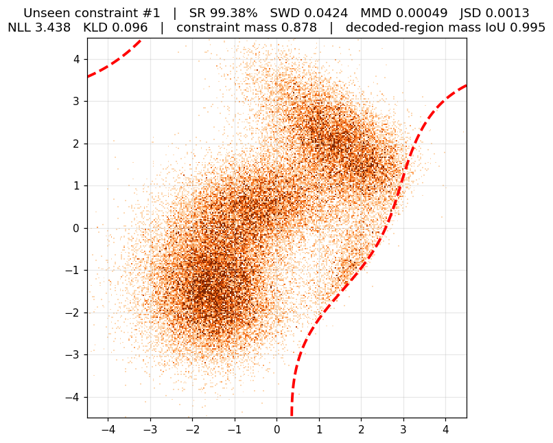
  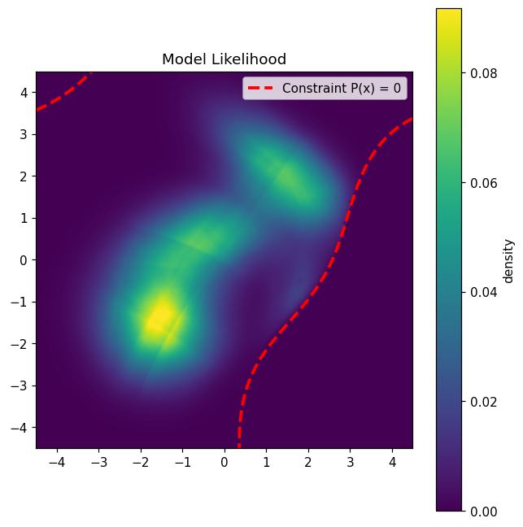
</p>

**Example 2** — a curve slicing through the overlapping covariance bridge; density is redirected without breaking the target topology.
<p align="center">
  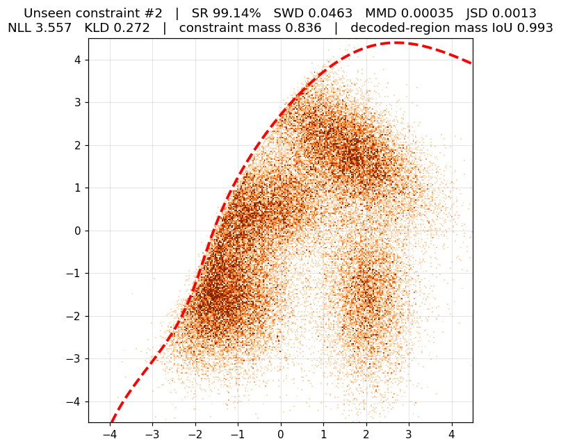
  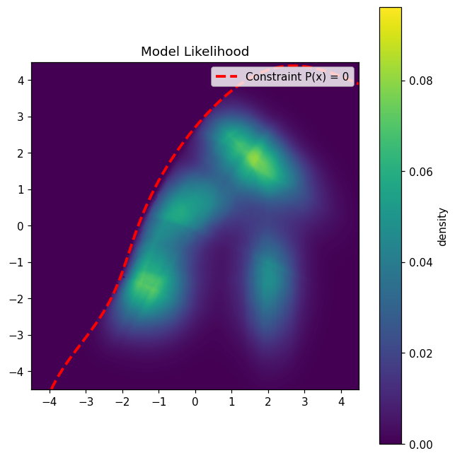
</p>

**Example 3** — the hard case: a low-mass (0.279) *disconnected* region. Both components are populated and the boundary is respected (SR 93.63%, IoU 0.963), but the mass ratio between components is off, which is what drives the SWD of 0.41.
<p align="center">
  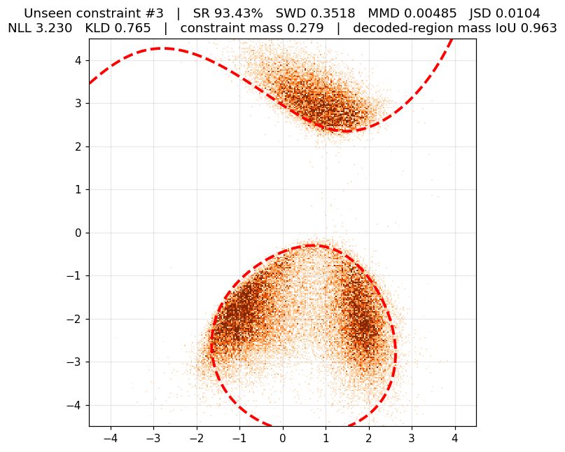
  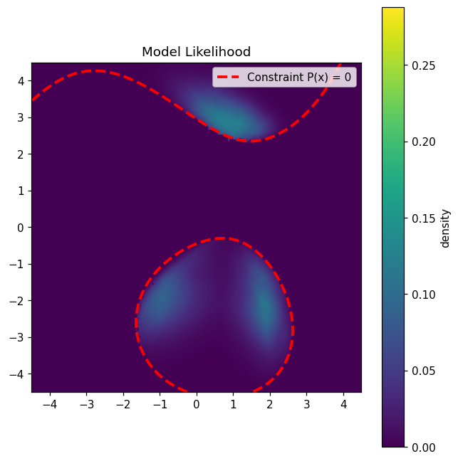
</p>

**Example 4** — a curved boundary cutting two modes; the density gradient is preserved right up to the cutoff.
<p align="center">
  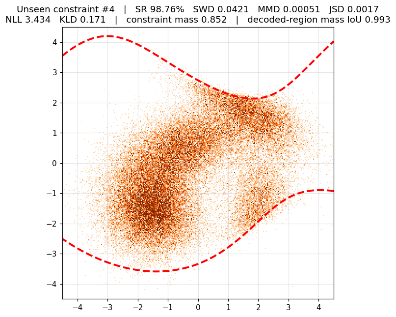
  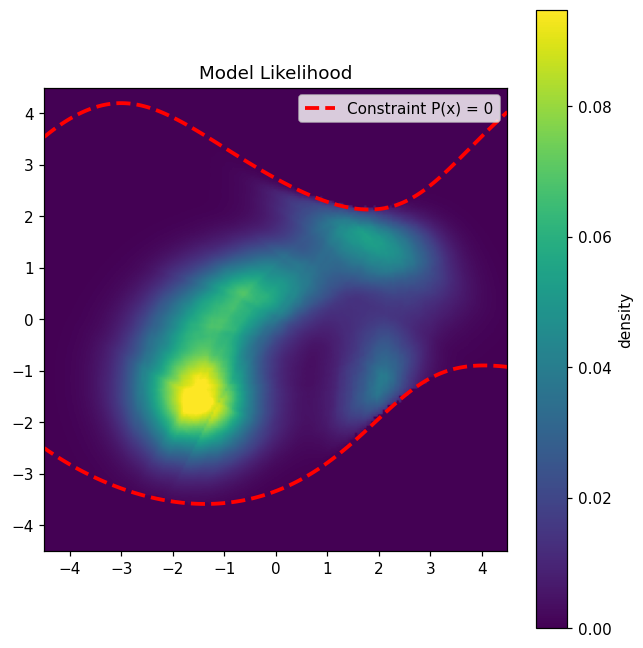
</p>

**Example 5** — the smallest region shown (mass 0.104), isolating a single mode's flank; the model concentrates almost all mass correctly (SR 95.05%).
<p align="center">
  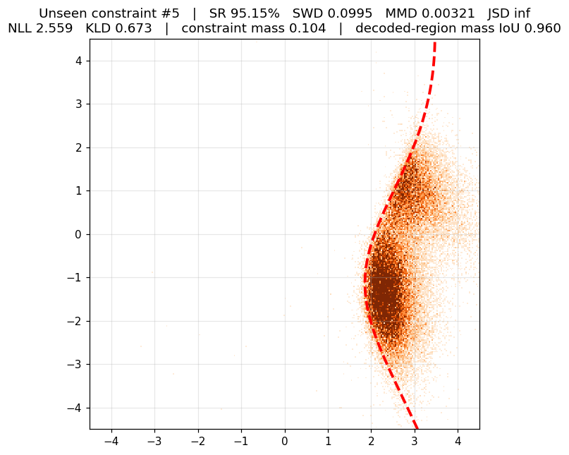
  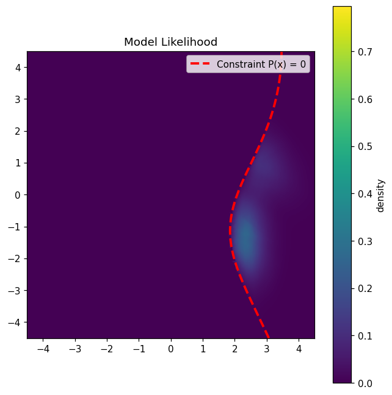
</p>

**Example 6** — an S-shaped boundary; the flow tracks a non-convex curve without leaking across it.
<p align="center">
  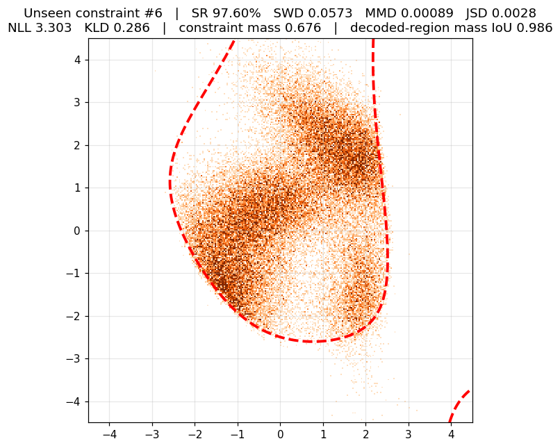
  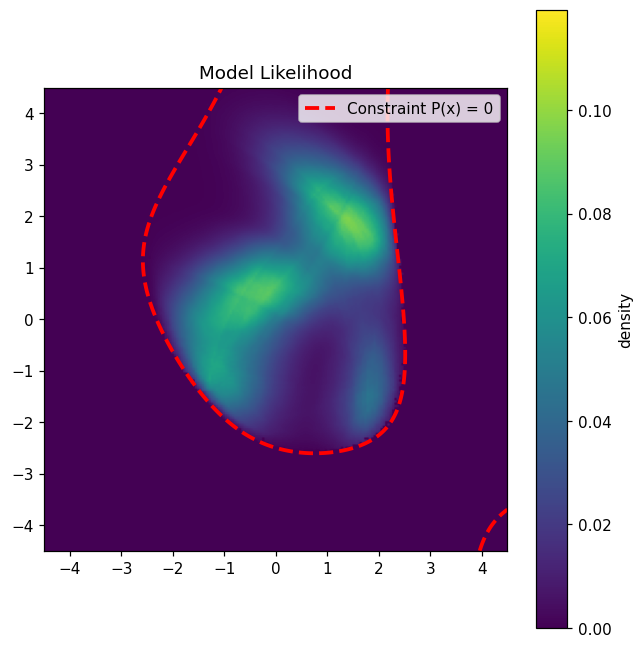
</p>

---

## Technical Takeaways

* **A constraint can be delivered as a latent instead of as parameters.** Conditioning on a 512-dim functa code matches the explicitly-conditioned model on distributional metrics (SWD 0.0797 vs 0.0822), despite never seeing the polynomial.
* **The pointwise field feature is the key ingredient.** Replacing the exact $P(x_t)$ with the frozen encoder's own $\mathrm{SIREN}(x_t, z)$ preserves per-step boundary awareness, which is what lets a latent-conditioned model compete with a parameter-conditioned one.
* **The flow matcher is robust to imperfect conditioning.** Trained on (latent, true region) pairs it learns $p(\text{region} \mid z)$ rather than blindly filling the decoded level set — measurably correcting encoder error rather than inheriting it.
* **Encoding fidelity, not generator capacity, set the ceiling** for most of this work; once extraction was correct, the bottleneck moved to the generator and the remaining error became allocative.
* **Natural next step:** the residual tail is a *mass-allocation* problem on low-mass and multi-component regions — the same problem the main README solves for disjoint bounding boxes with an auxiliary Area Mass Predictor.

---

## Appendix: Development Notes

Condensed record of the issues that shaped the final configuration.

* **Notebook → script pipeline.** Monolithic notebooks were replaced by a 4-stage pipeline (config → pool → train → eval) with YAML+dataclass configs and fingerprinted run IDs, so every reported number is reproducible and re-evaluation never forks a run. The notebook is now report-only.
* **Query-distribution coupling.** Extraction query points must be drawn from the same distribution the SIREN was meta-trained on; a config field controlling this was silently ignored on one code path, degrading latents.
* **Checkpoint provenance.** A reused `siren_best.pt` filename caused a silent encoder swap and a large unexplained regression. Checkpoints are now named by training protocol with their SHA-256 recorded in each run's fingerprint.
* **CAVIA step-size bug (largest single win).** The inner-loop loss was mean-reduced over *(batch × points)*, making the per-shape gradient step depend on the extraction chunk size — deployment used chunks of 128 against a meta-training batch of 16, i.e. an **8× too small step** for the same 15 steps. Fixing the reduction to be chunk-invariant raised worst-5% region IoU from 0.66 to 0.93 and cut extraction MSE 58×, with no retraining.
* **A misleading diagnostic.** An earlier probe concluded the SIREN was capacity-limited; it ran extraction at batch 1, i.e. a 16× *too large* step, and its oscillating output was divergence rather than a capacity ceiling. The capacity conclusion was wrong.
* **Flow-matcher ablations were near-null.** Mass-reweighting power and the pointwise SIREN feature moved median success rate by under ~1 point, while encoder-side changes moved it by 7+ — conditioning quality dominated throughout.
* **Attribution tooling.** A believed-region vs. true-region diagnostic was added to attribute error between encoder and generator; it is what establishes that the bottleneck has now moved to the flow matcher.
