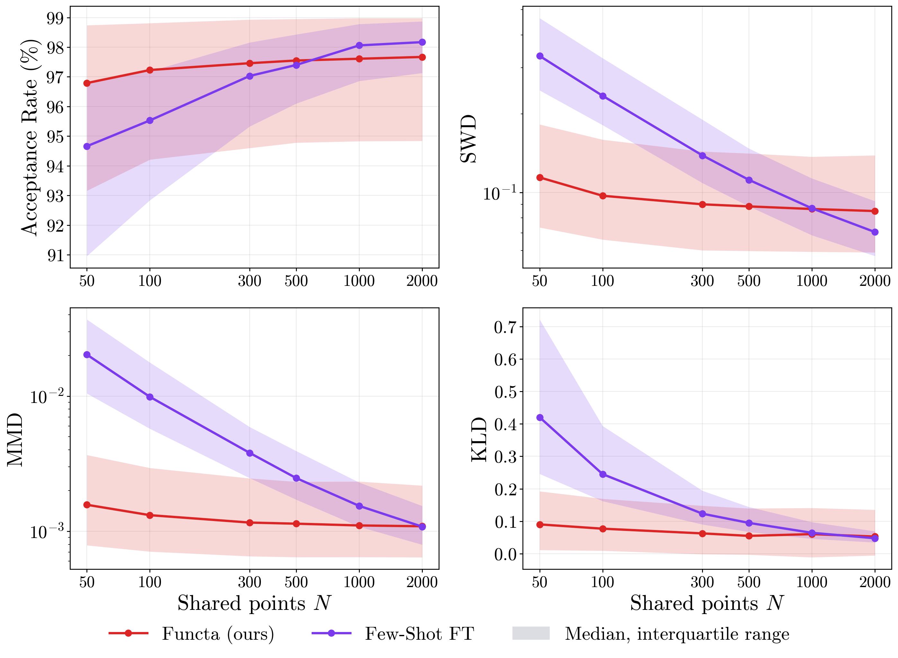

# Shared budget: Functa vs fine-tuned few-shot

Each constraint gets a single draw of 2000 points from the target GMM. Budget $N$ uses the first $N$ of them, so a smaller budget is always a subset of a larger one. **Functa** labels all $N$ points with $\tanh P(x)$, runs CAVIA with the frozen uniform-query SIREN to get a latent, and samples from the implicit conditional FM. **FS-FT** fine-tunes the base FM only on the $N_{\mathrm{in}}$ points that satisfy the constraint (lr 1e-4, patience 12, early stopping on 10k held-out inside points).

Evaluation uses the v1k set. Medians are over the 917/1000 constraints that have at least 5 inside points at $N{=}50$. Run `shared_budget_v1k-d0c34cd1`.

| $N$ | $N_{\mathrm{in}}$ | AR % (Functa / FS-FT) | SWD | MMD | KLD |
|---|---|---|---|---|---|
| 50 | 27 | **96.8** / 94.7 | **0.114** / 0.333 | **0.0016** / 0.0203 | **0.090** / 0.420 |
| 100 | 54 | **97.2** / 95.5 | **0.097** / 0.234 | **0.0013** / 0.0099 | **0.077** / 0.245 |
| 300 | 162 | **97.5** / 97.0 | **0.090** / 0.139 | **0.0012** / 0.0038 | **0.063** / 0.123 |
| 500 | 269 | **97.6** / 97.4 | **0.089** / 0.112 | **0.0011** / 0.0025 | **0.055** / 0.095 |
| 1000 | 539 | 97.6 / **98.1** | **0.087** / 0.087 | **0.0011** / 0.0015 | **0.061** / 0.064 |
| 2000 | 1082 | 97.7 / **98.2** | 0.085 / **0.071** | 0.0011 / 0.0011 | 0.053 / **0.048** |

The paper version of this table is [tables/shared_budget.tex](tables/shared_budget.tex).



A version with 5th–95th percentile bands is at [shared_budget_curves_p5p95.png](images/thesis_pool/shared_budget/shared_budget_curves_p5p95.png).

## Conclusions
- **Small budgets ($N \le 500$):** Functa wins on every metric. At $N{=}50$ its SWD is about 3× lower, its MMD about 13× lower and its KLD about 4.6× lower than FS-FT's.
- **Large budgets:** FS-FT catches up around $N \approx 1000$ ($N_{\mathrm{in}} \approx 540$). It pulls ahead only at $N{=}2000$, and by a small margin.
- **Functa levels off:** its SWD only goes from 0.114 to 0.085 over the whole range. The likely cause is that queries are placed where the GMM has mass, while the SIREN was trained on uniform queries. With 1000 uniform queries (main table), Functa reaches SWD 0.071 and KLD 0.046, which is better than its own $N{=}2000$ GMM result.
- **FS-FT is an optimistic upper bound:** it early-stops on 10k held-out inside points. It is also undefined when no points fall inside the constraint (6/1000 constraints at $N{=}50$).

## Reproduce
```
sbatch scripts/run_shared_budget.sh
python3 -m constrained_fm.scripts.merge_val1k --outdir constrained_fm/baselines/shared_budget_v1k
python3 -m constrained_fm.scripts.table_shared_budget
sbatch scripts/run_shared_budget_plots.sh --spread iqr p5p95
```
