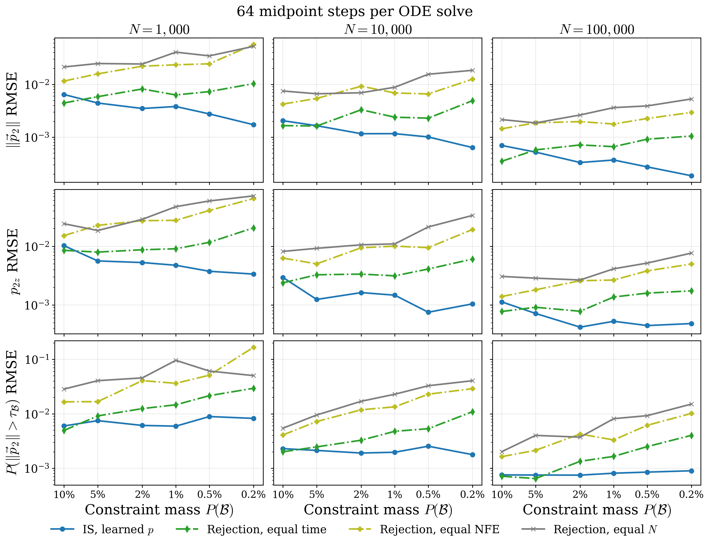
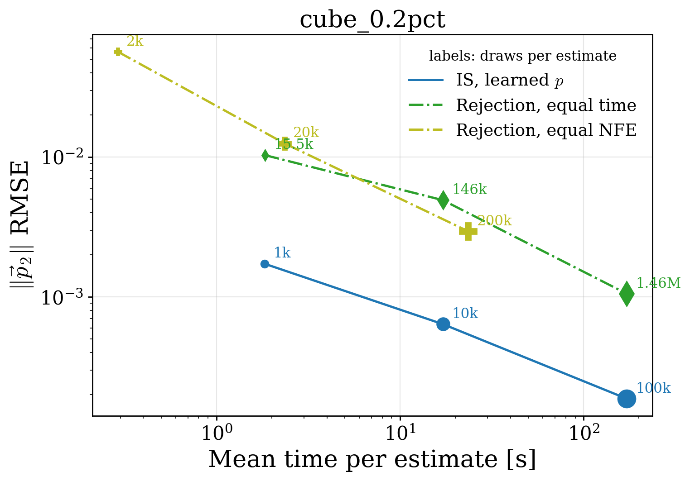

# Decay6D per-box accuracy and cost (64 midpoint steps)

Every ODE solve (q sampling with its log-density, the backward $p_{\rm uncon}$ density,
and $p_{\rm uncon}$ sampling for rejection) uses 64 fixed midpoint steps, i.e.
128 velocity calls per batch. Each box is one SLURM task on one GPU, and its IS
and rejection repetitions alternate in the same process.

Each box has one combined table. Its values are ordered by $N=1,000/10,000/100,000$, one value per line within each cell.
Each accuracy cell gives the standard deviation of absolute error across valid
repetitions; RMSE is computed across those repetitions. `valid reps` gives finite
estimates out of 20, ordered by observable (norm / z / tail) and then by N.
A rejection repetition with no accepted event has no estimate and is not valid.

Cost columns show means over repetitions. `q draws` is the number from the box-conditioned
proposal; `p_uncon draws` is the mean number from the unconstrained model. Samples used
are all proposals for raw $q$, in-box proposals for filtered $q$ and IS, and accepted
events for rejection. NFE counts velocity-network calls. Times are measured wall clock
for each repetition and include the estimator's own density work only.

Budgets are per repetition, not calibrated averages: `rej_equal_time` samples
$p_{\rm uncon}$ until the measured wall time of the same repetition's `is_learned` run is
used up, sizing its last batch from the measured batch-time curve so it does not overrun;
`rej_equal_nfe` draws batches of $\min(N, 10^4)$ until its velocity calls reach the
`is_learned` count, which is $2N$ draws; `rej_equal_n` draws exactly $N$.

#### Summary figures

RMSE against $P(\mathcal B)$; rows are $\Vert\vec p_2\Vert$, $p_{2z}$ and the tail
probability, columns are $N$. The mass axis is reversed, so boxes become rarer to the right.

cube_0.2pct error-cost frontier at IS budgets $N=1,000/10,000/100,000$, using mean time per estimate;
point labels give each estimator's own model draws per estimate.

#### cube_0.2pct: $P(\mathcal B)=0.0020$, GT events=2,029,315

| estimator | $q$ draws | $p_{\rm uncon}$ draws | density evals (learned/exact) | samples used (mean) | NFE (mean) | time [s] (mean) | valid reps (norm/z/tail per N) | $\lVert\vec p_2\rVert$ abs-error std | $\lVert\vec p_2\rVert$ RMSE | $p_{2z}$ abs-error std | $p_{2z}$ RMSE | tail abs-error std | tail RMSE |
| :--- | ---: | ---: | ---: | ---: | ---: | ---: | ---: | ---: | ---: | ---: | ---: | ---: | ---: |
| q_raw | 1,000 10,000 100,000 | 0 0 0 | 0 / 0 0 / 0 0 / 0 | 1,000 10,000 100,000 | 128 128 1,280 | 0.9 8.6 86.0 | 20 / 20 / 20 20 / 20 / 20 20 / 20 / 20 | 1.22e&#8209;03 4.67e&#8209;04 1.83e&#8209;04 | 1.83e&#8209;03 8.40e&#8209;04 3.84e&#8209;04 | 2.25e&#8209;03 6.15e&#8209;04 3.53e&#8209;04 | 3.33e&#8209;03 1.01e&#8209;03 6.96e&#8209;04 | 5.76e&#8209;03 1.61e&#8209;03 7.58e&#8209;04 | 9.50e&#8209;03 2.72e&#8209;03 1.56e&#8209;03 |
| q_filtered | 1,000 10,000 100,000 | 0 0 0 | 0 / 0 0 / 0 0 / 0 | 978 9,792 97,919 | 128 128 1,280 | 0.9 8.6 86.0 | 20 / 20 / 20 20 / 20 / 20 20 / 20 / 20 | 1.10e&#8209;03 4.58e&#8209;04 1.45e&#8209;04 | 1.81e&#8209;03 7.26e&#8209;04 2.69e&#8209;04 | 2.20e&#8209;03 6.56e&#8209;04 3.47e&#8209;04 | 3.28e&#8209;03 1.02e&#8209;03 6.56e&#8209;04 | 5.55e&#8209;03 1.22e&#8209;03 4.04e&#8209;04 | 9.13e&#8209;03 2.05e&#8209;03 8.19e&#8209;04 |
| is_learned | 1,000 10,000 100,000 | 0 0 0 | 1,000 / 0 10,000 / 0 100,000 / 0 | 978 9,792 97,919 | 256 256 2,560 | 1.8 17.2 171.8 | 20 / 20 / 20 20 / 20 / 20 20 / 20 / 20 | 1.01e&#8209;03 4.37e&#8209;04 9.81e&#8209;05 | 1.73e&#8209;03 6.39e&#8209;04 1.87e&#8209;04 | 2.31e&#8209;03 6.28e&#8209;04 2.74e&#8209;04 | 3.37e&#8209;03 1.05e&#8209;03 4.84e&#8209;04 | 5.13e&#8209;03 1.04e&#8209;03 5.27e&#8209;04 | 8.24e&#8209;03 1.78e&#8209;03 8.99e&#8209;04 |
| is_exact | 1,000 10,000 100,000 | 0 0 0 | 0 / 1,000 0 / 10,000 0 / 100,000 | 978 9,792 97,919 | 128 128 1,280 | 0.9 8.6 86.3 | 20 / 20 / 20 20 / 20 / 20 20 / 20 / 20 | 1.01e&#8209;03 4.52e&#8209;04 9.79e&#8209;05 | 1.77e&#8209;03 6.61e&#8209;04 1.86e&#8209;04 | 2.30e&#8209;03 5.69e&#8209;04 1.93e&#8209;04 | 3.33e&#8209;03 1.09e&#8209;03 4.02e&#8209;04 | 5.33e&#8209;03 1.16e&#8209;03 3.85e&#8209;04 | 8.57e&#8209;03 1.95e&#8209;03 7.42e&#8209;04 |
| rej_equal_n | 0 0 0 | 1,000 10,000 100,000 | 0 / 0 0 / 0 0 / 0 | 2 19 204 | 128 128 1,280 | 0.1 1.2 11.8 | 18 / 18 / 18 20 / 20 / 20 20 / 20 / 20 | 2.54e&#8209;02 1.01e&#8209;02 2.83e&#8209;03 | 5.23e&#8209;02 1.84e&#8209;02 5.30e&#8209;03 | 3.86e&#8209;02 1.64e&#8209;02 5.20e&#8209;03 | 7.21e&#8209;02 3.35e&#8209;02 7.67e&#8209;03 | 0.00e+00 2.39e&#8209;02 9.29e&#8209;03 | 5.04e&#8209;02 4.06e&#8209;02 1.51e&#8209;02 |
| rej_equal_time | 0 0 0 | 15,520 146,174 1,460,381 | 0 / 0 0 / 0 0 / 0 | 28 303 2,952 | 256 1,920 18,752 | 1.8 17.2 171.8 | 20 / 20 / 20 20 / 20 / 20 20 / 20 / 20 | 6.40e&#8209;03 2.75e&#8209;03 4.93e&#8209;04 | 1.03e&#8209;02 4.91e&#8209;03 1.05e&#8209;03 | 1.14e&#8209;02 3.71e&#8209;03 9.29e&#8209;04 | 2.06e&#8209;02 6.06e&#8209;03 1.74e&#8209;03 | 1.72e&#8209;02 5.25e&#8209;03 2.46e&#8209;03 | 2.95e&#8209;02 1.09e&#8209;02 4.02e&#8209;03 |
| rej_equal_nfe | 0 0 0 | 2,000 20,000 200,000 | 0 / 0 0 / 0 0 / 0 | 4 40 410 | 256 256 2,560 | 0.3 2.3 23.5 | 20 / 20 / 20 20 / 20 / 20 20 / 20 / 20 | 3.18e&#8209;02 6.46e&#8209;03 1.82e&#8209;03 | 5.67e&#8209;02 1.25e&#8209;02 2.95e&#8209;03 | 3.86e&#8209;02 1.18e&#8209;02 3.24e&#8209;03 | 6.50e&#8209;02 1.93e&#8209;02 5.00e&#8209;03 | 1.17e&#8209;01 1.72e&#8209;02 6.50e&#8209;03 | 1.67e&#8209;01 2.90e&#8209;02 1.02e&#8209;02 |

#### cube_0.5pct: $P(\mathcal B)=0.0050$, GT events=5,032,903

| estimator | $q$ draws | $p_{\rm uncon}$ draws | density evals (learned/exact) | samples used (mean) | NFE (mean) | time [s] (mean) | valid reps (norm/z/tail per N) | $\lVert\vec p_2\rVert$ abs-error std | $\lVert\vec p_2\rVert$ RMSE | $p_{2z}$ abs-error std | $p_{2z}$ RMSE | tail abs-error std | tail RMSE |
| :--- | ---: | ---: | ---: | ---: | ---: | ---: | ---: | ---: | ---: | ---: | ---: | ---: | ---: |
| q_raw | 1,000 10,000 100,000 | 0 0 0 | 0 / 0 0 / 0 0 / 0 | 1,000 10,000 100,000 | 128 128 1,280 | 0.9 8.6 85.8 | 20 / 20 / 20 20 / 20 / 20 20 / 20 / 20 | 2.00e&#8209;03 2.01e+03 1.48e&#8209;04 | 2.65e&#8209;03 2.06e+03 2.47e&#8209;04 | 3.04e&#8209;03 7.40e+02 4.20e&#8209;04 | 3.94e&#8209;03 7.59e+02 7.57e&#8209;04 | 4.51e&#8209;03 1.11e&#8209;03 3.40e&#8209;04 | 7.80e&#8209;03 2.21e&#8209;03 6.19e&#8209;04 |
| q_filtered | 1,000 10,000 100,000 | 0 0 0 | 0 / 0 0 / 0 0 / 0 | 987 9,865 98,636 | 128 128 1,280 | 0.9 8.6 85.8 | 20 / 20 / 20 20 / 20 / 20 20 / 20 / 20 | 1.93e&#8209;03 5.99e&#8209;04 1.87e&#8209;04 | 2.80e&#8209;03 1.14e&#8209;03 3.12e&#8209;04 | 3.08e&#8209;03 4.72e&#8209;04 4.01e&#8209;04 | 3.98e&#8209;03 7.95e&#8209;04 6.84e&#8209;04 | 5.41e&#8209;03 1.47e&#8209;03 6.04e&#8209;04 | 8.84e&#8209;03 2.73e&#8209;03 1.09e&#8209;03 |
| is_learned | 1,000 10,000 100,000 | 0 0 0 | 1,000 / 0 10,000 / 0 100,000 / 0 | 987 9,865 98,636 | 256 256 2,560 | 1.8 17.1 171.2 | 20 / 20 / 20 20 / 20 / 20 20 / 20 / 20 | 1.91e&#8209;03 4.68e&#8209;04 1.66e&#8209;04 | 2.76e&#8209;03 1.01e&#8209;03 2.76e&#8209;04 | 2.96e&#8209;03 4.77e&#8209;04 2.90e&#8209;04 | 3.76e&#8209;03 7.54e&#8209;04 4.47e&#8209;04 | 5.43e&#8209;03 1.34e&#8209;03 4.19e&#8209;04 | 8.92e&#8209;03 2.54e&#8209;03 8.50e&#8209;04 |
| is_exact | 1,000 10,000 100,000 | 0 0 0 | 0 / 1,000 0 / 10,000 0 / 100,000 | 987 9,865 98,636 | 128 128 1,280 | 0.9 8.6 86.0 | 20 / 20 / 20 20 / 20 / 20 20 / 20 / 20 | 1.89e&#8209;03 4.57e&#8209;04 1.74e&#8209;04 | 2.77e&#8209;03 9.97e&#8209;04 2.86e&#8209;04 | 2.99e&#8209;03 5.18e&#8209;04 2.66e&#8209;04 | 3.78e&#8209;03 8.25e&#8209;04 4.19e&#8209;04 | 5.38e&#8209;03 1.28e&#8209;03 3.06e&#8209;04 | 8.95e&#8209;03 2.49e&#8209;03 7.47e&#8209;04 |
| rej_equal_n | 0 0 0 | 1,000 10,000 100,000 | 0 / 0 0 / 0 0 / 0 | 5 50 504 | 128 128 1,280 | 0.1 1.2 11.7 | 20 / 20 / 20 20 / 20 / 20 20 / 20 / 20 | 1.78e&#8209;02 8.55e&#8209;03 2.32e&#8209;03 | 3.45e&#8209;02 1.55e&#8209;02 3.91e&#8209;03 | 3.37e&#8209;02 1.38e&#8209;02 2.96e&#8209;03 | 5.92e&#8209;02 2.14e&#8209;02 5.18e&#8209;03 | 2.39e&#8209;02 1.82e&#8209;02 5.15e&#8209;03 | 6.11e&#8209;02 3.28e&#8209;02 9.26e&#8209;03 |
| rej_equal_time | 0 0 0 | 15,754 146,306 1,461,970 | 0 / 0 0 / 0 0 / 0 | 81 741 7,374 | 256 1,920 18,784 | 1.8 17.1 171.2 | 20 / 20 / 20 20 / 20 / 20 20 / 20 / 20 | 4.48e&#8209;03 1.06e&#8209;03 6.25e&#8209;04 | 7.30e&#8209;03 2.30e&#8209;03 9.19e&#8209;04 | 6.33e&#8209;03 2.51e&#8209;03 1.09e&#8209;03 | 1.17e&#8209;02 4.11e&#8209;03 1.60e&#8209;03 | 1.27e&#8209;02 3.50e&#8209;03 1.73e&#8209;03 | 2.16e&#8209;02 5.33e&#8209;03 2.50e&#8209;03 |
| rej_equal_nfe | 0 0 0 | 2,000 20,000 200,000 | 0 / 0 0 / 0 0 / 0 | 10 104 1,008 | 256 256 2,560 | 0.3 2.3 23.4 | 20 / 20 / 20 20 / 20 / 20 20 / 20 / 20 | 1.27e&#8209;02 4.51e&#8209;03 1.50e&#8209;03 | 2.45e&#8209;02 6.58e&#8209;03 2.26e&#8209;03 | 2.50e&#8209;02 4.88e&#8209;03 2.37e&#8209;03 | 4.08e&#8209;02 9.49e&#8209;03 3.82e&#8209;03 | 1.12e&#8209;02 1.09e&#8209;02 3.76e&#8209;03 | 5.13e&#8209;02 2.30e&#8209;02 6.16e&#8209;03 |

#### cube_1pct: $P(\mathcal B)=0.0100$, GT events=10,020,461

| estimator | $q$ draws | $p_{\rm uncon}$ draws | density evals (learned/exact) | samples used (mean) | NFE (mean) | time [s] (mean) | valid reps (norm/z/tail per N) | $\lVert\vec p_2\rVert$ abs-error std | $\lVert\vec p_2\rVert$ RMSE | $p_{2z}$ abs-error std | $p_{2z}$ RMSE | tail abs-error std | tail RMSE |
| :--- | ---: | ---: | ---: | ---: | ---: | ---: | ---: | ---: | ---: | ---: | ---: | ---: | ---: |
| q_raw | 1,000 10,000 100,000 | 0 0 0 | 0 / 0 0 / 0 0 / 0 | 1,000 10,000 100,000 | 128 128 1,280 | 0.9 8.5 85.5 | 20 / 20 / 20 20 / 20 / 20 20 / 20 / 20 | 2.00e&#8209;03 7.52e&#8209;04 3.13e&#8209;04 | 3.81e&#8209;03 1.31e&#8209;03 5.26e&#8209;04 | 2.55e&#8209;03 7.95e&#8209;04 3.51e&#8209;04 | 4.36e&#8209;03 1.63e&#8209;03 7.83e&#8209;04 | 3.72e&#8209;03 1.23e&#8209;03 4.01e&#8209;04 | 5.80e&#8209;03 1.99e&#8209;03 7.75e&#8209;04 |
| q_filtered | 1,000 10,000 100,000 | 0 0 0 | 0 / 0 0 / 0 0 / 0 | 991 9,906 99,056 | 128 128 1,280 | 0.9 8.5 85.5 | 20 / 20 / 20 20 / 20 / 20 20 / 20 / 20 | 1.93e&#8209;03 8.08e&#8209;04 3.27e&#8209;04 | 3.99e&#8209;03 1.38e&#8209;03 7.24e&#8209;04 | 2.56e&#8209;03 7.64e&#8209;04 3.39e&#8209;04 | 4.50e&#8209;03 1.63e&#8209;03 7.01e&#8209;04 | 3.54e&#8209;03 1.21e&#8209;03 6.21e&#8209;04 | 6.12e&#8209;03 2.19e&#8209;03 1.32e&#8209;03 |
| is_learned | 1,000 10,000 100,000 | 0 0 0 | 1,000 / 0 10,000 / 0 100,000 / 0 | 991 9,906 99,056 | 256 256 2,560 | 1.8 17.1 170.6 | 20 / 20 / 20 20 / 20 / 20 20 / 20 / 20 | 1.89e&#8209;03 6.34e&#8209;04 1.71e&#8209;04 | 3.81e&#8209;03 1.17e&#8209;03 3.72e&#8209;04 | 2.68e&#8209;03 6.95e&#8209;04 2.84e&#8209;04 | 4.75e&#8209;03 1.47e&#8209;03 5.29e&#8209;04 | 3.34e&#8209;03 1.18e&#8209;03 4.11e&#8209;04 | 5.94e&#8209;03 1.97e&#8209;03 8.11e&#8209;04 |
| is_exact | 1,000 10,000 100,000 | 0 0 0 | 0 / 1,000 0 / 10,000 0 / 100,000 | 991 9,906 99,056 | 128 128 1,280 | 0.9 8.6 85.7 | 20 / 20 / 20 20 / 20 / 20 20 / 20 / 20 | 1.84e&#8209;03 6.38e&#8209;04 1.51e&#8209;04 | 3.80e&#8209;03 1.17e&#8209;03 3.41e&#8209;04 | 2.64e&#8209;03 7.39e&#8209;04 2.68e&#8209;04 | 4.67e&#8209;03 1.47e&#8209;03 4.89e&#8209;04 | 3.31e&#8209;03 1.25e&#8209;03 4.31e&#8209;04 | 6.00e&#8209;03 2.00e&#8209;03 7.68e&#8209;04 |
| rej_equal_n | 0 0 0 | 1,000 10,000 100,000 | 0 / 0 0 / 0 0 / 0 | 10 105 1,015 | 128 128 1,280 | 0.1 1.2 11.7 | 20 / 20 / 20 20 / 20 / 20 20 / 20 / 20 | 2.29e&#8209;02 4.60e&#8209;03 2.24e&#8209;03 | 4.06e&#8209;02 8.82e&#8209;03 3.63e&#8209;03 | 2.44e&#8209;02 6.68e&#8209;03 2.46e&#8209;03 | 4.73e&#8209;02 1.10e&#8209;02 4.14e&#8209;03 | 5.94e&#8209;02 1.49e&#8209;02 4.76e&#8209;03 | 9.62e&#8209;02 2.29e&#8209;02 8.15e&#8209;03 |
| rej_equal_time | 0 0 0 | 15,656 145,746 1,458,015 | 0 / 0 0 / 0 0 / 0 | 154 1,459 14,686 | 256 1,920 18,694 | 1.8 17.1 170.6 | 20 / 20 / 20 20 / 20 / 20 20 / 20 / 20 | 3.79e&#8209;03 1.53e&#8209;03 3.65e&#8209;04 | 6.30e&#8209;03 2.39e&#8209;03 6.64e&#8209;04 | 5.32e&#8209;03 2.09e&#8209;03 8.84e&#8209;04 | 9.08e&#8209;03 3.14e&#8209;03 1.37e&#8209;03 | 8.98e&#8209;03 2.70e&#8209;03 1.09e&#8209;03 | 1.47e&#8209;02 4.78e&#8209;03 1.65e&#8209;03 |
| rej_equal_nfe | 0 0 0 | 2,000 20,000 200,000 | 0 / 0 0 / 0 0 / 0 | 21 199 2,019 | 256 256 2,560 | 0.3 2.3 23.4 | 20 / 20 / 20 20 / 20 / 20 20 / 20 / 20 | 1.49e&#8209;02 4.57e&#8209;03 1.09e&#8209;03 | 2.34e&#8209;02 6.88e&#8209;03 1.78e&#8209;03 | 1.60e&#8209;02 5.97e&#8209;03 1.61e&#8209;03 | 2.77e&#8209;02 1.01e&#8209;02 2.66e&#8209;03 | 2.36e&#8209;02 8.98e&#8209;03 2.01e&#8209;03 | 3.64e&#8209;02 1.35e&#8209;02 3.31e&#8209;03 |

#### cube_2pct: $P(\mathcal B)=0.0200$, GT events=19,978,538

| estimator | $q$ draws | $p_{\rm uncon}$ draws | density evals (learned/exact) | samples used (mean) | NFE (mean) | time [s] (mean) | valid reps (norm/z/tail per N) | $\lVert\vec p_2\rVert$ abs-error std | $\lVert\vec p_2\rVert$ RMSE | $p_{2z}$ abs-error std | $p_{2z}$ RMSE | tail abs-error std | tail RMSE |
| :--- | ---: | ---: | ---: | ---: | ---: | ---: | ---: | ---: | ---: | ---: | ---: | ---: | ---: |
| q_raw | 1,000 10,000 100,000 | 0 0 0 | 0 / 0 0 / 0 0 / 0 | 1,000 10,000 100,000 | 128 128 1,280 | 0.9 8.7 86.5 | 20 / 20 / 20 20 / 20 / 20 20 / 20 / 20 | 1.77e&#8209;03 9.25e&#8209;04 3.13e&#8209;04 | 3.30e&#8209;03 1.50e&#8209;03 8.24e&#8209;04 | 2.39e&#8209;03 9.24e&#8209;04 2.34e&#8209;04 | 4.80e&#8209;03 1.50e&#8209;03 4.74e&#8209;04 | 3.22e&#8209;03 7.84e&#8209;04 3.55e&#8209;04 | 5.83e&#8209;03 1.61e&#8209;03 6.50e&#8209;04 |
| q_filtered | 1,000 10,000 100,000 | 0 0 0 | 0 / 0 0 / 0 0 / 0 | 992 9,931 99,307 | 128 128 1,280 | 0.9 8.7 86.5 | 20 / 20 / 20 20 / 20 / 20 20 / 20 / 20 | 1.98e&#8209;03 9.78e&#8209;04 3.06e&#8209;04 | 3.61e&#8209;03 1.65e&#8209;03 1.07e&#8209;03 | 2.41e&#8209;03 9.49e&#8209;04 2.28e&#8209;04 | 4.87e&#8209;03 1.57e&#8209;03 4.23e&#8209;04 | 3.51e&#8209;03 1.01e&#8209;03 5.42e&#8209;04 | 5.98e&#8209;03 1.80e&#8209;03 1.06e&#8209;03 |
| is_learned | 1,000 10,000 100,000 | 0 0 0 | 1,000 / 0 10,000 / 0 100,000 / 0 | 992 9,931 99,307 | 256 256 2,560 | 1.8 17.3 172.6 | 20 / 20 / 20 20 / 20 / 20 20 / 20 / 20 | 2.14e&#8209;03 6.98e&#8209;04 2.03e&#8209;04 | 3.50e&#8209;03 1.17e&#8209;03 3.33e&#8209;04 | 2.93e&#8209;03 1.04e&#8209;03 2.22e&#8209;04 | 5.29e&#8209;03 1.63e&#8209;03 4.21e&#8209;04 | 3.17e&#8209;03 1.01e&#8209;03 4.14e&#8209;04 | 6.12e&#8209;03 1.90e&#8209;03 7.47e&#8209;04 |
| is_exact | 1,000 10,000 100,000 | 0 0 0 | 0 / 1,000 0 / 10,000 0 / 100,000 | 992 9,931 99,307 | 128 128 1,280 | 0.9 8.7 86.7 | 20 / 20 / 20 20 / 20 / 20 20 / 20 / 20 | 2.15e&#8209;03 7.36e&#8209;04 2.01e&#8209;04 | 3.52e&#8209;03 1.19e&#8209;03 3.38e&#8209;04 | 2.94e&#8209;03 1.07e&#8209;03 2.25e&#8209;04 | 5.29e&#8209;03 1.64e&#8209;03 4.12e&#8209;04 | 3.24e&#8209;03 1.01e&#8209;03 4.13e&#8209;04 | 6.18e&#8209;03 1.90e&#8209;03 7.67e&#8209;04 |
| rej_equal_n | 0 0 0 | 1,000 10,000 100,000 | 0 / 0 0 / 0 0 / 0 | 19 199 2,043 | 128 128 1,280 | 0.1 1.2 11.8 | 20 / 20 / 20 20 / 20 / 20 20 / 20 / 20 | 1.47e&#8209;02 4.19e&#8209;03 1.25e&#8209;03 | 2.42e&#8209;02 6.94e&#8209;03 2.64e&#8209;03 | 1.76e&#8209;02 6.49e&#8209;03 1.13e&#8209;03 | 2.88e&#8209;02 1.06e&#8209;02 2.67e&#8209;03 | 1.98e&#8209;02 1.14e&#8209;02 2.12e&#8209;03 | 4.58e&#8209;02 1.70e&#8209;02 3.73e&#8209;03 |
| rej_equal_time | 0 0 0 | 15,507 146,399 1,460,715 | 0 / 0 0 / 0 0 / 0 | 309 2,955 29,211 | 256 1,926 18,758 | 1.8 17.3 172.6 | 20 / 20 / 20 20 / 20 / 20 20 / 20 / 20 | 5.10e&#8209;03 2.13e&#8209;03 3.89e&#8209;04 | 8.19e&#8209;03 3.31e&#8209;03 7.16e&#8209;04 | 4.53e&#8209;03 2.05e&#8209;03 4.72e&#8209;04 | 8.74e&#8209;03 3.36e&#8209;03 7.84e&#8209;04 | 7.14e&#8209;03 1.95e&#8209;03 7.09e&#8209;04 | 1.25e&#8209;02 3.28e&#8209;03 1.34e&#8209;03 |
| rej_equal_nfe | 0 0 0 | 2,000 20,000 200,000 | 0 / 0 0 / 0 0 / 0 | 38 400 4,010 | 256 256 2,560 | 0.3 2.4 23.6 | 20 / 20 / 20 20 / 20 / 20 20 / 20 / 20 | 1.14e&#8209;02 6.06e&#8209;03 1.20e&#8209;03 | 2.21e&#8209;02 9.22e&#8209;03 1.98e&#8209;03 | 1.46e&#8209;02 6.41e&#8209;03 1.32e&#8209;03 | 2.73e&#8209;02 9.45e&#8209;03 2.60e&#8209;03 | 2.14e&#8209;02 7.50e&#8209;03 2.15e&#8209;03 | 4.08e&#8209;02 1.19e&#8209;02 4.26e&#8209;03 |

#### cube_5pct: $P(\mathcal B)=0.0500$, GT events=49,965,039

| estimator | $q$ draws | $p_{\rm uncon}$ draws | density evals (learned/exact) | samples used (mean) | NFE (mean) | time [s] (mean) | valid reps (norm/z/tail per N) | $\lVert\vec p_2\rVert$ abs-error std | $\lVert\vec p_2\rVert$ RMSE | $p_{2z}$ abs-error std | $p_{2z}$ RMSE | tail abs-error std | tail RMSE |
| :--- | ---: | ---: | ---: | ---: | ---: | ---: | ---: | ---: | ---: | ---: | ---: | ---: | ---: |
| q_raw | 1,000 10,000 100,000 | 0 0 0 | 0 / 0 0 / 0 0 / 0 | 1,000 10,000 100,000 | 128 128 1,280 | 0.9 8.6 86.0 | 20 / 20 / 20 20 / 20 / 20 20 / 20 / 20 | 2.89e&#8209;03 9.80e&#8209;04 5.01e&#8209;04 | 4.98e&#8209;03 2.11e&#8209;03 1.78e&#8209;03 | 3.53e&#8209;03 6.52e&#8209;04 3.08e&#8209;04 | 5.70e&#8209;03 1.15e&#8209;03 8.48e&#8209;04 | 3.66e&#8209;03 1.27e&#8209;03 5.69e&#8209;04 | 6.13e&#8209;03 2.19e&#8209;03 9.90e&#8209;04 |
| q_filtered | 1,000 10,000 100,000 | 0 0 0 | 0 / 0 0 / 0 0 / 0 | 993 9,939 99,397 | 128 128 1,280 | 0.9 8.6 86.0 | 20 / 20 / 20 20 / 20 / 20 20 / 20 / 20 | 3.15e&#8209;03 1.08e&#8209;03 5.01e&#8209;04 | 5.33e&#8209;03 2.34e&#8209;03 2.11e&#8209;03 | 3.50e&#8209;03 6.32e&#8209;04 3.07e&#8209;04 | 5.73e&#8209;03 1.17e&#8209;03 8.36e&#8209;04 | 3.46e&#8209;03 1.24e&#8209;03 6.30e&#8209;04 | 5.62e&#8209;03 2.16e&#8209;03 1.61e&#8209;03 |
| is_learned | 1,000 10,000 100,000 | 0 0 0 | 1,000 / 0 10,000 / 0 100,000 / 0 | 993 9,939 99,397 | 256 256 2,560 | 1.8 17.2 171.7 | 20 / 20 / 20 20 / 20 / 20 20 / 20 / 20 | 2.90e&#8209;03 1.06e&#8209;03 3.01e&#8209;04 | 4.44e&#8209;03 1.65e&#8209;03 5.24e&#8209;04 | 3.49e&#8209;03 7.23e&#8209;04 4.59e&#8209;04 | 5.64e&#8209;03 1.25e&#8209;03 7.19e&#8209;04 | 4.51e&#8209;03 1.31e&#8209;03 4.43e&#8209;04 | 7.49e&#8209;03 2.13e&#8209;03 7.51e&#8209;04 |
| is_exact | 1,000 10,000 100,000 | 0 0 0 | 0 / 1,000 0 / 10,000 0 / 100,000 | 993 9,939 99,397 | 128 128 1,280 | 0.9 8.6 86.3 | 20 / 20 / 20 20 / 20 / 20 20 / 20 / 20 | 2.93e&#8209;03 1.05e&#8209;03 3.12e&#8209;04 | 4.49e&#8209;03 1.64e&#8209;03 5.35e&#8209;04 | 3.49e&#8209;03 6.97e&#8209;04 4.27e&#8209;04 | 5.62e&#8209;03 1.24e&#8209;03 7.09e&#8209;04 | 4.50e&#8209;03 1.18e&#8209;03 5.05e&#8209;04 | 7.43e&#8209;03 2.09e&#8209;03 8.26e&#8209;04 |
| rej_equal_n | 0 0 0 | 1,000 10,000 100,000 | 0 / 0 0 / 0 0 / 0 | 49 498 5,003 | 128 128 1,280 | 0.1 1.2 11.8 | 20 / 20 / 20 20 / 20 / 20 20 / 20 / 20 | 1.41e&#8209;02 3.83e&#8209;03 1.12e&#8209;03 | 2.48e&#8209;02 6.63e&#8209;03 1.87e&#8209;03 | 1.08e&#8209;02 5.24e&#8209;03 1.76e&#8209;03 | 1.86e&#8209;02 9.24e&#8209;03 2.87e&#8209;03 | 2.16e&#8209;02 4.74e&#8209;03 2.49e&#8209;03 | 4.07e&#8209;02 9.51e&#8209;03 4.02e&#8209;03 |
| rej_equal_time | 0 0 0 | 15,503 146,107 1,460,751 | 0 / 0 0 / 0 0 / 0 | 781 7,316 73,087 | 256 1,920 18,797 | 1.8 17.2 171.7 | 20 / 20 / 20 20 / 20 / 20 20 / 20 / 20 | 2.88e&#8209;03 1.10e&#8209;03 3.64e&#8209;04 | 5.85e&#8209;03 1.63e&#8209;03 5.77e&#8209;04 | 5.08e&#8209;03 2.09e&#8209;03 5.60e&#8209;04 | 7.97e&#8209;03 3.28e&#8209;03 9.17e&#8209;04 | 5.88e&#8209;03 1.55e&#8209;03 3.41e&#8209;04 | 9.16e&#8209;03 2.47e&#8209;03 6.47e&#8209;04 |
| rej_equal_nfe | 0 0 0 | 2,000 20,000 200,000 | 0 / 0 0 / 0 0 / 0 | 99 1,017 10,002 | 256 256 2,560 | 0.3 2.3 23.5 | 20 / 20 / 20 20 / 20 / 20 20 / 20 / 20 | 9.98e&#8209;03 2.93e&#8209;03 1.06e&#8209;03 | 1.58e&#8209;02 5.42e&#8209;03 1.87e&#8209;03 | 1.28e&#8209;02 2.64e&#8209;03 1.11e&#8209;03 | 2.28e&#8209;02 5.03e&#8209;03 1.82e&#8209;03 | 7.88e&#8209;03 4.75e&#8209;03 1.10e&#8209;03 | 1.68e&#8209;02 7.22e&#8209;03 2.14e&#8209;03 |

#### cube_10pct: $P(\mathcal B)=0.0999$, GT events=99,938,331

| estimator | $q$ draws | $p_{\rm uncon}$ draws | density evals (learned/exact) | samples used (mean) | NFE (mean) | time [s] (mean) | valid reps (norm/z/tail per N) | $\lVert\vec p_2\rVert$ abs-error std | $\lVert\vec p_2\rVert$ RMSE | $p_{2z}$ abs-error std | $p_{2z}$ RMSE | tail abs-error std | tail RMSE |
| :--- | ---: | ---: | ---: | ---: | ---: | ---: | ---: | ---: | ---: | ---: | ---: | ---: | ---: |
| q_raw | 1,000 10,000 100,000 | 0 0 0 | 0 / 0 0 / 0 0 / 0 | 1,000 10,000 100,000 | 128 128 1,280 | 0.9 8.6 86.0 | 20 / 20 / 20 20 / 20 / 20 20 / 20 / 20 | 3.77e&#8209;03 1.39e&#8209;03 6.71e&#8209;04 | 7.81e&#8209;03 3.31e&#8209;03 2.92e&#8209;03 | 6.11e&#8209;03 2.39e&#8209;03 1.07e&#8209;03 | 1.03e&#8209;02 5.01e&#8209;03 3.27e&#8209;03 | 4.48e&#8209;03 1.90e&#8209;03 6.63e&#8209;04 | 7.66e&#8209;03 3.86e&#8209;03 3.64e&#8209;03 |
| q_filtered | 1,000 10,000 100,000 | 0 0 0 | 0 / 0 0 / 0 0 / 0 | 994 9,935 99,353 | 128 128 1,280 | 0.9 8.6 86.0 | 20 / 20 / 20 20 / 20 / 20 20 / 20 / 20 | 3.88e&#8209;03 1.43e&#8209;03 6.70e&#8209;04 | 7.95e&#8209;03 3.54e&#8209;03 3.21e&#8209;03 | 6.10e&#8209;03 2.41e&#8209;03 1.06e&#8209;03 | 1.04e&#8209;02 5.07e&#8209;03 3.33e&#8209;03 | 4.48e&#8209;03 1.96e&#8209;03 6.86e&#8209;04 | 7.91e&#8209;03 4.37e&#8209;03 4.21e&#8209;03 |
| is_learned | 1,000 10,000 100,000 | 0 0 0 | 1,000 / 0 10,000 / 0 100,000 / 0 | 994 9,935 99,353 | 256 256 2,560 | 1.9 17.2 171.6 | 20 / 20 / 20 20 / 20 / 20 20 / 20 / 20 | 3.64e&#8209;03 1.22e&#8209;03 3.92e&#8209;04 | 6.42e&#8209;03 2.05e&#8209;03 6.99e&#8209;04 | 5.90e&#8209;03 1.97e&#8209;03 6.39e&#8209;04 | 1.02e&#8209;02 2.95e&#8209;03 1.13e&#8209;03 | 3.67e&#8209;03 1.34e&#8209;03 4.99e&#8209;04 | 5.99e&#8209;03 2.29e&#8209;03 7.55e&#8209;04 |
| is_exact | 1,000 10,000 100,000 | 0 0 0 | 0 / 1,000 0 / 10,000 0 / 100,000 | 994 9,935 99,353 | 128 128 1,280 | 0.9 8.6 86.3 | 20 / 20 / 20 20 / 20 / 20 20 / 20 / 20 | 3.69e&#8209;03 1.19e&#8209;03 4.07e&#8209;04 | 6.42e&#8209;03 2.07e&#8209;03 7.07e&#8209;04 | 5.89e&#8209;03 1.94e&#8209;03 5.73e&#8209;04 | 1.02e&#8209;02 2.89e&#8209;03 1.09e&#8209;03 | 3.66e&#8209;03 1.36e&#8209;03 5.26e&#8209;04 | 6.01e&#8209;03 2.30e&#8209;03 7.87e&#8209;04 |
| rej_equal_n | 0 0 0 | 1,000 10,000 100,000 | 0 / 0 0 / 0 0 / 0 | 96 1,011 10,007 | 128 128 1,280 | 0.1 1.2 11.8 | 20 / 20 / 20 20 / 20 / 20 20 / 20 / 20 | 1.04e&#8209;02 4.11e&#8209;03 1.44e&#8209;03 | 2.13e&#8209;02 7.49e&#8209;03 2.16e&#8209;03 | 1.41e&#8209;02 4.58e&#8209;03 1.68e&#8209;03 | 2.42e&#8209;02 8.19e&#8209;03 3.07e&#8209;03 | 1.90e&#8209;02 3.85e&#8209;03 1.24e&#8209;03 | 2.85e&#8209;02 5.45e&#8209;03 2.02e&#8209;03 |
| rej_equal_time | 0 0 0 | 15,612 145,510 1,456,028 | 0 / 0 0 / 0 0 / 0 | 1,567 14,550 145,594 | 256 1,920 18,688 | 1.9 17.2 171.6 | 20 / 20 / 20 20 / 20 / 20 20 / 20 / 20 | 2.80e&#8209;03 1.03e&#8209;03 2.19e&#8209;04 | 4.45e&#8209;03 1.66e&#8209;03 3.52e&#8209;04 | 4.79e&#8209;03 1.30e&#8209;03 4.38e&#8209;04 | 8.54e&#8209;03 2.39e&#8209;03 7.77e&#8209;04 | 2.84e&#8209;03 1.23e&#8209;03 4.00e&#8209;04 | 4.96e&#8209;03 2.01e&#8209;03 7.13e&#8209;04 |
| rej_equal_nfe | 0 0 0 | 2,000 20,000 200,000 | 0 / 0 0 / 0 0 / 0 | 200 2,008 20,015 | 256 256 2,560 | 0.3 2.4 23.6 | 20 / 20 / 20 20 / 20 / 20 20 / 20 / 20 | 5.73e&#8209;03 2.73e&#8209;03 6.46e&#8209;04 | 1.16e&#8209;02 4.24e&#8209;03 1.45e&#8209;03 | 8.75e&#8209;03 3.66e&#8209;03 9.77e&#8209;04 | 1.52e&#8209;02 6.30e&#8209;03 1.40e&#8209;03 | 1.13e&#8209;02 2.55e&#8209;03 1.08e&#8209;03 | 1.66e&#8209;02 4.09e&#8209;03 1.64e&#8209;03 |
