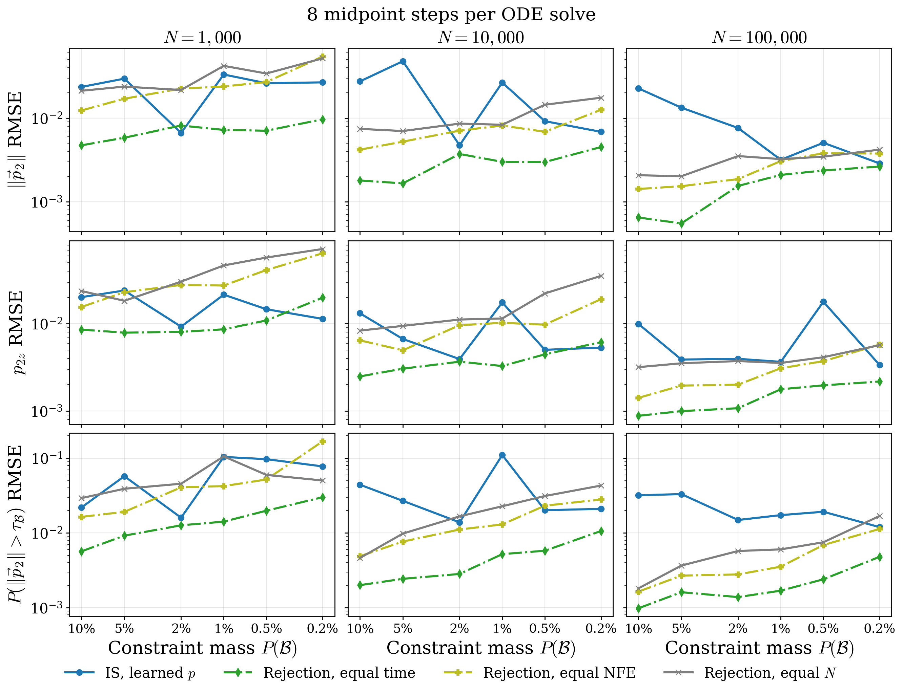
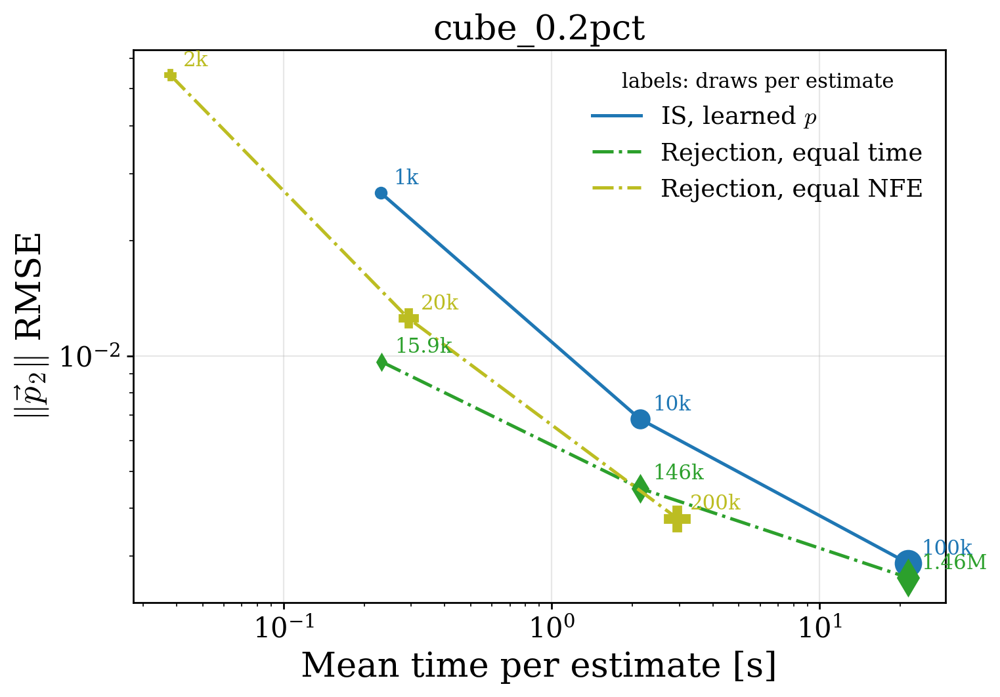

# Decay6D per-box accuracy and cost (8 midpoint steps)

Every ODE solve (q sampling with its log-density, the backward $p_{\rm uncon}$ density,
and $p_{\rm uncon}$ sampling for rejection) uses 8 fixed midpoint steps, i.e.
16 velocity calls per batch. Each box is one SLURM task on one GPU, and its IS
and rejection repetitions alternate in the same process.

Each box has one combined table. Its values are ordered by $N=1,000/10,000/100,000$, one value per line within each cell.
Each accuracy cell gives the standard deviation of absolute error across valid
repetitions; RMSE is computed across those repetitions. `valid reps` gives finite
estimates out of 20, ordered by observable (norm / z / tail) and then by N.
A rejection repetition with no accepted event has no estimate and is not valid.

Cost columns show means over repetitions. `q draws` is the number from the box-conditioned
proposal; `p_uncon draws` is the mean number from the unconstrained model. Samples used
are all proposals for raw $q$, in-box proposals for filtered $q$ and IS, and accepted
events for rejection. NFE counts velocity-network calls. Times are measured wall clock
for each repetition and include the estimator's own density work only.

Budgets are per repetition, not calibrated averages: `rej_equal_time` samples
$p_{\rm uncon}$ until the measured wall time of the same repetition's `is_learned` run is
used up, sizing its last batch from the measured batch-time curve so it does not overrun;
`rej_equal_nfe` draws batches of $\min(N, 10^4)$ until its velocity calls reach the
`is_learned` count, which is $2N$ draws; `rej_equal_n` draws exactly $N$.

#### Summary figures

RMSE against $P(\mathcal B)$; rows are $\Vert\vec p_2\Vert$, $p_{2z}$ and the tail
probability, columns are $N$. The mass axis is reversed, so boxes become rarer to the right.

cube_0.2pct error-cost frontier at IS budgets $N=1,000/10,000/100,000$, using mean time per estimate;
point labels give each estimator's own model draws per estimate.

#### cube_0.2pct: $P(\mathcal B)=0.0020$, GT events=2,029,315

| estimator | $q$ draws | $p_{\rm uncon}$ draws | density evals (learned/exact) | samples used (mean) | NFE (mean) | time [s] (mean) | valid reps (norm/z/tail per N) | $\lVert\vec p_2\rVert$ abs-error std | $\lVert\vec p_2\rVert$ RMSE | $p_{2z}$ abs-error std | $p_{2z}$ RMSE | tail abs-error std | tail RMSE |
| :--- | ---: | ---: | ---: | ---: | ---: | ---: | ---: | ---: | ---: | ---: | ---: | ---: | ---: |
| q_raw | 1,000 10,000 100,000 | 0 0 0 | 0 / 0 0 / 0 0 / 0 | 1,000 10,000 100,000 | 16 16 160 | 0.1 1.1 10.7 | 20 / 20 / 20 20 / 20 / 20 20 / 20 / 20 | 1.29e&#8209;03 4.71e&#8209;04 1.85e&#8209;04 | 1.96e&#8209;03 1.01e&#8209;03 6.20e&#8209;04 | 2.23e&#8209;03 5.87e&#8209;04 3.33e&#8209;04 | 3.27e&#8209;03 1.00e&#8209;03 5.90e&#8209;04 | 6.12e&#8209;03 1.55e&#8209;03 7.43e&#8209;04 | 9.74e&#8209;03 2.63e&#8209;03 1.54e&#8209;03 |
| q_filtered | 1,000 10,000 100,000 | 0 0 0 | 0 / 0 0 / 0 0 / 0 | 994 9,945 99,427 | 16 16 160 | 0.1 1.1 10.7 | 20 / 20 / 20 20 / 20 / 20 20 / 20 / 20 | 1.33e&#8209;03 4.73e&#8209;04 1.88e&#8209;04 | 2.02e&#8209;03 9.85e&#8209;04 6.13e&#8209;04 | 2.23e&#8209;03 5.93e&#8209;04 3.37e&#8209;04 | 3.23e&#8209;03 1.01e&#8209;03 6.28e&#8209;04 | 6.16e&#8209;03 1.57e&#8209;03 7.37e&#8209;04 | 9.81e&#8209;03 2.63e&#8209;03 1.52e&#8209;03 |
| is_learned | 1,000 10,000 100,000 | 0 0 0 | 1,000 / 0 10,000 / 0 100,000 / 0 | 994 9,945 99,427 | 32 32 320 | 0.2 2.1 21.4 | 20 / 20 / 20 20 / 20 / 20 20 / 20 / 20 | 2.38e&#8209;02 5.16e&#8209;03 1.72e&#8209;03 | 2.67e&#8209;02 6.84e&#8209;03 2.87e&#8209;03 | 8.98e&#8209;03 3.61e&#8209;03 2.50e&#8209;03 | 1.14e&#8209;02 5.33e&#8209;03 3.37e&#8209;03 | 6.87e&#8209;02 1.64e&#8209;02 3.45e&#8209;03 | 7.78e&#8209;02 2.10e&#8209;02 1.20e&#8209;02 |
| is_exact | 1,000 10,000 100,000 | 0 0 0 | 0 / 1,000 0 / 10,000 0 / 100,000 | 994 9,945 99,427 | 16 16 160 | 0.1 1.1 11.0 | 20 / 20 / 20 20 / 20 / 20 20 / 20 / 20 | 2.69e&#8209;02 5.29e&#8209;03 2.71e&#8209;03 | 2.95e&#8209;02 6.96e&#8209;03 3.89e&#8209;03 | 1.02e&#8209;02 3.46e&#8209;03 2.00e&#8209;03 | 1.25e&#8209;02 5.80e&#8209;03 3.23e&#8209;03 | 6.63e&#8209;02 1.44e&#8209;02 3.36e&#8209;03 | 7.46e&#8209;02 1.77e&#8209;02 8.19e&#8209;03 |
| rej_equal_n | 0 0 0 | 1,000 10,000 100,000 | 0 / 0 0 / 0 0 / 0 | 2 19 206 | 16 16 160 | 0.0 0.1 1.5 | 18 / 18 / 18 20 / 20 / 20 20 / 20 / 20 | 2.51e&#8209;02 9.60e&#8209;03 2.34e&#8209;03 | 5.17e&#8209;02 1.75e&#8209;02 4.20e&#8209;03 | 3.85e&#8209;02 1.88e&#8209;02 3.86e&#8209;03 | 7.21e&#8209;02 3.54e&#8209;02 5.69e&#8209;03 | 0.00e+00 2.45e&#8209;02 1.05e&#8209;02 | 5.04e&#8209;02 4.31e&#8209;02 1.69e&#8209;02 |
| rej_equal_time | 0 0 0 | 15,866 145,797 1,455,541 | 0 / 0 0 / 0 0 / 0 | 29 307 2,997 | 32 240 2,336 | 0.2 2.1 21.4 | 20 / 20 / 20 20 / 20 / 20 20 / 20 / 20 | 6.62e&#8209;03 2.58e&#8209;03 1.07e&#8209;03 | 9.65e&#8209;03 4.51e&#8209;03 2.63e&#8209;03 | 1.14e&#8209;02 3.64e&#8209;03 1.21e&#8209;03 | 1.99e&#8209;02 6.16e&#8209;03 2.18e&#8209;03 | 1.58e&#8209;02 5.75e&#8209;03 2.56e&#8209;03 | 3.01e&#8209;02 1.06e&#8209;02 4.80e&#8209;03 |
| rej_equal_nfe | 0 0 0 | 2,000 20,000 200,000 | 0 / 0 0 / 0 0 / 0 | 4 41 412 | 32 32 320 | 0.0 0.3 2.9 | 20 / 20 / 20 20 / 20 / 20 20 / 20 / 20 | 3.10e&#8209;02 8.20e&#8209;03 2.01e&#8209;03 | 5.43e&#8209;02 1.26e&#8209;02 3.76e&#8209;03 | 3.73e&#8209;02 1.10e&#8209;02 3.59e&#8209;03 | 6.43e&#8209;02 1.92e&#8209;02 5.77e&#8209;03 | 1.16e&#8209;01 1.77e&#8209;02 5.97e&#8209;03 | 1.68e&#8209;01 2.81e&#8209;02 1.13e&#8209;02 |

#### cube_0.5pct: $P(\mathcal B)=0.0050$, GT events=5,032,903

| estimator | $q$ draws | $p_{\rm uncon}$ draws | density evals (learned/exact) | samples used (mean) | NFE (mean) | time [s] (mean) | valid reps (norm/z/tail per N) | $\lVert\vec p_2\rVert$ abs-error std | $\lVert\vec p_2\rVert$ RMSE | $p_{2z}$ abs-error std | $p_{2z}$ RMSE | tail abs-error std | tail RMSE |
| :--- | ---: | ---: | ---: | ---: | ---: | ---: | ---: | ---: | ---: | ---: | ---: | ---: | ---: |
| q_raw | 1,000 10,000 100,000 | 0 0 0 | 0 / 0 0 / 0 0 / 0 | 1,000 10,000 100,000 | 16 16 160 | 0.1 1.1 10.9 | 20 / 20 / 20 20 / 20 / 20 20 / 20 / 20 | 1.89e&#8209;03 5.32e&#8209;04 2.05e&#8209;04 | 2.54e&#8209;03 9.88e&#8209;04 4.09e&#8209;04 | 3.02e&#8209;03 5.27e&#8209;04 4.04e&#8209;04 | 3.92e&#8209;03 8.48e&#8209;04 6.90e&#8209;04 | 4.50e&#8209;03 1.12e&#8209;03 4.39e&#8209;04 | 7.76e&#8209;03 2.21e&#8209;03 7.52e&#8209;04 |
| q_filtered | 1,000 10,000 100,000 | 0 0 0 | 0 / 0 0 / 0 0 / 0 | 996 9,958 99,554 | 16 16 160 | 0.1 1.1 10.9 | 20 / 20 / 20 20 / 20 / 20 20 / 20 / 20 | 1.87e&#8209;03 5.26e&#8209;04 2.04e&#8209;04 | 2.55e&#8209;03 9.66e&#8209;04 4.33e&#8209;04 | 3.10e&#8209;03 5.20e&#8209;04 4.22e&#8209;04 | 4.02e&#8209;03 8.74e&#8209;04 7.80e&#8209;04 | 4.58e&#8209;03 1.15e&#8209;03 4.50e&#8209;04 | 7.88e&#8209;03 2.20e&#8209;03 7.71e&#8209;04 |
| is_learned | 1,000 10,000 100,000 | 0 0 0 | 1,000 / 0 10,000 / 0 100,000 / 0 | 996 9,958 99,554 | 32 32 320 | 0.2 2.1 21.7 | 20 / 20 / 20 20 / 20 / 20 20 / 20 / 20 | 2.33e&#8209;02 7.01e&#8209;03 3.64e&#8209;03 | 2.61e&#8209;02 9.18e&#8209;03 5.06e&#8209;03 | 1.23e&#8209;02 2.94e&#8209;03 1.65e&#8209;02 | 1.47e&#8209;02 5.03e&#8209;03 1.79e&#8209;02 | 9.10e&#8209;02 1.17e&#8209;02 8.20e&#8209;03 | 9.72e&#8209;02 2.02e&#8209;02 1.92e&#8209;02 |
| is_exact | 1,000 10,000 100,000 | 0 0 0 | 0 / 1,000 0 / 10,000 0 / 100,000 | 996 9,958 99,554 | 16 16 160 | 0.1 1.1 11.1 | 20 / 20 / 20 20 / 20 / 20 20 / 20 / 20 | 2.28e&#8209;02 7.53e&#8209;03 4.16e&#8209;03 | 2.60e&#8209;02 9.12e&#8209;03 4.81e&#8209;03 | 1.23e&#8209;02 2.77e&#8209;03 1.64e&#8209;02 | 1.45e&#8209;02 4.73e&#8209;03 1.77e&#8209;02 | 8.85e&#8209;02 1.11e&#8209;02 8.28e&#8209;03 | 9.38e&#8209;02 1.77e&#8209;02 1.63e&#8209;02 |
| rej_equal_n | 0 0 0 | 1,000 10,000 100,000 | 0 / 0 0 / 0 0 / 0 | 5 51 509 | 16 16 160 | 0.0 0.1 1.5 | 20 / 20 / 20 20 / 20 / 20 20 / 20 / 20 | 1.83e&#8209;02 8.17e&#8209;03 2.26e&#8209;03 | 3.41e&#8209;02 1.44e&#8209;02 3.45e&#8209;03 | 3.40e&#8209;02 1.35e&#8209;02 2.30e&#8209;03 | 5.75e&#8209;02 2.23e&#8209;02 4.14e&#8209;03 | 2.28e&#8209;02 1.76e&#8209;02 4.14e&#8209;03 | 5.98e&#8209;02 3.12e&#8209;02 7.51e&#8209;03 |
| rej_equal_time | 0 0 0 | 15,960 145,790 1,455,212 | 0 / 0 0 / 0 0 / 0 | 83 749 7,464 | 32 240 2,336 | 0.2 2.1 21.7 | 20 / 20 / 20 20 / 20 / 20 20 / 20 / 20 | 4.39e&#8209;03 1.66e&#8209;03 9.55e&#8209;04 | 7.06e&#8209;03 2.98e&#8209;03 2.36e&#8209;03 | 6.94e&#8209;03 2.81e&#8209;03 1.26e&#8209;03 | 1.09e&#8209;02 4.47e&#8209;03 1.97e&#8209;03 | 1.18e&#8209;02 3.32e&#8209;03 1.64e&#8209;03 | 1.99e&#8209;02 5.78e&#8209;03 2.40e&#8209;03 |
| rej_equal_nfe | 0 0 0 | 2,000 20,000 200,000 | 0 / 0 0 / 0 0 / 0 | 10 105 1,017 | 32 32 320 | 0.0 0.3 3.0 | 20 / 20 / 20 20 / 20 / 20 20 / 20 / 20 | 1.70e&#8209;02 4.32e&#8209;03 1.97e&#8209;03 | 2.70e&#8209;02 6.85e&#8209;03 3.81e&#8209;03 | 2.60e&#8209;02 6.09e&#8209;03 2.53e&#8209;03 | 4.13e&#8209;02 9.78e&#8209;03 3.72e&#8209;03 | 1.05e&#8209;02 1.15e&#8209;02 4.54e&#8209;03 | 5.19e&#8209;02 2.32e&#8209;02 6.89e&#8209;03 |

#### cube_1pct: $P(\mathcal B)=0.0100$, GT events=10,020,461

| estimator | $q$ draws | $p_{\rm uncon}$ draws | density evals (learned/exact) | samples used (mean) | NFE (mean) | time [s] (mean) | valid reps (norm/z/tail per N) | $\lVert\vec p_2\rVert$ abs-error std | $\lVert\vec p_2\rVert$ RMSE | $p_{2z}$ abs-error std | $p_{2z}$ RMSE | tail abs-error std | tail RMSE |
| :--- | ---: | ---: | ---: | ---: | ---: | ---: | ---: | ---: | ---: | ---: | ---: | ---: | ---: |
| q_raw | 1,000 10,000 100,000 | 0 0 0 | 0 / 0 0 / 0 0 / 0 | 1,000 10,000 100,000 | 16 16 160 | 0.1 1.1 11.0 | 20 / 20 / 20 20 / 20 / 20 20 / 20 / 20 | 1.90e&#8209;03 6.58e&#8209;04 1.86e&#8209;04 | 3.70e&#8209;03 1.26e&#8209;03 3.56e&#8209;04 | 2.56e&#8209;03 7.94e&#8209;04 3.51e&#8209;04 | 4.37e&#8209;03 1.63e&#8209;03 7.75e&#8209;04 | 3.59e&#8209;03 1.18e&#8209;03 4.00e&#8209;04 | 5.61e&#8209;03 1.89e&#8209;03 7.01e&#8209;04 |
| q_filtered | 1,000 10,000 100,000 | 0 0 0 | 0 / 0 0 / 0 0 / 0 | 997 9,968 99,685 | 16 16 160 | 0.1 1.1 11.0 | 20 / 20 / 20 20 / 20 / 20 20 / 20 / 20 | 1.84e&#8209;03 6.71e&#8209;04 1.68e&#8209;04 | 3.70e&#8209;03 1.27e&#8209;03 3.45e&#8209;04 | 2.57e&#8209;03 8.09e&#8209;04 3.58e&#8209;04 | 4.30e&#8209;03 1.71e&#8209;03 8.63e&#8209;04 | 3.73e&#8209;03 1.16e&#8209;03 4.10e&#8209;04 | 5.84e&#8209;03 1.87e&#8209;03 7.12e&#8209;04 |
| is_learned | 1,000 10,000 100,000 | 0 0 0 | 1,000 / 0 10,000 / 0 100,000 / 0 | 997 9,968 99,685 | 32 32 320 | 0.2 2.2 22.1 | 20 / 20 / 20 20 / 20 / 20 20 / 20 / 20 | 3.00e&#8209;02 2.44e&#8209;02 1.45e&#8209;03 | 3.31e&#8209;02 2.66e&#8209;02 3.17e&#8209;03 | 1.86e&#8209;02 1.49e&#8209;02 2.93e&#8209;03 | 2.16e&#8209;02 1.76e&#8209;02 3.66e&#8209;03 | 9.62e&#8209;02 1.04e&#8209;01 4.66e&#8209;03 | 1.04e&#8209;01 1.10e&#8209;01 1.73e&#8209;02 |
| is_exact | 1,000 10,000 100,000 | 0 0 0 | 0 / 1,000 0 / 10,000 0 / 100,000 | 997 9,968 99,685 | 16 16 160 | 0.1 1.1 11.3 | 20 / 20 / 20 20 / 20 / 20 20 / 20 / 20 | 2.88e&#8209;02 2.40e&#8209;02 1.52e&#8209;03 | 3.19e&#8209;02 2.59e&#8209;02 2.35e&#8209;03 | 1.79e&#8209;02 1.51e&#8209;02 2.41e&#8209;03 | 2.07e&#8209;02 1.76e&#8209;02 3.08e&#8209;03 | 9.29e&#8209;02 1.02e&#8209;01 4.39e&#8209;03 | 1.00e&#8209;01 1.08e&#8209;01 1.38e&#8209;02 |
| rej_equal_n | 0 0 0 | 1,000 10,000 100,000 | 0 / 0 0 / 0 0 / 0 | 10 106 1,011 | 16 16 160 | 0.0 0.2 1.5 | 20 / 20 / 20 20 / 20 / 20 20 / 20 / 20 | 2.51e&#8209;02 4.77e&#8209;03 1.64e&#8209;03 | 4.21e&#8209;02 8.32e&#8209;03 3.23e&#8209;03 | 2.21e&#8209;02 7.90e&#8209;03 1.89e&#8209;03 | 4.67e&#8209;02 1.15e&#8209;02 3.55e&#8209;03 | 7.10e&#8209;02 1.44e&#8209;02 3.49e&#8209;03 | 1.06e&#8209;01 2.28e&#8209;02 6.03e&#8209;03 |
| rej_equal_time | 0 0 0 | 15,393 144,184 1,440,059 | 0 / 0 0 / 0 0 / 0 | 153 1,462 14,715 | 32 240 2,310 | 0.2 2.2 22.1 | 20 / 20 / 20 20 / 20 / 20 20 / 20 / 20 | 4.21e&#8209;03 1.83e&#8209;03 6.33e&#8209;04 | 7.22e&#8209;03 3.00e&#8209;03 2.09e&#8209;03 | 4.45e&#8209;03 2.16e&#8209;03 9.73e&#8209;04 | 8.64e&#8209;03 3.28e&#8209;03 1.77e&#8209;03 | 8.14e&#8209;03 2.86e&#8209;03 1.03e&#8209;03 | 1.42e&#8209;02 5.20e&#8209;03 1.69e&#8209;03 |
| rej_equal_nfe | 0 0 0 | 2,000 20,000 200,000 | 0 / 0 0 / 0 0 / 0 | 22 201 2,039 | 32 32 320 | 0.0 0.3 3.1 | 20 / 20 / 20 20 / 20 / 20 20 / 20 / 20 | 1.47e&#8209;02 5.33e&#8209;03 1.48e&#8209;03 | 2.38e&#8209;02 8.13e&#8209;03 3.06e&#8209;03 | 1.56e&#8209;02 5.54e&#8209;03 1.82e&#8209;03 | 2.75e&#8209;02 1.03e&#8209;02 3.09e&#8209;03 | 2.56e&#8209;02 9.14e&#8209;03 2.11e&#8209;03 | 4.24e&#8209;02 1.30e&#8209;02 3.54e&#8209;03 |

#### cube_2pct: $P(\mathcal B)=0.0200$, GT events=19,978,538

| estimator | $q$ draws | $p_{\rm uncon}$ draws | density evals (learned/exact) | samples used (mean) | NFE (mean) | time [s] (mean) | valid reps (norm/z/tail per N) | $\lVert\vec p_2\rVert$ abs-error std | $\lVert\vec p_2\rVert$ RMSE | $p_{2z}$ abs-error std | $p_{2z}$ RMSE | tail abs-error std | tail RMSE |
| :--- | ---: | ---: | ---: | ---: | ---: | ---: | ---: | ---: | ---: | ---: | ---: | ---: | ---: |
| q_raw | 1,000 10,000 100,000 | 0 0 0 | 0 / 0 0 / 0 0 / 0 | 1,000 10,000 100,000 | 16 16 160 | 0.1 1.1 10.8 | 20 / 20 / 20 20 / 20 / 20 20 / 20 / 20 | 1.80e&#8209;03 8.66e&#8209;04 2.84e&#8209;04 | 3.19e&#8209;03 1.34e&#8209;03 5.87e&#8209;04 | 2.39e&#8209;03 9.10e&#8209;04 2.45e&#8209;04 | 4.80e&#8209;03 1.48e&#8209;03 5.26e&#8209;04 | 3.24e&#8209;03 8.34e&#8209;04 3.88e&#8209;04 | 6.09e&#8209;03 1.57e&#8209;03 6.50e&#8209;04 |
| q_filtered | 1,000 10,000 100,000 | 0 0 0 | 0 / 0 0 / 0 0 / 0 | 998 9,978 99,788 | 16 16 160 | 0.1 1.1 10.8 | 20 / 20 / 20 20 / 20 / 20 20 / 20 / 20 | 1.77e&#8209;03 8.58e&#8209;04 2.82e&#8209;04 | 3.21e&#8209;03 1.35e&#8209;03 5.64e&#8209;04 | 2.34e&#8209;03 9.11e&#8209;04 2.69e&#8209;04 | 4.80e&#8209;03 1.51e&#8209;03 5.75e&#8209;04 | 3.24e&#8209;03 8.60e&#8209;04 3.71e&#8209;04 | 6.12e&#8209;03 1.59e&#8209;03 6.37e&#8209;04 |
| is_learned | 1,000 10,000 100,000 | 0 0 0 | 1,000 / 0 10,000 / 0 100,000 / 0 | 998 9,978 99,788 | 32 32 320 | 0.2 2.2 21.6 | 20 / 20 / 20 20 / 20 / 20 20 / 20 / 20 | 4.54e&#8209;03 2.72e&#8209;03 5.17e&#8209;03 | 6.64e&#8209;03 4.73e&#8209;03 7.61e&#8209;03 | 5.03e&#8209;03 2.88e&#8209;03 2.71e&#8209;03 | 9.27e&#8209;03 3.94e&#8209;03 3.97e&#8209;03 | 8.97e&#8209;03 6.73e&#8209;03 4.74e&#8209;03 | 1.60e&#8209;02 1.39e&#8209;02 1.49e&#8209;02 |
| is_exact | 1,000 10,000 100,000 | 0 0 0 | 0 / 1,000 0 / 10,000 0 / 100,000 | 998 9,978 99,788 | 16 16 160 | 0.1 1.1 11.1 | 20 / 20 / 20 20 / 20 / 20 20 / 20 / 20 | 5.30e&#8209;03 3.02e&#8209;03 6.60e&#8209;03 | 7.49e&#8209;03 4.64e&#8209;03 8.27e&#8209;03 | 5.26e&#8209;03 2.68e&#8209;03 2.93e&#8209;03 | 9.45e&#8209;03 3.80e&#8209;03 4.04e&#8209;03 | 7.79e&#8209;03 6.18e&#8209;03 3.55e&#8209;03 | 1.28e&#8209;02 9.96e&#8209;03 1.06e&#8209;02 |
| rej_equal_n | 0 0 0 | 1,000 10,000 100,000 | 0 / 0 0 / 0 0 / 0 | 19 203 2,022 | 16 16 160 | 0.0 0.1 1.5 | 20 / 20 / 20 20 / 20 / 20 20 / 20 / 20 | 1.38e&#8209;02 5.72e&#8209;03 2.06e&#8209;03 | 2.16e&#8209;02 8.58e&#8209;03 3.51e&#8209;03 | 1.83e&#8209;02 7.02e&#8209;03 2.12e&#8209;03 | 3.05e&#8209;02 1.12e&#8209;02 3.74e&#8209;03 | 2.00e&#8209;02 1.05e&#8209;02 3.25e&#8209;03 | 4.56e&#8209;02 1.67e&#8209;02 5.73e&#8209;03 |
| rej_equal_time | 0 0 0 | 15,760 145,823 1,456,806 | 0 / 0 0 / 0 0 / 0 | 317 2,967 29,455 | 32 240 2,336 | 0.2 2.2 21.6 | 20 / 20 / 20 20 / 20 / 20 20 / 20 / 20 | 5.08e&#8209;03 2.61e&#8209;03 6.59e&#8209;04 | 8.14e&#8209;03 3.72e&#8209;03 1.55e&#8209;03 | 4.03e&#8209;03 2.11e&#8209;03 6.00e&#8209;04 | 8.09e&#8209;03 3.68e&#8209;03 1.08e&#8209;03 | 7.75e&#8209;03 1.69e&#8209;03 7.28e&#8209;04 | 1.27e&#8209;02 2.83e&#8209;03 1.39e&#8209;03 |
| rej_equal_nfe | 0 0 0 | 2,000 20,000 200,000 | 0 / 0 0 / 0 0 / 0 | 38 408 4,052 | 32 32 320 | 0.0 0.3 3.0 | 20 / 20 / 20 20 / 20 / 20 20 / 20 / 20 | 1.16e&#8209;02 4.71e&#8209;03 1.06e&#8209;03 | 2.25e&#8209;02 7.08e&#8209;03 1.86e&#8209;03 | 1.53e&#8209;02 5.49e&#8209;03 1.23e&#8209;03 | 2.79e&#8209;02 9.63e&#8209;03 2.00e&#8209;03 | 2.14e&#8209;02 6.81e&#8209;03 1.46e&#8209;03 | 4.08e&#8209;02 1.11e&#8209;02 2.78e&#8209;03 |

#### cube_5pct: $P(\mathcal B)=0.0500$, GT events=49,965,039

| estimator | $q$ draws | $p_{\rm uncon}$ draws | density evals (learned/exact) | samples used (mean) | NFE (mean) | time [s] (mean) | valid reps (norm/z/tail per N) | $\lVert\vec p_2\rVert$ abs-error std | $\lVert\vec p_2\rVert$ RMSE | $p_{2z}$ abs-error std | $p_{2z}$ RMSE | tail abs-error std | tail RMSE |
| :--- | ---: | ---: | ---: | ---: | ---: | ---: | ---: | ---: | ---: | ---: | ---: | ---: | ---: |
| q_raw | 1,000 10,000 100,000 | 0 0 0 | 0 / 0 0 / 0 0 / 0 | 1,000 10,000 100,000 | 16 16 160 | 0.1 1.1 10.8 | 20 / 20 / 20 20 / 20 / 20 20 / 20 / 20 | 2.85e&#8209;03 9.45e&#8209;04 5.01e&#8209;04 | 4.85e&#8209;03 1.93e&#8209;03 1.53e&#8209;03 | 3.51e&#8209;03 6.47e&#8209;04 3.73e&#8209;04 | 5.73e&#8209;03 1.21e&#8209;03 9.92e&#8209;04 | 3.82e&#8209;03 1.37e&#8209;03 4.29e&#8209;04 | 6.07e&#8209;03 2.20e&#8209;03 7.45e&#8209;04 |
| q_filtered | 1,000 10,000 100,000 | 0 0 0 | 0 / 0 0 / 0 0 / 0 | 998 9,986 99,865 | 16 16 160 | 0.1 1.1 10.8 | 20 / 20 / 20 20 / 20 / 20 20 / 20 / 20 | 2.90e&#8209;03 9.23e&#8209;04 4.99e&#8209;04 | 4.96e&#8209;03 1.90e&#8209;03 1.50e&#8209;03 | 3.52e&#8209;03 6.22e&#8209;04 3.99e&#8209;04 | 5.78e&#8209;03 1.22e&#8209;03 1.04e&#8209;03 | 3.92e&#8209;03 1.30e&#8209;03 4.39e&#8209;04 | 6.08e&#8209;03 2.14e&#8209;03 7.48e&#8209;04 |
| is_learned | 1,000 10,000 100,000 | 0 0 0 | 1,000 / 0 10,000 / 0 100,000 / 0 | 998 9,986 99,865 | 32 32 320 | 0.2 2.2 21.6 | 20 / 20 / 20 20 / 20 / 20 20 / 20 / 20 | 2.04e&#8209;02 4.14e&#8209;02 5.82e&#8209;03 | 2.96e&#8209;02 4.78e&#8209;02 1.33e&#8209;02 | 1.67e&#8209;02 4.89e&#8209;03 2.53e&#8209;03 | 2.41e&#8209;02 6.69e&#8209;03 3.89e&#8209;03 | 4.41e&#8209;02 1.02e&#8209;02 1.70e&#8209;02 | 5.75e&#8209;02 2.69e&#8209;02 3.31e&#8209;02 |
| is_exact | 1,000 10,000 100,000 | 0 0 0 | 0 / 1,000 0 / 10,000 0 / 100,000 | 998 9,986 99,865 | 16 16 160 | 0.1 1.1 11.1 | 20 / 20 / 20 20 / 20 / 20 20 / 20 / 20 | 1.66e&#8209;02 4.69e&#8209;02 4.73e&#8209;03 | 2.28e&#8209;02 5.05e&#8209;02 6.46e&#8209;03 | 1.43e&#8209;02 5.02e&#8209;03 2.18e&#8209;03 | 2.13e&#8209;02 6.68e&#8209;03 3.41e&#8209;03 | 3.26e&#8209;02 8.50e&#8209;03 1.55e&#8209;02 | 4.12e&#8209;02 1.49e&#8209;02 2.15e&#8209;02 |
| rej_equal_n | 0 0 0 | 1,000 10,000 100,000 | 0 / 0 0 / 0 0 / 0 | 49 498 5,008 | 16 16 160 | 0.0 0.1 1.5 | 20 / 20 / 20 20 / 20 / 20 20 / 20 / 20 | 1.40e&#8209;02 3.71e&#8209;03 1.14e&#8209;03 | 2.38e&#8209;02 7.00e&#8209;03 2.02e&#8209;03 | 1.21e&#8209;02 5.34e&#8209;03 1.68e&#8209;03 | 1.84e&#8209;02 9.46e&#8209;03 3.52e&#8209;03 | 2.00e&#8209;02 5.56e&#8209;03 2.41e&#8209;03 | 3.90e&#8209;02 9.81e&#8209;03 3.66e&#8209;03 |
| rej_equal_time | 0 0 0 | 15,737 145,809 1,457,290 | 0 / 0 0 / 0 0 / 0 | 793 7,313 73,063 | 32 240 2,336 | 0.2 2.2 21.6 | 20 / 20 / 20 20 / 20 / 20 20 / 20 / 20 | 2.90e&#8209;03 9.63e&#8209;04 3.69e&#8209;04 | 5.82e&#8209;03 1.66e&#8209;03 5.51e&#8209;04 | 4.78e&#8209;03 1.59e&#8209;03 6.53e&#8209;04 | 7.91e&#8209;03 3.05e&#8209;03 9.97e&#8209;04 | 5.32e&#8209;03 1.61e&#8209;03 6.79e&#8209;04 | 9.20e&#8209;03 2.43e&#8209;03 1.61e&#8209;03 |
| rej_equal_nfe | 0 0 0 | 2,000 20,000 200,000 | 0 / 0 0 / 0 0 / 0 | 98 1,019 10,008 | 32 32 320 | 0.0 0.3 3.0 | 20 / 20 / 20 20 / 20 / 20 20 / 20 / 20 | 9.57e&#8209;03 3.04e&#8209;03 9.25e&#8209;04 | 1.70e&#8209;02 5.22e&#8209;03 1.53e&#8209;03 | 1.24e&#8209;02 2.88e&#8209;03 1.03e&#8209;03 | 2.30e&#8209;02 4.97e&#8209;03 1.96e&#8209;03 | 9.32e&#8209;03 4.53e&#8209;03 1.48e&#8209;03 | 1.92e&#8209;02 7.67e&#8209;03 2.69e&#8209;03 |

#### cube_10pct: $P(\mathcal B)=0.0999$, GT events=99,938,331

| estimator | $q$ draws | $p_{\rm uncon}$ draws | density evals (learned/exact) | samples used (mean) | NFE (mean) | time [s] (mean) | valid reps (norm/z/tail per N) | $\lVert\vec p_2\rVert$ abs-error std | $\lVert\vec p_2\rVert$ RMSE | $p_{2z}$ abs-error std | $p_{2z}$ RMSE | tail abs-error std | tail RMSE |
| :--- | ---: | ---: | ---: | ---: | ---: | ---: | ---: | ---: | ---: | ---: | ---: | ---: | ---: |
| q_raw | 1,000 10,000 100,000 | 0 0 0 | 0 / 0 0 / 0 0 / 0 | 1,000 10,000 100,000 | 16 16 160 | 0.1 1.1 10.8 | 20 / 20 / 20 20 / 20 / 20 20 / 20 / 20 | 3.69e&#8209;03 1.26e&#8209;03 6.73e&#8209;04 | 7.62e&#8209;03 3.04e&#8209;03 2.59e&#8209;03 | 6.28e&#8209;03 2.38e&#8209;03 1.07e&#8209;03 | 1.06e&#8209;02 5.39e&#8209;03 3.69e&#8209;03 | 4.27e&#8209;03 1.86e&#8209;03 6.41e&#8209;04 | 7.50e&#8209;03 3.58e&#8209;03 3.18e&#8209;03 |
| q_filtered | 1,000 10,000 100,000 | 0 0 0 | 0 / 0 0 / 0 0 / 0 | 999 9,990 99,900 | 16 16 160 | 0.1 1.1 10.8 | 20 / 20 / 20 20 / 20 / 20 20 / 20 / 20 | 3.61e&#8209;03 1.22e&#8209;03 6.74e&#8209;04 | 7.55e&#8209;03 2.97e&#8209;03 2.52e&#8209;03 | 6.34e&#8209;03 2.36e&#8209;03 1.06e&#8209;03 | 1.07e&#8209;02 5.47e&#8209;03 3.75e&#8209;03 | 4.27e&#8209;03 1.87e&#8209;03 6.41e&#8209;04 | 7.47e&#8209;03 3.59e&#8209;03 3.19e&#8209;03 |
| is_learned | 1,000 10,000 100,000 | 0 0 0 | 1,000 / 0 10,000 / 0 100,000 / 0 | 999 9,990 99,900 | 32 32 320 | 0.2 2.2 21.5 | 20 / 20 / 20 20 / 20 / 20 20 / 20 / 20 | 1.47e&#8209;02 9.77e&#8209;03 2.86e&#8209;03 | 2.36e&#8209;02 2.74e&#8209;02 2.26e&#8209;02 | 1.41e&#8209;02 9.08e&#8209;03 4.65e&#8209;03 | 2.02e&#8209;02 1.32e&#8209;02 9.96e&#8209;03 | 9.70e&#8209;03 1.98e&#8209;02 4.24e&#8209;03 | 2.19e&#8209;02 4.42e&#8209;02 3.20e&#8209;02 |
| is_exact | 1,000 10,000 100,000 | 0 0 0 | 0 / 1,000 0 / 10,000 0 / 100,000 | 999 9,990 99,900 | 16 16 160 | 0.1 1.1 11.1 | 20 / 20 / 20 20 / 20 / 20 20 / 20 / 20 | 6.75e&#8209;03 5.63e&#8209;03 2.50e&#8209;03 | 1.33e&#8209;02 8.04e&#8209;03 3.41e&#8209;03 | 1.26e&#8209;02 6.78e&#8209;03 2.25e&#8209;03 | 1.92e&#8209;02 9.31e&#8209;03 3.64e&#8209;03 | 5.33e&#8209;03 8.53e&#8209;03 2.10e&#8209;03 | 9.49e&#8209;03 1.26e&#8209;02 4.44e&#8209;03 |
| rej_equal_n | 0 0 0 | 1,000 10,000 100,000 | 0 / 0 0 / 0 0 / 0 | 96 1,012 10,007 | 16 16 160 | 0.0 0.1 1.5 | 20 / 20 / 20 20 / 20 / 20 20 / 20 / 20 | 1.01e&#8209;02 4.30e&#8209;03 1.46e&#8209;03 | 2.12e&#8209;02 7.43e&#8209;03 2.07e&#8209;03 | 1.46e&#8209;02 4.92e&#8209;03 1.74e&#8209;03 | 2.38e&#8209;02 8.36e&#8209;03 3.18e&#8209;03 | 1.84e&#8209;02 3.05e&#8209;03 9.81e&#8209;04 | 2.93e&#8209;02 4.63e&#8209;03 1.81e&#8209;03 |
| rej_equal_time | 0 0 0 | 15,827 145,636 1,457,081 | 0 / 0 0 / 0 0 / 0 | 1,589 14,563 145,702 | 32 240 2,336 | 0.2 2.2 21.5 | 20 / 20 / 20 20 / 20 / 20 20 / 20 / 20 | 3.02e&#8209;03 1.12e&#8209;03 2.83e&#8209;04 | 4.72e&#8209;03 1.80e&#8209;03 6.48e&#8209;04 | 4.27e&#8209;03 1.28e&#8209;03 4.49e&#8209;04 | 8.58e&#8209;03 2.49e&#8209;03 8.80e&#8209;04 | 3.52e&#8209;03 1.01e&#8209;03 5.66e&#8209;04 | 5.67e&#8209;03 2.00e&#8209;03 9.82e&#8209;04 |
| rej_equal_nfe | 0 0 0 | 2,000 20,000 200,000 | 0 / 0 0 / 0 0 / 0 | 200 2,008 20,013 | 32 32 320 | 0.0 0.3 3.0 | 20 / 20 / 20 20 / 20 / 20 20 / 20 / 20 | 6.70e&#8209;03 2.72e&#8209;03 7.80e&#8209;04 | 1.23e&#8209;02 4.19e&#8209;03 1.42e&#8209;03 | 8.18e&#8209;03 3.59e&#8209;03 1.01e&#8209;03 | 1.56e&#8209;02 6.45e&#8209;03 1.41e&#8209;03 | 1.08e&#8209;02 2.79e&#8209;03 9.68e&#8209;04 | 1.64e&#8209;02 4.88e&#8209;03 1.64e&#8209;03 |
