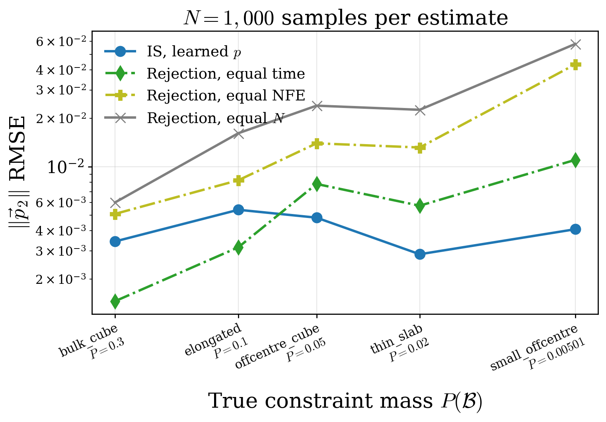
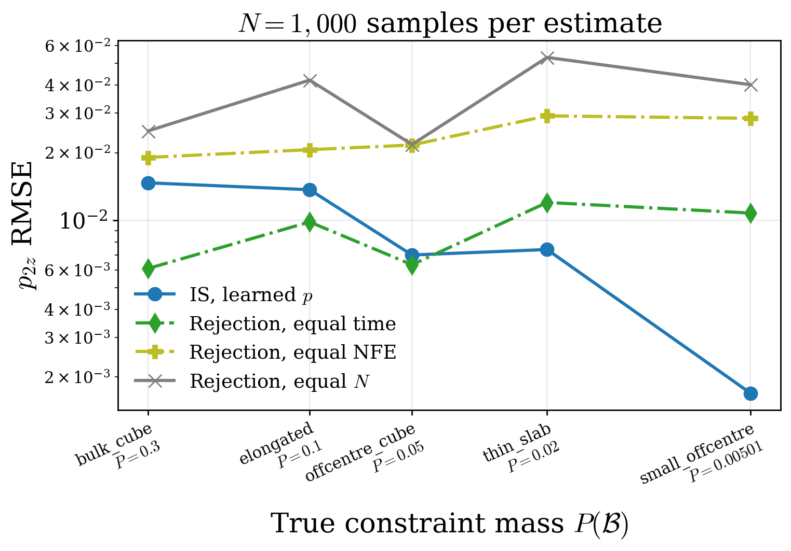
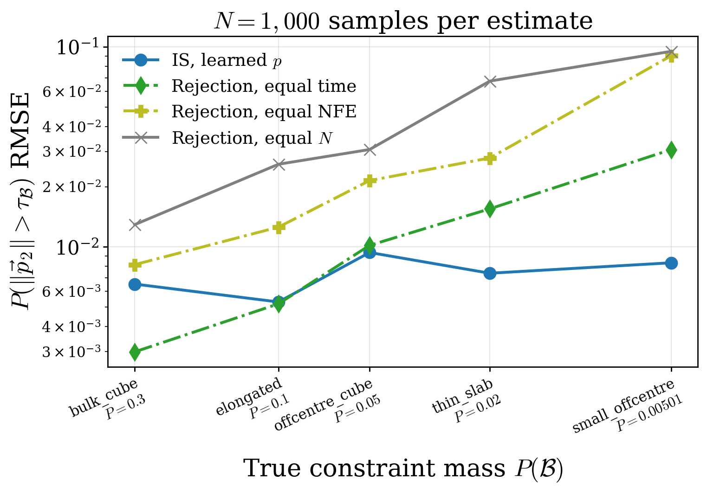
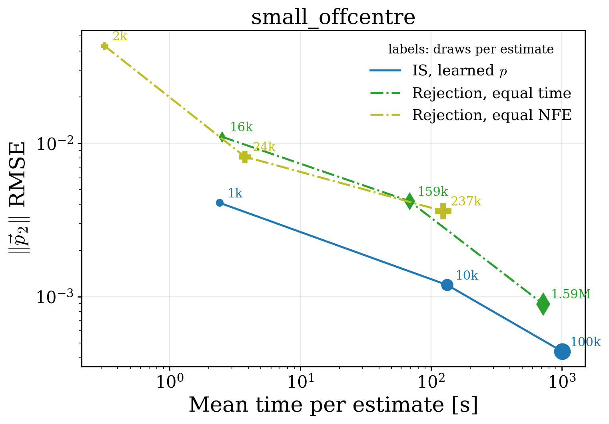

# Decay6D per-box accuracy and cost

Each box has one combined table. Its values are ordered by $N=1,000/10,000/100,000$, one value per line within each cell.
One repetition uses $N$ proposal samples or its listed rejection draw budget to produce
one estimate. Each accuracy cell gives the standard deviation of absolute error across
valid repetitions; RMSE is one value per box, estimator, and observable, computed across
those repetitions. `valid reps` gives finite estimates out of 20, ordered by observable
(norm / z / tail) and then by N (one line per N). A repetition is valid for an observable
only if its estimate is finite. Raw $q$ includes every proposal, so a non-finite fallback
output can invalidate its norm and z estimates; the tail indicator can remain numerically
finite because a NaN threshold comparison is false. Thus valid means finite, not
necessarily fallback-free. Filtered $q$ and IS exclude leaked proposals.

Cost columns show mean values only, except draw/evaluation budgets which are fixed per
repetition. `q draws` is the number from the box-conditioned proposal; `p_uncon draws`
is the number from the unconstrained model. Density evals are learned / exact. Samples
used are all proposals for raw $q$, in-box proposals for filtered $q$ and IS, and accepted
events for rejection. NFE counts velocity-network calls. Exact IS adds quadrature time but
no extra network NFE; all times include the estimator's density work.

Equal-time and equal-NFE draw budgets are calibrated from median per-chunk costs, then
rounded to 1,000-draw minibatches. The table reports mean realized costs, which need not
match exactly: adaptive solver work and fallback trajectories vary between repetitions.
At $N=100{,}000$, equal-time windows contain 1.4--1.9 million draws; the observed
60 fallbacks in 80 million draws imply about 1.1--1.5 fallback trajectories per such
window on average, which can raise realized cost above the median-chunk target.
Timing/NFE costs for partial 10,000-sample chunks are prorated by sample count.

#### Summary figures

RMSE at $N=1,000$ against $P(\mathcal B)$ for $\lVert\vec p_2\rVert$, $p_{2z}$, and the tail
probability; the mass axis is reversed, so boxes become rarer to the right.

small_offcentre error-cost frontier at IS budgets $N=1,000/10,000/100,000$, using mean time per estimate;
point labels give each estimator's own model draws per estimate (rejection draws far more
than $N$ to match IS time or NFE). Means include occasional fallback trajectories.

#### small_offcentre: $P(\mathcal B)=0.0050$, GT events=5,005,887

| estimator | $q$ draws | $p_{\rm uncon}$ draws | density evals (learned/exact) | samples used (mean) | NFE (mean) | time [s] (mean) | valid reps (norm/z/tail per N) | $\lVert\vec p_2\rVert$ abs-error std | $\lVert\vec p_2\rVert$ RMSE | $p_{2z}$ abs-error std | $p_{2z}$ RMSE | tail abs-error std | tail RMSE |
| :--- | ---: | ---: | ---: | ---: | ---: | ---: | ---: | ---: | ---: | ---: | ---: | ---: | ---: |
| q_raw | 1,000 10,000 100,000 | 0 0 0 | 0 / 0 0 / 0 0 / 0 | 1,000 10,000 100,000 | 17 9,114 63,229 | 1.1 111.2 811.0 | 20 / 20 / 20 19 / 19 / 20 14 / 14 / 20 | 2.43e&#8209;03 6.54e&#8209;04 2.63e&#8209;04 | 3.89e&#8209;03 1.33e&#8209;03 5.05e&#8209;04 | 8.34e&#8209;04 5.24e&#8209;04 2.24e&#8209;04 | 1.85e&#8209;03 1.01e&#8209;03 7.73e&#8209;04 | 4.19e&#8209;03 1.29e&#8209;03 4.16e&#8209;04 | 7.40e&#8209;03 2.28e&#8209;03 6.32e&#8209;04 |
| q_filtered | 1,000 10,000 100,000 | 0 0 0 | 0 / 0 0 / 0 0 / 0 | 987 9,863 98,636 | 17 9,114 63,229 | 1.1 111.2 811.0 | 20 / 20 / 20 20 / 20 / 20 20 / 20 / 20 | 2.49e&#8209;03 6.25e&#8209;04 2.90e&#8209;04 | 3.88e&#8209;03 1.42e&#8209;03 7.28e&#8209;04 | 8.52e&#8209;04 5.81e&#8209;04 2.00e&#8209;04 | 1.79e&#8209;03 1.15e&#8209;03 9.63e&#8209;04 | 4.48e&#8209;03 1.34e&#8209;03 5.77e&#8209;04 | 7.49e&#8209;03 2.40e&#8209;03 1.27e&#8209;03 |
| is_learned | 1,000 10,000 100,000 | 0 0 0 | 1,000 / 0 10,000 / 0 100,000 / 0 | 987 9,863 98,636 | 37 11,390 79,840 | 2.4 133.0 1,008.4 | 20 / 20 / 20 20 / 20 / 20 20 / 20 / 20 | 2.55e&#8209;03 6.82e&#8209;04 2.81e&#8209;04 | 4.09e&#8209;03 1.19e&#8209;03 4.39e&#8209;04 | 7.77e&#8209;04 3.65e&#8209;04 1.96e&#8209;04 | 1.69e&#8209;03 7.05e&#8209;04 4.64e&#8209;04 | 5.54e&#8209;03 1.27e&#8209;03 5.41e&#8209;04 | 8.33e&#8209;03 2.23e&#8209;03 8.57e&#8209;04 |
| is_exact | 1,000 10,000 100,000 | 0 0 0 | 0 / 1,000 0 / 10,000 0 / 100,000 | 987 9,863 98,636 | 17 9,114 63,229 | 1.1 111.2 811.3 | 20 / 20 / 20 20 / 20 / 20 20 / 20 / 20 | 2.57e&#8209;03 6.98e&#8209;04 2.09e&#8209;04 | 4.13e&#8209;03 1.15e&#8209;03 3.72e&#8209;04 | 8.61e&#8209;04 3.69e&#8209;04 1.24e&#8209;04 | 1.73e&#8209;03 5.99e&#8209;04 2.20e&#8209;04 | 5.40e&#8209;03 1.17e&#8209;03 4.25e&#8209;04 | 8.29e&#8209;03 2.22e&#8209;03 6.79e&#8209;04 |
| rej_equal_n | 0 0 0 | 1,000 10,000 100,000 | 0 / 0 0 / 0 0 / 0 | 5 52 502 | 17 161 10,311 | 0.2 1.5 30.0 | 20 / 20 / 20 20 / 20 / 20 20 / 20 / 20 | 3.69e&#8209;02 7.85e&#8209;03 2.94e&#8209;03 | 5.79e&#8209;02 1.24e&#8209;02 5.25e&#8209;03 | 2.20e&#8209;02 5.68e&#8209;03 1.86e&#8209;03 | 4.02e&#8209;02 9.96e&#8209;03 3.22e&#8209;03 | 5.74e&#8209;02 2.27e&#8209;02 5.22e&#8209;03 | 9.50e&#8209;02 3.49e&#8209;02 9.26e&#8209;03 |
| rej_equal_time | 0 0 0 | 16,000 159,000 1,593,000 | 0 / 0 0 / 0 0 / 0 | 81 797 7,968 | 262 28,906 301,845 | 2.5 68.3 719.1 | 20 / 20 / 20 20 / 20 / 20 20 / 20 / 20 | 6.60e&#8209;03 2.24e&#8209;03 6.47e&#8209;04 | 1.10e&#8209;02 4.20e&#8209;03 8.98e&#8209;04 | 5.87e&#8209;03 1.63e&#8209;03 5.08e&#8209;04 | 1.08e&#8209;02 2.66e&#8209;03 9.62e&#8209;04 | 1.59e&#8209;02 4.85e&#8209;03 1.43e&#8209;03 | 3.07e&#8209;02 7.91e&#8209;03 2.18e&#8209;03 |
| rej_equal_nfe | 0 0 0 | 2,000 24,000 237,000 | 0 / 0 0 / 0 0 / 0 | 11 122 1,193 | 32 394 56,145 | 0.3 3.8 123.2 | 20 / 20 / 20 20 / 20 / 20 20 / 20 / 20 | 2.57e&#8209;02 5.04e&#8209;03 2.07e&#8209;03 | 4.32e&#8209;02 8.18e&#8209;03 3.62e&#8209;03 | 1.65e&#8209;02 4.12e&#8209;03 1.34e&#8209;03 | 2.85e&#8209;02 7.93e&#8209;03 2.35e&#8209;03 | 5.81e&#8209;02 1.12e&#8209;02 3.25e&#8209;03 | 9.02e&#8209;02 2.23e&#8209;02 5.78e&#8209;03 |

#### thin_slab: $P(\mathcal B)=0.0200$, GT events=19,960,819

| estimator | $q$ draws | $p_{\rm uncon}$ draws | density evals (learned/exact) | samples used (mean) | NFE (mean) | time [s] (mean) | valid reps (norm/z/tail per N) | $\lVert\vec p_2\rVert$ abs-error std | $\lVert\vec p_2\rVert$ RMSE | $p_{2z}$ abs-error std | $p_{2z}$ RMSE | tail abs-error std | tail RMSE |
| :--- | ---: | ---: | ---: | ---: | ---: | ---: | ---: | ---: | ---: | ---: | ---: | ---: | ---: |
| q_raw | 1,000 10,000 100,000 | 0 0 0 | 0 / 0 0 / 0 0 / 0 | 1,000 10,000 100,000 | 22 240 28,724 | 1.5 15.6 435.9 | 20 / 20 / 20 20 / 20 / 20 17 / 17 / 20 | 1.98e&#8209;03 7.34e&#8209;04 3.45e&#8209;04 | 3.05e&#8209;03 1.74e&#8209;03 1.44e&#8209;03 | 4.28e&#8209;03 1.47e&#8209;03 7.20e&#8209;04 | 7.12e&#8209;03 3.01e&#8209;03 1.85e&#8209;03 | 3.80e&#8209;03 1.36e&#8209;03 7.36e&#8209;04 | 7.55e&#8209;03 2.67e&#8209;03 1.31e&#8209;03 |
| q_filtered | 1,000 10,000 100,000 | 0 0 0 | 0 / 0 0 / 0 0 / 0 | 982 9,825 98,243 | 22 240 28,724 | 1.5 15.6 435.9 | 20 / 20 / 20 20 / 20 / 20 20 / 20 / 20 | 1.90e&#8209;03 7.75e&#8209;04 3.18e&#8209;04 | 3.10e&#8209;03 1.95e&#8209;03 1.64e&#8209;03 | 4.70e&#8209;03 1.47e&#8209;03 7.86e&#8209;04 | 7.35e&#8209;03 2.93e&#8209;03 1.61e&#8209;03 | 3.81e&#8209;03 1.60e&#8209;03 7.84e&#8209;04 | 7.88e&#8209;03 2.94e&#8209;03 1.62e&#8209;03 |
| is_learned | 1,000 10,000 100,000 | 0 0 0 | 1,000 / 0 10,000 / 0 100,000 / 0 | 982 9,825 98,243 | 46 488 62,143 | 3.0 31.5 884.7 | 20 / 20 / 20 20 / 20 / 20 20 / 20 / 20 | 1.80e&#8209;03 5.53e&#8209;04 2.60e&#8209;04 | 2.86e&#8209;03 8.84e&#8209;04 4.72e&#8209;04 | 5.45e&#8209;03 1.27e&#8209;03 5.31e&#8209;04 | 7.40e&#8209;03 2.68e&#8209;03 1.02e&#8209;03 | 4.31e&#8209;03 1.08e&#8209;03 4.81e&#8209;04 | 7.38e&#8209;03 2.34e&#8209;03 8.73e&#8209;04 |
| is_exact | 1,000 10,000 100,000 | 0 0 0 | 0 / 1,000 0 / 10,000 0 / 100,000 | 982 9,825 98,243 | 22 240 28,724 | 1.5 15.6 436.2 | 20 / 20 / 20 20 / 20 / 20 20 / 20 / 20 | 2.20e&#8209;03 5.63e&#8209;04 1.94e&#8209;04 | 3.39e&#8209;03 8.82e&#8209;04 3.77e&#8209;04 | 5.44e&#8209;03 1.29e&#8209;03 4.33e&#8209;04 | 7.87e&#8209;03 2.51e&#8209;03 8.29e&#8209;04 | 4.54e&#8209;03 1.02e&#8209;03 4.87e&#8209;04 | 8.34e&#8209;03 2.36e&#8209;03 8.59e&#8209;04 |
| rej_equal_n | 0 0 0 | 1,000 10,000 100,000 | 0 / 0 0 / 0 0 / 0 | 18 199 2,003 | 17 161 10,311 | 0.2 1.5 30.0 | 20 / 20 / 20 20 / 20 / 20 20 / 20 / 20 | 1.38e&#8209;02 4.12e&#8209;03 1.32e&#8209;03 | 2.26e&#8209;02 7.81e&#8209;03 2.29e&#8209;03 | 2.72e&#8209;02 7.95e&#8209;03 2.20e&#8209;03 | 5.32e&#8209;02 1.56e&#8209;02 3.65e&#8209;03 | 4.38e&#8209;02 1.20e&#8209;02 3.83e&#8209;03 | 6.75e&#8209;02 1.89e&#8209;02 5.37e&#8209;03 |
| rej_equal_time | 0 0 0 | 19,000 194,000 1,943,000 | 0 / 0 0 / 0 0 / 0 | 381 3,883 38,892 | 311 38,249 363,848 | 3.0 87.9 870.3 | 20 / 20 / 20 20 / 20 / 20 20 / 20 / 20 | 2.96e&#8209;03 8.40e&#8209;04 2.92e&#8209;04 | 5.73e&#8209;03 1.31e&#8209;03 5.30e&#8209;04 | 6.79e&#8209;03 2.47e&#8209;03 6.22e&#8209;04 | 1.20e&#8209;02 4.16e&#8209;03 1.05e&#8209;03 | 1.02e&#8209;02 2.59e&#8209;03 6.95e&#8209;04 | 1.55e&#8209;02 3.45e&#8209;03 1.38e&#8209;03 |
| rej_equal_nfe | 0 0 0 | 3,000 29,000 286,000 | 0 / 0 0 / 0 0 / 0 | 59 579 5,727 | 49 476 56,940 | 0.5 4.5 130.8 | 20 / 20 / 20 20 / 20 / 20 20 / 20 / 20 | 7.50e&#8209;03 2.23e&#8209;03 7.59e&#8209;04 | 1.32e&#8209;02 3.67e&#8209;03 1.20e&#8209;03 | 1.72e&#8209;02 4.74e&#8209;03 1.79e&#8209;03 | 2.92e&#8209;02 9.55e&#8209;03 3.38e&#8209;03 | 1.90e&#8209;02 4.23e&#8209;03 1.42e&#8209;03 | 2.78e&#8209;02 7.68e&#8209;03 2.45e&#8209;03 |

#### offcentre_cube: $P(\mathcal B)=0.0500$, GT events=49,965,039

| estimator | $q$ draws | $p_{\rm uncon}$ draws | density evals (learned/exact) | samples used (mean) | NFE (mean) | time [s] (mean) | valid reps (norm/z/tail per N) | $\lVert\vec p_2\rVert$ abs-error std | $\lVert\vec p_2\rVert$ RMSE | $p_{2z}$ abs-error std | $p_{2z}$ RMSE | tail abs-error std | tail RMSE |
| :--- | ---: | ---: | ---: | ---: | ---: | ---: | ---: | ---: | ---: | ---: | ---: | ---: | ---: |
| q_raw | 1,000 10,000 100,000 | 0 0 0 | 0 / 0 0 / 0 0 / 0 | 1,000 10,000 100,000 | 17 185 10,083 | 1.1 12.0 208.8 | 20 / 20 / 20 20 / 20 / 20 19 / 19 / 20 | 2.39e&#8209;03 9.42e&#8209;04 3.19e&#8209;04 | 4.41e&#8209;03 1.63e&#8209;03 8.02e&#8209;04 | 3.55e&#8209;03 1.25e&#8209;03 3.80e&#8209;04 | 6.69e&#8209;03 2.51e&#8209;03 6.27e&#8209;04 | 6.86e&#8209;03 1.66e&#8209;03 6.33e&#8209;04 | 9.37e&#8209;03 2.70e&#8209;03 1.03e&#8209;03 |
| q_filtered | 1,000 10,000 100,000 | 0 0 0 | 0 / 0 0 / 0 0 / 0 | 994 9,939 99,414 | 17 185 10,083 | 1.1 12.0 208.8 | 20 / 20 / 20 20 / 20 / 20 20 / 20 / 20 | 2.58e&#8209;03 9.92e&#8209;04 3.59e&#8209;04 | 4.72e&#8209;03 1.71e&#8209;03 9.70e&#8209;04 | 3.64e&#8209;03 1.26e&#8209;03 4.63e&#8209;04 | 6.68e&#8209;03 2.50e&#8209;03 7.48e&#8209;04 | 6.78e&#8209;03 1.55e&#8209;03 5.48e&#8209;04 | 9.22e&#8209;03 2.45e&#8209;03 8.53e&#8209;04 |
| is_learned | 1,000 10,000 100,000 | 0 0 0 | 1,000 / 0 10,000 / 0 100,000 / 0 | 994 9,939 99,414 | 38 352 13,808 | 2.5 22.7 324.2 | 20 / 20 / 20 20 / 20 / 20 20 / 20 / 20 | 2.82e&#8209;03 1.00e&#8209;03 2.95e&#8209;04 | 4.83e&#8209;03 1.72e&#8209;03 4.52e&#8209;04 | 4.03e&#8209;03 1.30e&#8209;03 4.52e&#8209;04 | 6.99e&#8209;03 2.58e&#8209;03 7.34e&#8209;04 | 6.48e&#8209;03 1.68e&#8209;03 6.10e&#8209;04 | 9.37e&#8209;03 2.65e&#8209;03 8.65e&#8209;04 |
| is_exact | 1,000 10,000 100,000 | 0 0 0 | 0 / 1,000 0 / 10,000 0 / 100,000 | 994 9,939 99,414 | 17 185 10,083 | 1.1 12.0 209.1 | 20 / 20 / 20 20 / 20 / 20 20 / 20 / 20 | 2.82e&#8209;03 1.00e&#8209;03 2.72e&#8209;04 | 4.86e&#8209;03 1.72e&#8209;03 4.52e&#8209;04 | 4.07e&#8209;03 1.31e&#8209;03 4.51e&#8209;04 | 6.99e&#8209;03 2.61e&#8209;03 7.61e&#8209;04 | 6.46e&#8209;03 1.67e&#8209;03 6.08e&#8209;04 | 9.31e&#8209;03 2.65e&#8209;03 8.59e&#8209;04 |
| rej_equal_n | 0 0 0 | 1,000 10,000 100,000 | 0 / 0 0 / 0 0 / 0 | 51 494 5,020 | 17 161 10,311 | 0.2 1.5 30.0 | 20 / 20 / 20 20 / 20 / 20 20 / 20 / 20 | 1.49e&#8209;02 5.01e&#8209;03 1.52e&#8209;03 | 2.40e&#8209;02 8.78e&#8209;03 2.38e&#8209;03 | 1.39e&#8209;02 4.25e&#8209;03 2.06e&#8209;03 | 2.18e&#8209;02 8.07e&#8209;03 3.95e&#8209;03 | 1.89e&#8209;02 6.89e&#8209;03 1.71e&#8209;03 | 3.07e&#8209;02 1.12e&#8209;02 3.60e&#8209;03 |
| rej_equal_time | 0 0 0 | 14,000 141,000 1,412,000 | 0 / 0 0 / 0 0 / 0 | 694 7,080 70,813 | 230 19,944 290,396 | 2.2 51.0 676.9 | 20 / 20 / 20 20 / 20 / 20 20 / 20 / 20 | 5.26e&#8209;03 1.23e&#8209;03 2.83e&#8209;04 | 7.82e&#8209;03 1.98e&#8209;03 5.20e&#8209;04 | 4.05e&#8209;03 1.61e&#8209;03 6.10e&#8209;04 | 6.33e&#8209;03 2.82e&#8209;03 9.97e&#8209;04 | 5.59e&#8209;03 1.67e&#8209;03 5.48e&#8209;04 | 1.02e&#8209;02 3.26e&#8209;03 8.03e&#8209;04 |
| rej_equal_nfe | 0 0 0 | 2,000 21,000 207,000 | 0 / 0 0 / 0 0 / 0 | 98 1,046 10,380 | 32 344 47,014 | 0.3 3.3 104.2 | 20 / 20 / 20 20 / 20 / 20 20 / 20 / 20 | 8.95e&#8209;03 4.34e&#8209;03 1.11e&#8209;03 | 1.40e&#8209;02 6.13e&#8209;03 1.57e&#8209;03 | 1.45e&#8209;02 3.32e&#8209;03 1.47e&#8209;03 | 2.16e&#8209;02 6.41e&#8209;03 2.52e&#8209;03 | 1.23e&#8209;02 3.69e&#8209;03 1.27e&#8209;03 | 2.15e&#8209;02 6.72e&#8209;03 2.10e&#8209;03 |

#### elongated: $P(\mathcal B)=0.1002$, GT events=100,175,687

| estimator | $q$ draws | $p_{\rm uncon}$ draws | density evals (learned/exact) | samples used (mean) | NFE (mean) | time [s] (mean) | valid reps (norm/z/tail per N) | $\lVert\vec p_2\rVert$ abs-error std | $\lVert\vec p_2\rVert$ RMSE | $p_{2z}$ abs-error std | $p_{2z}$ RMSE | tail abs-error std | tail RMSE |
| :--- | ---: | ---: | ---: | ---: | ---: | ---: | ---: | ---: | ---: | ---: | ---: | ---: | ---: |
| q_raw | 1,000 10,000 100,000 | 0 0 0 | 0 / 0 0 / 0 0 / 0 | 1,000 10,000 100,000 | 23 8,660 15,542 | 1.5 109.7 326.1 | 20 / 20 / 20 20 / 20 / 20 20 / 20 / 20 | 2.79e&#8209;03 6.09e+125 6.09e+124 | 5.25e&#8209;03 6.25e+125 6.25e+124 | 7.05e&#8209;03 5.25e+125 5.25e+124 | 1.21e&#8209;02 5.39e+125 5.39e+124 | 2.90e&#8209;03 1.31e&#8209;03 4.69e&#8209;04 | 4.79e&#8209;03 2.25e&#8209;03 8.07e&#8209;04 |
| q_filtered | 1,000 10,000 100,000 | 0 0 0 | 0 / 0 0 / 0 0 / 0 | 994 9,939 99,392 | 23 8,660 15,542 | 1.5 109.7 326.1 | 20 / 20 / 20 20 / 20 / 20 20 / 20 / 20 | 2.90e&#8209;03 1.09e&#8209;03 4.01e&#8209;04 | 5.20e&#8209;03 1.63e&#8209;03 1.27e&#8209;03 | 7.52e&#8209;03 2.12e&#8209;03 1.51e&#8209;03 | 1.24e&#8209;02 3.90e&#8209;03 2.71e&#8209;03 | 2.90e&#8209;03 1.32e&#8209;03 4.90e&#8209;04 | 4.80e&#8209;03 2.20e&#8209;03 8.60e&#8209;04 |
| is_learned | 1,000 10,000 100,000 | 0 0 0 | 1,000 / 0 10,000 / 0 100,000 / 0 | 994 9,939 99,392 | 43 23,491 61,254 | 2.8 271.0 946.3 | 20 / 20 / 20 20 / 20 / 20 20 / 20 / 20 | 3.29e&#8209;03 7.62e&#8209;04 2.40e&#8209;04 | 5.40e&#8209;03 1.30e&#8209;03 4.25e&#8209;04 | 7.98e&#8209;03 2.40e&#8209;03 9.80e&#8209;04 | 1.37e&#8209;02 4.24e&#8209;03 1.54e&#8209;03 | 3.27e&#8209;03 1.27e&#8209;03 5.11e&#8209;04 | 5.30e&#8209;03 2.21e&#8209;03 8.91e&#8209;04 |
| is_exact | 1,000 10,000 100,000 | 0 0 0 | 0 / 1,000 0 / 10,000 0 / 100,000 | 994 9,939 99,392 | 23 8,660 15,542 | 1.5 109.7 326.5 | 20 / 20 / 20 20 / 20 / 20 20 / 20 / 20 | 3.18e&#8209;03 7.56e&#8209;04 2.34e&#8209;04 | 5.28e&#8209;03 1.29e&#8209;03 4.21e&#8209;04 | 7.66e&#8209;03 2.36e&#8209;03 9.69e&#8209;04 | 1.32e&#8209;02 4.17e&#8209;03 1.54e&#8209;03 | 3.29e&#8209;03 1.25e&#8209;03 4.97e&#8209;04 | 5.33e&#8209;03 2.25e&#8209;03 8.90e&#8209;04 |
| rej_equal_n | 0 0 0 | 1,000 10,000 100,000 | 0 / 0 0 / 0 0 / 0 | 101 1,006 10,035 | 17 161 10,311 | 0.2 1.5 30.0 | 20 / 20 / 20 20 / 20 / 20 20 / 20 / 20 | 8.42e&#8209;03 2.66e&#8209;03 8.13e&#8209;04 | 1.62e&#8209;02 4.63e&#8209;03 1.66e&#8209;03 | 2.36e&#8209;02 5.78e&#8209;03 2.74e&#8209;03 | 4.21e&#8209;02 1.32e&#8209;02 4.07e&#8209;03 | 1.56e&#8209;02 3.70e&#8209;03 1.17e&#8209;03 | 2.59e&#8209;02 6.78e&#8209;03 1.82e&#8209;03 |
| rej_equal_time | 0 0 0 | 19,000 193,000 1,931,000 | 0 / 0 0 / 0 0 / 0 | 1,923 19,343 193,442 | 311 38,233 358,924 | 3.0 87.8 856.9 | 20 / 20 / 20 20 / 20 / 20 20 / 20 / 20 | 2.24e&#8209;03 8.08e&#8209;04 1.73e&#8209;04 | 3.16e&#8209;03 1.34e&#8209;03 2.94e&#8209;04 | 5.31e&#8209;03 2.18e&#8209;03 5.55e&#8209;04 | 9.82e&#8209;03 3.52e&#8209;03 8.03e&#8209;04 | 2.86e&#8209;03 9.66e&#8209;04 4.21e&#8209;04 | 5.19e&#8209;03 1.78e&#8209;03 6.45e&#8209;04 |
| rej_equal_nfe | 0 0 0 | 3,000 28,000 284,000 | 0 / 0 0 / 0 0 / 0 | 307 2,817 28,462 | 49 459 56,908 | 0.5 4.4 130.5 | 20 / 20 / 20 20 / 20 / 20 20 / 20 / 20 | 4.85e&#8209;03 1.63e&#8209;03 5.28e&#8209;04 | 8.25e&#8209;03 2.81e&#8209;03 8.30e&#8209;04 | 1.27e&#8209;02 5.51e&#8209;03 1.64e&#8209;03 | 2.06e&#8209;02 9.08e&#8209;03 2.90e&#8209;03 | 8.15e&#8209;03 2.40e&#8209;03 6.98e&#8209;04 | 1.26e&#8209;02 4.04e&#8209;03 1.14e&#8209;03 |

#### bulk_cube: $P(\mathcal B)=0.3001$, GT events=300,121,980

| estimator | $q$ draws | $p_{\rm uncon}$ draws | density evals (learned/exact) | samples used (mean) | NFE (mean) | time [s] (mean) | valid reps (norm/z/tail per N) | $\lVert\vec p_2\rVert$ abs-error std | $\lVert\vec p_2\rVert$ RMSE | $p_{2z}$ abs-error std | $p_{2z}$ RMSE | tail abs-error std | tail RMSE |
| :--- | ---: | ---: | ---: | ---: | ---: | ---: | ---: | ---: | ---: | ---: | ---: | ---: | ---: |
| q_raw | 1,000 10,000 100,000 | 0 0 0 | 0 / 0 0 / 0 0 / 0 | 1,000 10,000 100,000 | 20 200 2,024 | 1.3 13.0 131.3 | 20 / 20 / 20 20 / 20 / 20 20 / 20 / 20 | 1.72e&#8209;03 8.08e&#8209;04 2.65e&#8209;04 | 3.36e&#8209;03 1.30e&#8209;03 5.42e&#8209;04 | 8.38e&#8209;03 2.89e&#8209;03 9.74e&#8209;04 | 1.38e&#8209;02 4.40e&#8209;03 1.75e&#8209;03 | 3.30e&#8209;03 1.60e&#8209;03 4.64e&#8209;04 | 6.31e&#8209;03 2.77e&#8209;03 8.22e&#8209;04 |
| q_filtered | 1,000 10,000 100,000 | 0 0 0 | 0 / 0 0 / 0 0 / 0 | 998 9,979 99,784 | 20 200 2,024 | 1.3 13.0 131.3 | 20 / 20 / 20 20 / 20 / 20 20 / 20 / 20 | 1.77e&#8209;03 8.67e&#8209;04 2.80e&#8209;04 | 3.47e&#8209;03 1.46e&#8209;03 7.90e&#8209;04 | 8.48e&#8209;03 2.92e&#8209;03 9.82e&#8209;04 | 1.39e&#8209;02 4.43e&#8209;03 1.75e&#8209;03 | 3.28e&#8209;03 1.59e&#8209;03 4.86e&#8209;04 | 6.31e&#8209;03 2.77e&#8209;03 8.52e&#8209;04 |
| is_learned | 1,000 10,000 100,000 | 0 0 0 | 1,000 / 0 10,000 / 0 100,000 / 0 | 998 9,979 99,784 | 45 412 4,137 | 2.9 26.7 267.4 | 20 / 20 / 20 20 / 20 / 20 20 / 20 / 20 | 1.68e&#8209;03 7.29e&#8209;04 1.41e&#8209;04 | 3.44e&#8209;03 1.12e&#8209;03 2.56e&#8209;04 | 8.97e&#8209;03 2.82e&#8209;03 8.79e&#8209;04 | 1.47e&#8209;02 4.55e&#8209;03 1.70e&#8209;03 | 3.35e&#8209;03 1.52e&#8209;03 4.18e&#8209;04 | 6.52e&#8209;03 2.76e&#8209;03 7.67e&#8209;04 |
| is_exact | 1,000 10,000 100,000 | 0 0 0 | 0 / 1,000 0 / 10,000 0 / 100,000 | 998 9,979 99,784 | 20 200 2,024 | 1.3 13.0 131.6 | 20 / 20 / 20 20 / 20 / 20 20 / 20 / 20 | 1.75e&#8209;03 7.12e&#8209;04 1.51e&#8209;04 | 3.53e&#8209;03 1.11e&#8209;03 2.66e&#8209;04 | 9.09e&#8209;03 2.85e&#8209;03 8.85e&#8209;04 | 1.47e&#8209;02 4.65e&#8209;03 1.69e&#8209;03 | 3.24e&#8209;03 1.56e&#8209;03 4.50e&#8209;04 | 6.54e&#8209;03 2.79e&#8209;03 7.90e&#8209;04 |
| rej_equal_n | 0 0 0 | 1,000 10,000 100,000 | 0 / 0 0 / 0 0 / 0 | 295 2,989 30,090 | 17 161 10,311 | 0.2 1.5 30.0 | 20 / 20 / 20 20 / 20 / 20 20 / 20 / 20 | 3.30e&#8209;03 1.21e&#8209;03 3.45e&#8209;04 | 6.00e&#8209;03 1.94e&#8209;03 5.93e&#8209;04 | 1.91e&#8209;02 6.28e&#8209;03 1.58e&#8209;03 | 2.50e&#8209;02 9.27e&#8209;03 2.57e&#8209;03 | 7.15e&#8209;03 1.79e&#8209;03 7.70e&#8209;04 | 1.29e&#8209;02 3.71e&#8209;03 1.27e&#8209;03 |
| rej_equal_time | 0 0 0 | 17,000 166,000 1,662,000 | 0 / 0 0 / 0 0 / 0 | 5,092 49,882 498,783 | 278 29,020 302,954 | 2.7 69.4 729.5 | 20 / 20 / 20 20 / 20 / 20 20 / 20 / 20 | 7.84e&#8209;04 2.54e&#8209;04 1.16e&#8209;04 | 1.46e&#8209;03 4.96e&#8209;04 1.73e&#8209;04 | 3.74e&#8209;03 1.55e&#8209;03 4.06e&#8209;04 | 6.09e&#8209;03 2.34e&#8209;03 6.01e&#8209;04 | 1.64e&#8209;03 6.81e&#8209;04 2.43e&#8209;04 | 2.99e&#8209;03 1.14e&#8209;03 3.57e&#8209;04 |
| rej_equal_nfe | 0 0 0 | 2,000 24,000 244,000 | 0 / 0 0 / 0 0 / 0 | 597 7,210 73,305 | 32 394 56,256 | 0.3 3.8 124.3 | 20 / 20 / 20 20 / 20 / 20 20 / 20 / 20 | 2.51e&#8209;03 7.02e&#8209;04 1.75e&#8209;04 | 5.09e&#8209;03 1.18e&#8209;03 2.97e&#8209;04 | 1.33e&#8209;02 2.90e&#8209;03 6.82e&#8209;04 | 1.91e&#8209;02 4.92e&#8209;03 1.40e&#8209;03 | 4.48e&#8209;03 1.34e&#8209;03 4.70e&#8209;04 | 8.15e&#8209;03 2.49e&#8209;03 7.39e&#8209;04 |
