# Distilling Dynamic HardFlow for 1D Flow Matching

*[← Back to Main Repository](../README.md)*

This module explores applying **HardFlow constraints** to a Flow Matching model through distillation of the expensive gradient-guided sampling process into a blazing-fast, **dynamic Student MLP**.

## 1. The Target Dataset
The ground truth data is a 1D Gaussian Mixture Model (GMM) consisting of two distinct peaks:
* Peak 1: Mean 2, Std 1
* Peak 2: Mean -2, Std 2

## 2. The Unconstrained Base Model
The foundational model is an unconditional Flow Matching MLP trained to map standard Gaussian noise to the unconstrained 1D GMM target distribution. 

---

## Part 1: The Boundaries Constraint

### The Teacher: HardFlow with Gradient Guidance
To constrain the generated data without retraining the base model, we implement a HardFlow-style guidance loop. During the Euler integration steps, we predict the destination (`x1_hat`), calculate a **squared Softplus barrier loss** if it falls outside our desired boundaries, and subtract the gradient of that loss from the velocity. 

Using a squared Softplus provides a smooth, continuous gradient as points approach the boundaries, preventing exploding gradients while firmly pushing wandering points back inside. Combined with a linear guidance schedule (scaling the penalty by time `t`), the trajectories smoothly bend to respect the boundaries. 

**Example: Static Boundaries at [-3, 3]**
*(Achieved 99.44% boundary accuracy)*

### Dynamic Distillation & Feature Engineering
Calculating `requires_grad` inside an ODE solver is computationally expensive. To solve this, we train a **Student MLP** to predict the necessary gradient correction in a single forward pass.

Instead of training a static student for a single set of boundaries, we made the student **dynamic**. By generating a dataset with randomized boundaries for every sample, we forced the student to learn arbitrary constraints.  
Specifically, we sampled random boundaries in the ranges:
- Min Boundary: (-7.5, 0)
- Max Boundary: (0, 5)

**Teacher Baseline Accuracy:** Across this randomized training dataset, the Teacher model achieved a baseline boundary accuracy of **96.87%**.

#### Feature Importance & Pruning
To optimize the student, we engineered relative distance features and computed **Permutation Feature Importance** on a validation set to see what the network actually relied on.

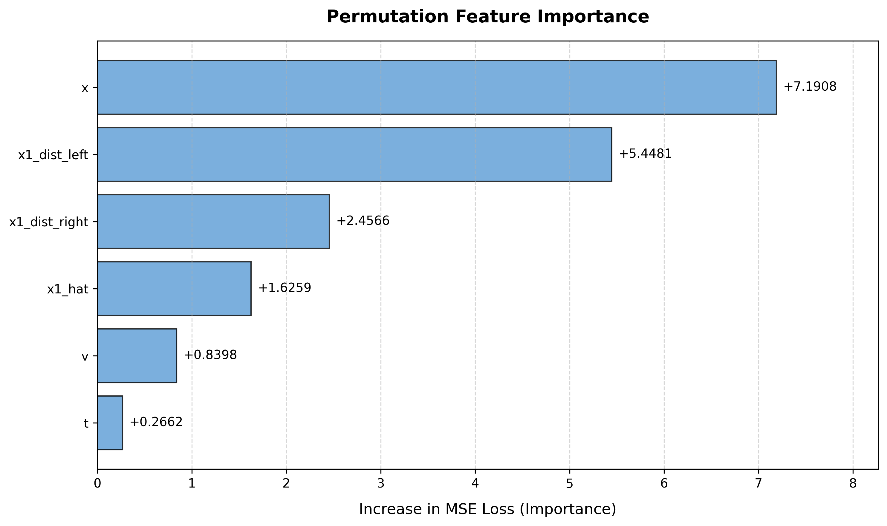

### Distilled Student Results
The distilled dynamic student successfully guides the flow to respect varying, unseen boundaries at inference time with zero backpropagation, closely matching the Teacher's baseline accuracy across drastically different constraints.

* **Dynamic Boundaries: [-3, 3]** *(Accuracy: 99.47%)*
  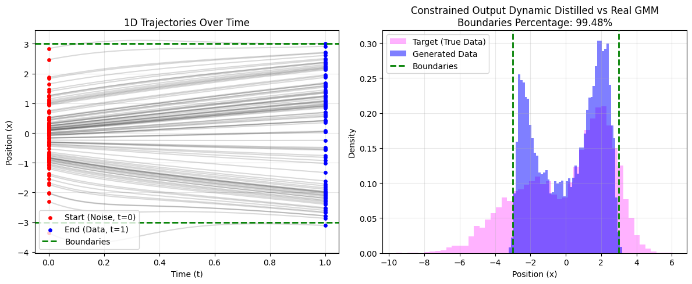
* **Dynamic Boundaries: [-2, 2]** *(Accuracy: 97.09%)*
  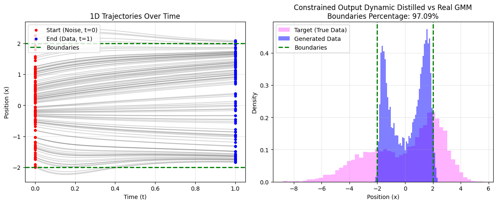
* **Dynamic Boundaries: [-1, 1]** *(Accuracy: 92.58%)*
  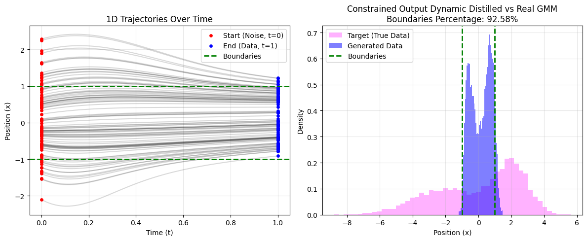
* **Dynamic Boundaries: [-2, 4]** *(Accuracy: 99.78%)*
  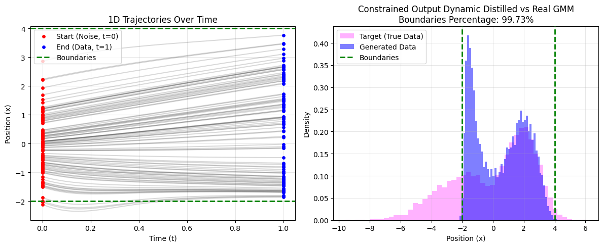
* **Dynamic Boundaries: [-7, 2]** *(Accuracy: 97.61%)*
  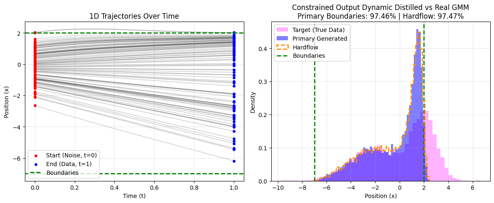
* **Dynamic Boundaries: [0, 3]** *(Accuracy: 99.18%)*
  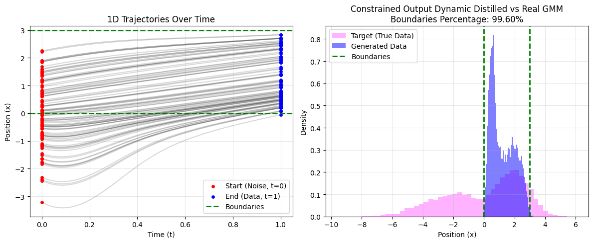
* **Dynamic Boundaries: [-3, 0]** *(Accuracy: 91.72%)*
  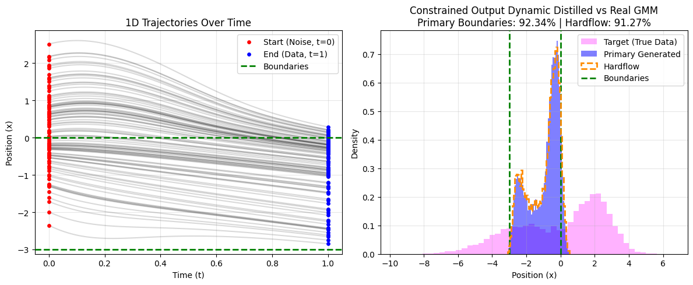

---

## Part 2: The Symmetry Constraint

### The Teacher: Interacting Particle Dynamics
For our second constraint, we force the final distribution to be mathematically symmetric around an arbitrary center point, $c$. Because symmetry depends on the shape of the entire distribution, the loss is calculated over the entire batch by sorting the points and minimizing the squared error of paired endpoints. 

This introduces **Interacting Particle System** dynamics, where the gradient applied to a single point depends on the behavior of its corresponding pair on the opposite side of the manifold.

**Example: Teacher Model with Center Symmetry at $c = 0.0$**
*(MSE: 0.00001)*
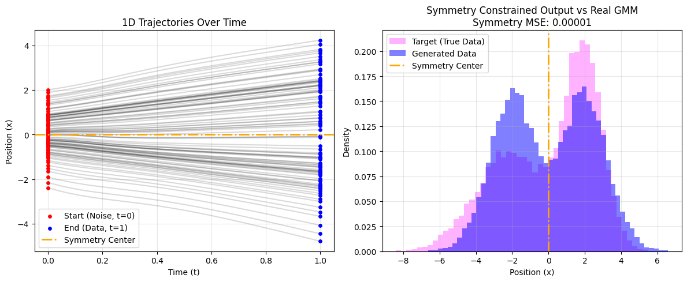

### Dynamic Distillation & Feature Engineering
To make the student dynamic, we generated a dataset where entire batches were guided to mirror randomly sampled centers (e.g., $c \in [-3, 3]$). We provided the student with the relative distance from the predicted destination to the target center (`x1_dist_center`) to give the MLP a clear mathematical path to predict the symmetry penalty.

#### Feature Importance & Pruning
Evaluating permutation importance on the validation set.

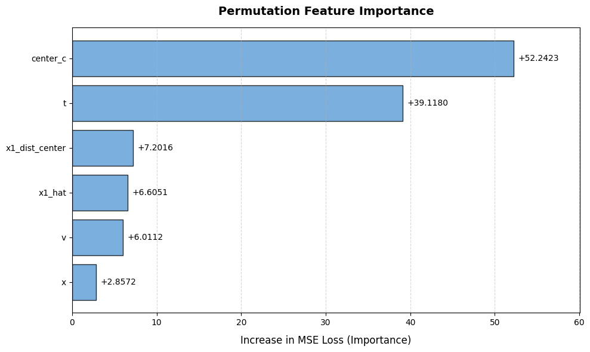

### Distilled Student Results
The dynamic student successfully coordinates the batch to reflect around unseen centers, actively pulling the two GMM peaks together or pushing them apart to balance the distribution.

* **Dynamic Symmetry: Center = 0.0** *(MSE: 0.05550)*
  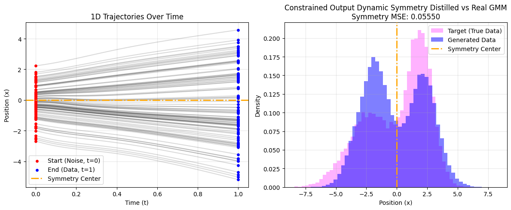
* **Dynamic Symmetry: Center = 1.5** *(MSE: 0.00505)*
  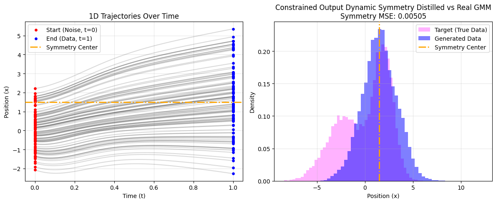
* **Dynamic Symmetry: Center = -1.5** *(MSE: 0.37636)*
  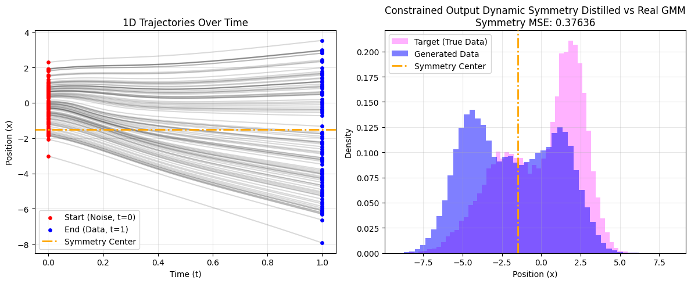
* **Dynamic Symmetry: Center = 2.5** *(MSE: 0.08423)*
  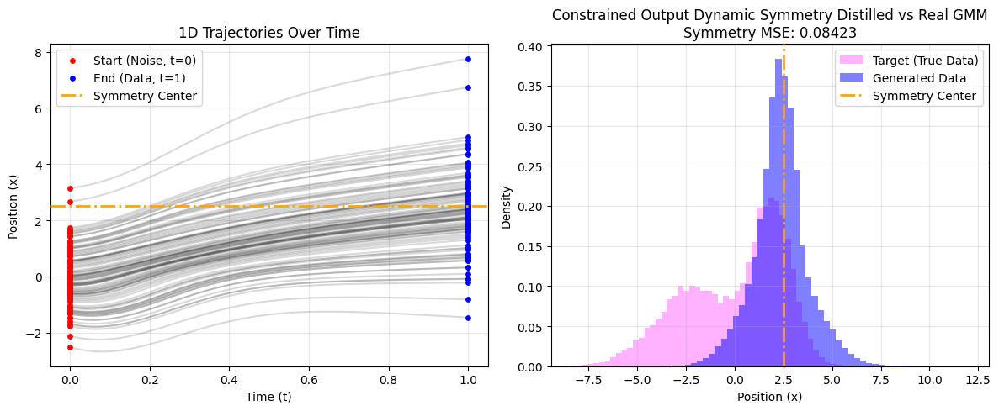
* **Dynamic Symmetry: Center = -2.5** *(MSE: 0.03243)*
  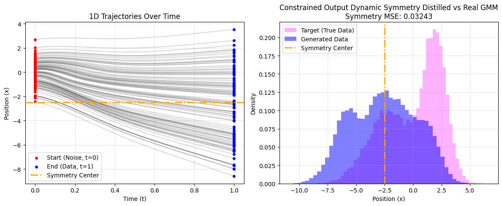

---

## Conclusion
By passing mathematically meaningful constraint features (like boundary distances or symmetry centers) into a normalized Student MLP, we can distill computationally expensive ODE gradient-guidance into a fast, generalized inference step. This allows for the zero-shot application of complex, interacting constraints while maintaining the structural integrity of the underlying Flow Matching distribution.
