# 1D Constrained Flow Matching: Distillation vs. Conditional Training

*[← Back to Main Repository](../README.md)*

Standard generative models excel at mapping noise to a target distribution, but enforcing strict, hard constraints at inference time is notoriously difficult. This module investigates two distinct paradigms for applying hard constraints to 1D Flow Matching models:
1. **Post-Hoc Guidance & Distillation:** Correcting trajectories at inference time using gradients, and distilling that process into a fast student network.
2. **Conditional Flow Matching:** Baking constraint physics directly into the model training using dynamic conditionality and novel boundary-correction techniques.

---

## 1. The Target Dataset
The ground truth data is a 1D Gaussian Mixture Model (GMM) consisting of two distinct peaks:
* Peak 1: Mean 2, Std 1
* Peak 2: Mean -2, Std 2

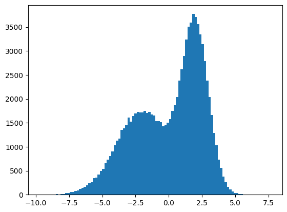

## 2. The Unconstrained Base Model
The foundational baseline is an unconditional Flow Matching MLP trained to map standard Gaussian noise to the unconstrained 1D GMM target distribution. 

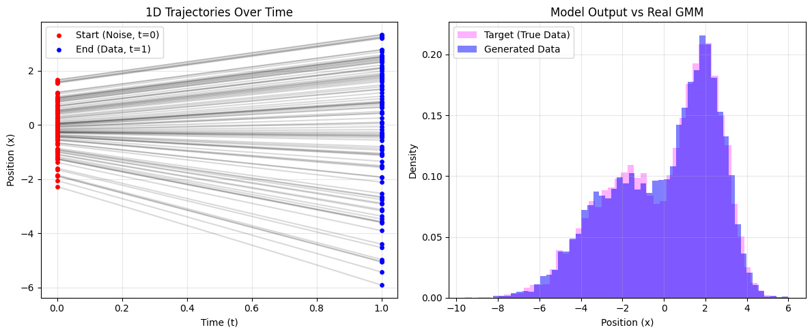

---

## Method 1: Post-Hoc Guidance & Distillation (HardFlow)
*How do we constrain a pre-trained model without retraining it?*

### Part A: The Boundaries Constraint
To constrain the generated data, we implement a HardFlow-style guidance loop. During the Euler integration steps, we predict the destination (`x1_hat`), calculate a **squared Softplus barrier loss** if it falls outside our desired boundaries, and subtract the gradient of that loss from the velocity. 

Using a squared Softplus provides a smooth, continuous gradient as points approach the boundaries, preventing exploding gradients while firmly pushing wandering points back inside.

**Example: Static Boundaries at [-3, 3]**
*(Achieved 99.44% boundary accuracy)*
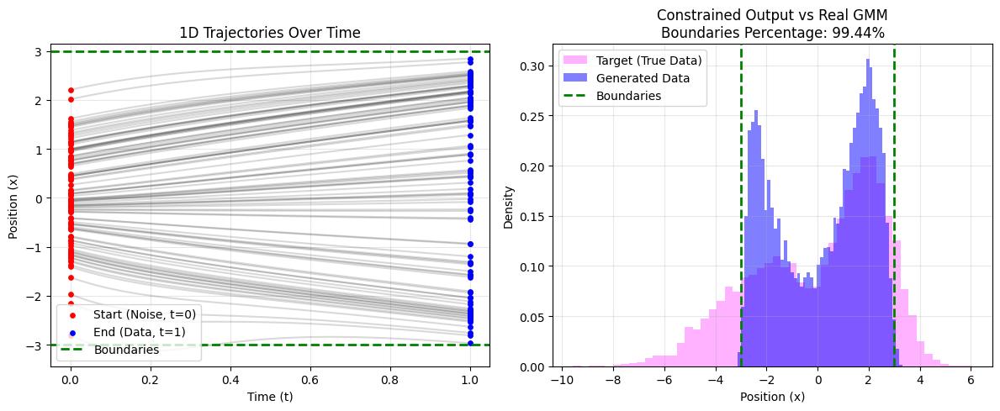

#### Dynamic Distillation
Calculating `requires_grad` inside an ODE solver is computationally expensive. We trained a **Student MLP** to predict the necessary gradient correction in a single forward pass. By generating a teacher dataset with randomized boundaries for every sample, we forced the student to learn arbitrary, dynamic constraints.

* **Dynamic Boundaries: [-3, 3]** *(Accuracy: 99.45%)*
  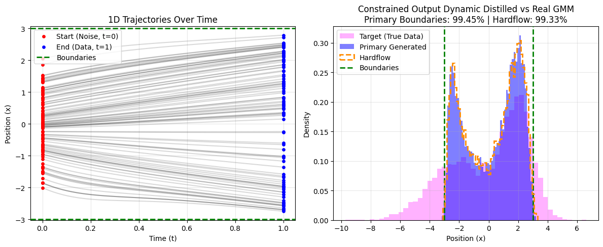
* **Dynamic Boundaries: [-2, 2]** *(Accuracy: 96.84%)*
  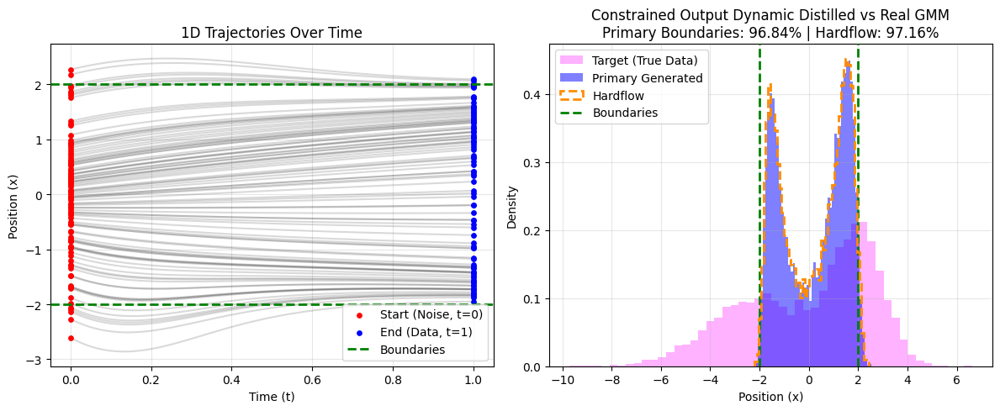

### Part B: The Symmetry Constraint
For our second constraint, we force the final distribution to be mathematically symmetric around an arbitrary center point, $c$. The loss is calculated over the entire batch by sorting the points and minimizing the squared error of paired endpoints, introducing **Interacting Particle System** dynamics.

* **Dynamic Symmetry: Center = 0.0** *(MSE: 0.05550)*
  
* **Dynamic Symmetry: Center = 1.5** *(MSE: 0.00505)*
  

---

## Method 2: Conditional Flow Matching (Manifold-Preserving)
*How do we bake constraints into the vector field natively?*

Post-hoc methods (like HardFlow) act as strict barriers. While they enforce the constraint, they can corrupt the underlying data distribution by causing probability mass to pile up artificially at the boundary edges. 

To solve this, we implemented **Conditional Flow Matching**. During training, we randomly sample lower and upper boundaries for each data point and pass the relative distances into the network. This teaches the model to natively compress the distribution so it naturally lands within the boundaries.

**Baseline Conditional FM Generation:**
Showing this method compared to the previous method (in dashed orange).
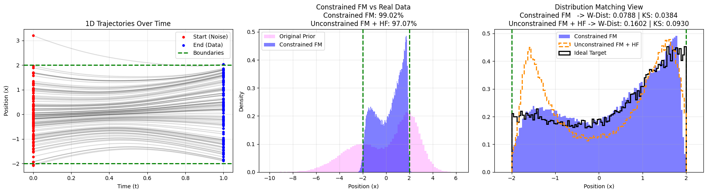
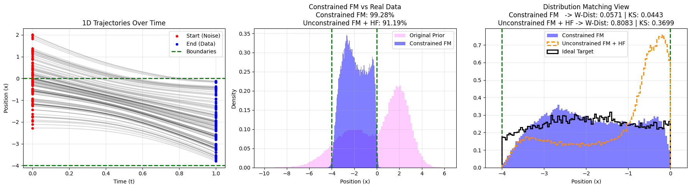
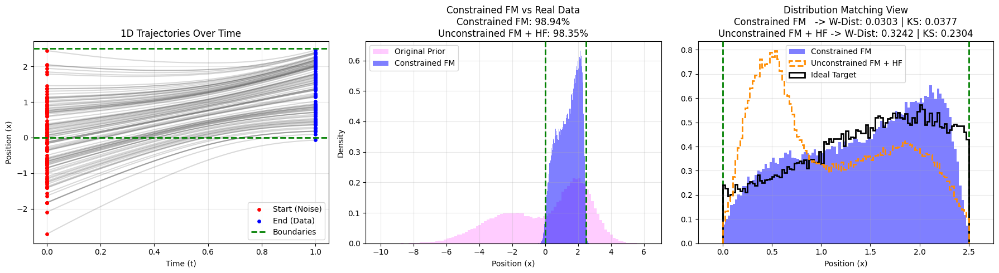
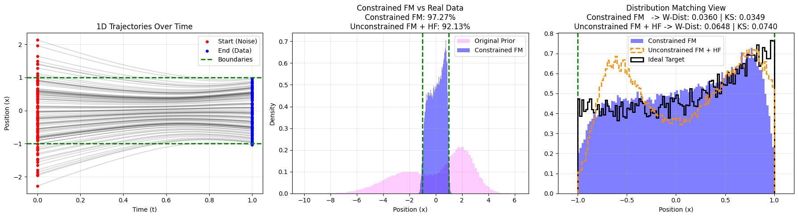

### Addressing Spectral Bias
While Conditional FM prevents the wall near the boundaries effect, it introduces a new challenge: **density degradation at domain edges** caused by the spectral bias of neural networks (smoothing error). To preserve strict boundaries and perfect density, we implemented two novel boundary-correction techniques, comparing them to the base conditional FM (in dashed orange):

#### 1. Probability Mass Mirroring
This technique dynamically extends the constraint boundaries during training by a precise percentage of probability mass using numerical root-finding on the underlying GMM's Cumulative Distribution Function (CDF). By generating data within these relaxed boundaries and folding the resulting tails inward at inference time, this method perfectly compensates for the network's smoothing error, automatically adapting to the varying steepness of local distribution slopes. This method requires tuning the percentage of mass that should be added to the boundaries. The following results are on hardcoded hyperparameters that were found using trial and error. I believe we can figure out the math for more accurate assignment, or predicting it with a neural network.

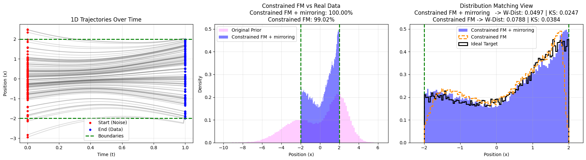
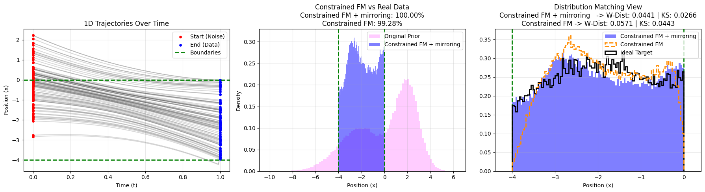
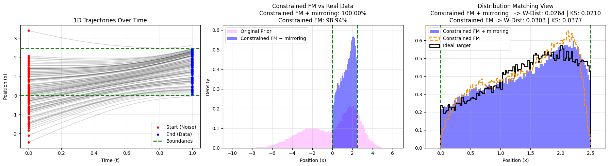
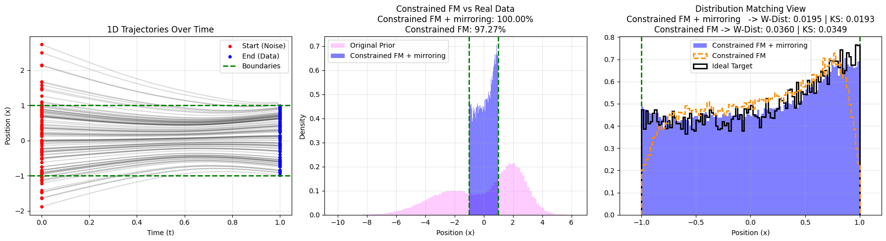

#### 2. Margin Sampling with Post-Hoc Rejection
During generation, the Conditional Flow Matcher is given boundaries that are artificially extended by 5% on each side. This pushes the network's inevitable approximation error (the smoothing "tails") out into the extended margin. Once sampling is complete, a simple rejection filter is applied to discard any points that fall outside the true target constraints. This guarantees strict adherence and better preserves the distribution's structural fidelity, with the only trade-off being a small, measurable percentage of "lost" points rejected at the boundaries.

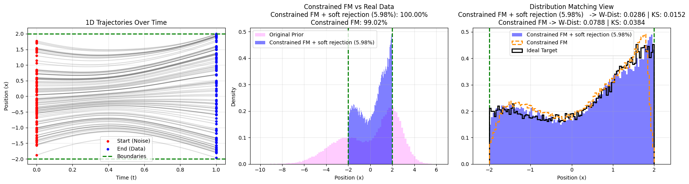
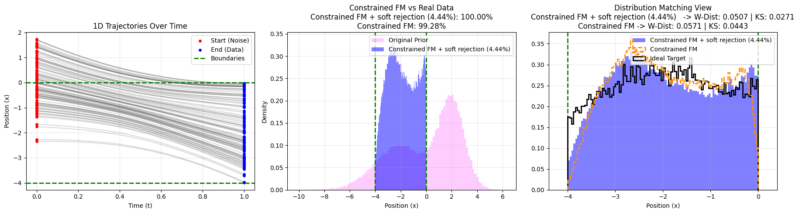
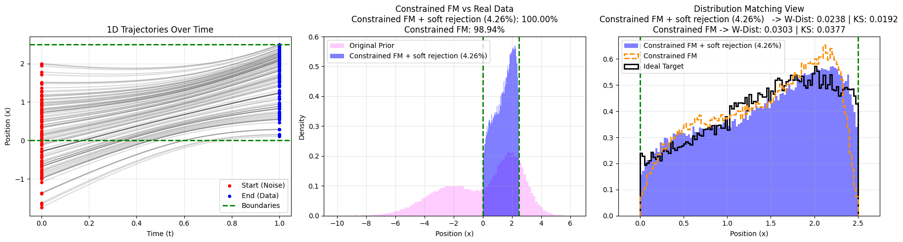
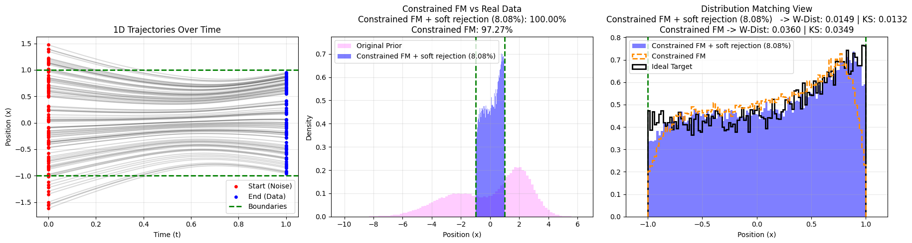

---

## Conclusion
This repository demonstrates a clear evolution in constraint enforcement. **Method 1 (Distillation)** is highly effective for applying zero-shot, complex interacting constraints (like symmetry) to existing unconditional models. However, when architectural control is available, **Method 2 (Conditional Training)** combined with root-finding boundary corrections (Mirroring/Rejection) yields vastly superior manifold preservation, eliminating post-hoc artifacts entirely.
